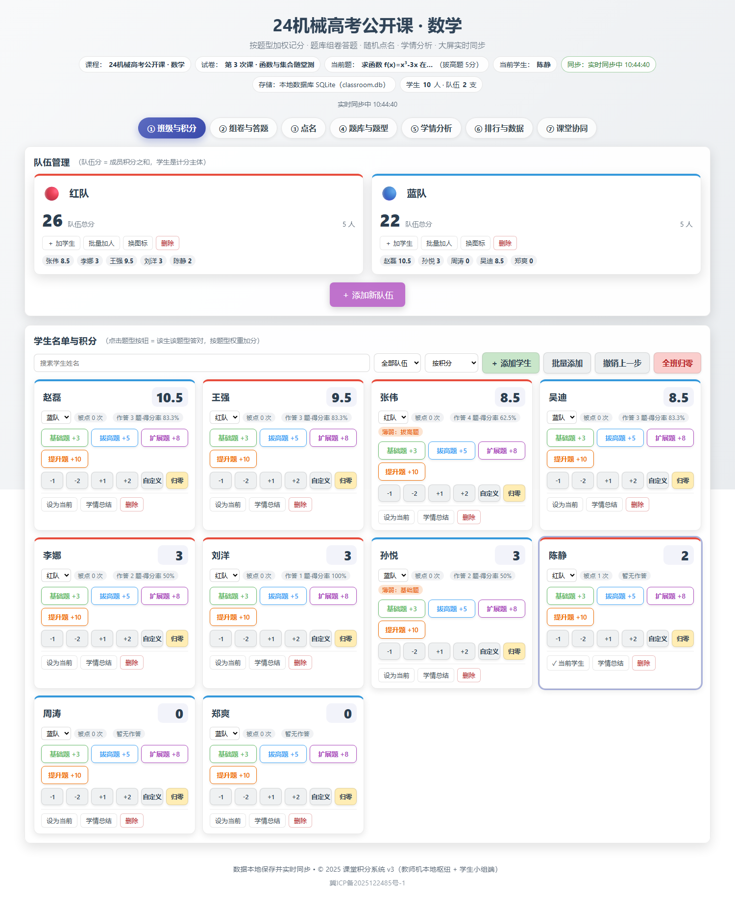
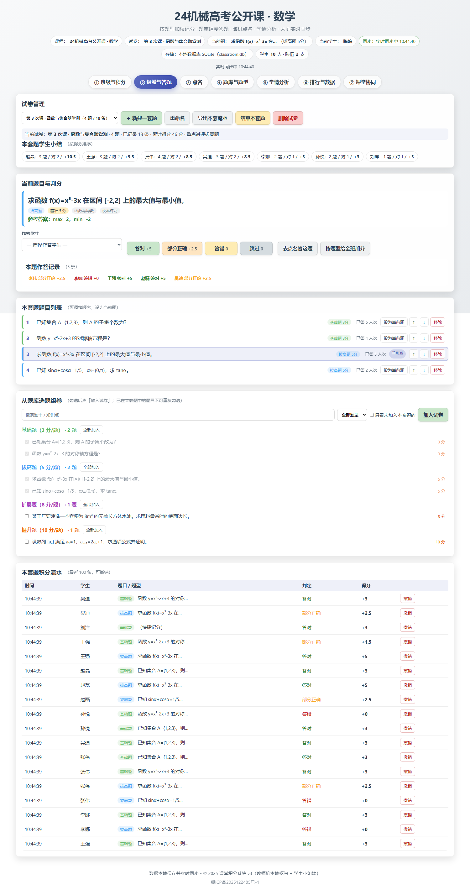
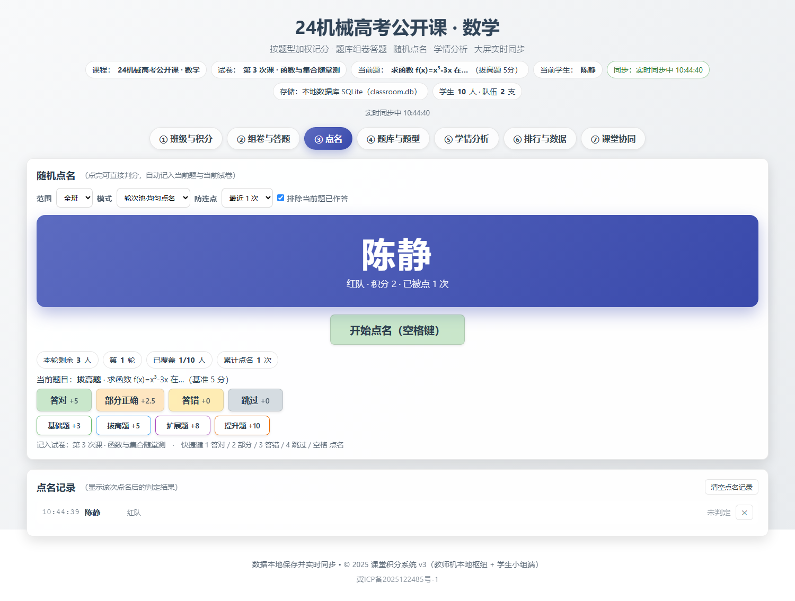
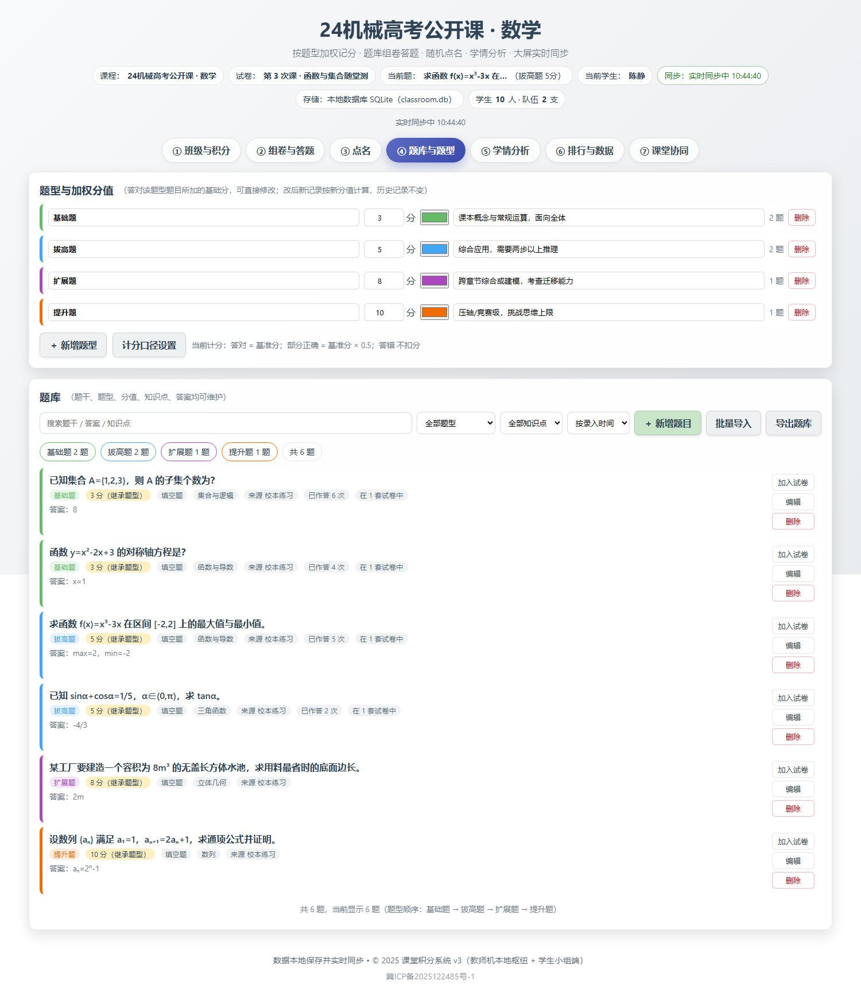
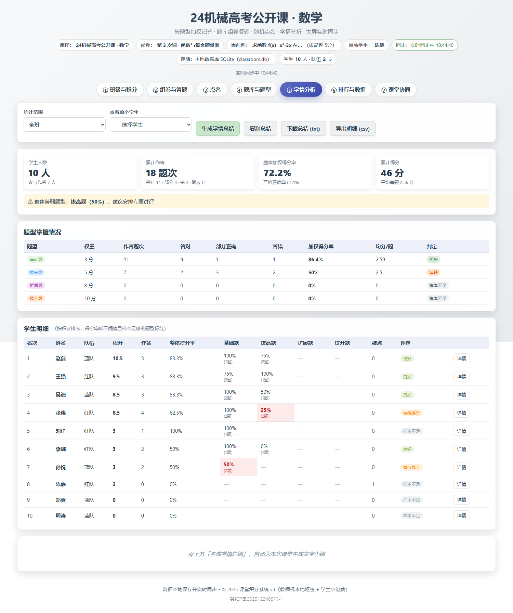
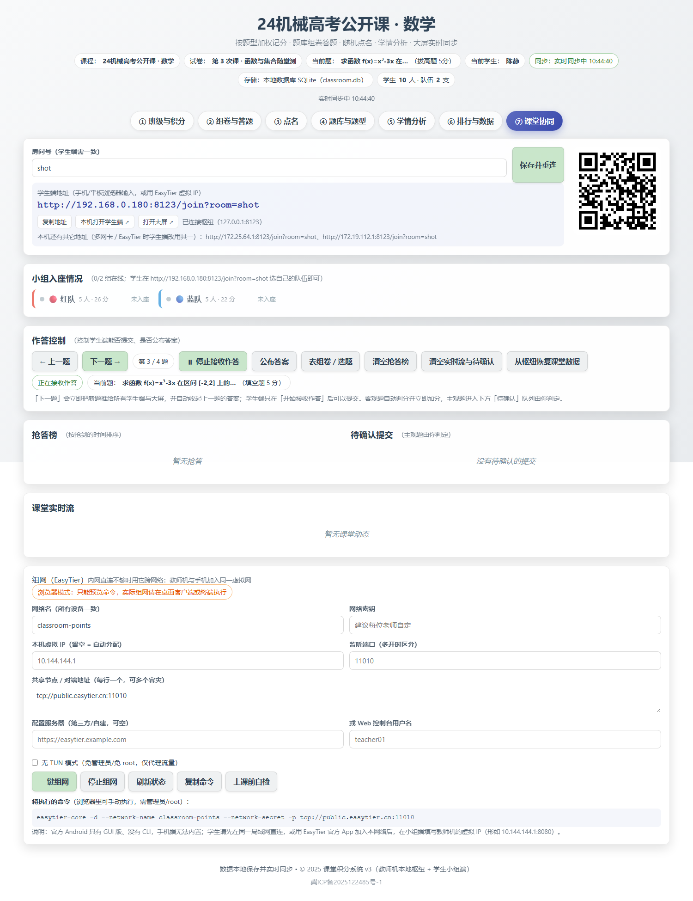
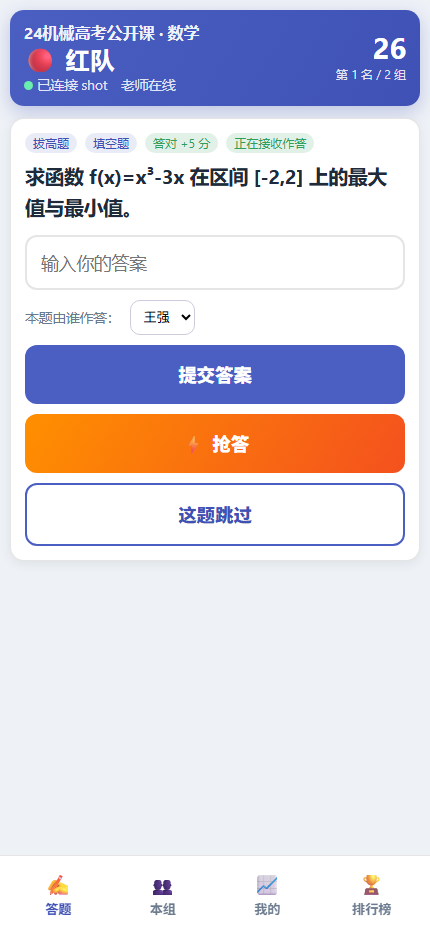
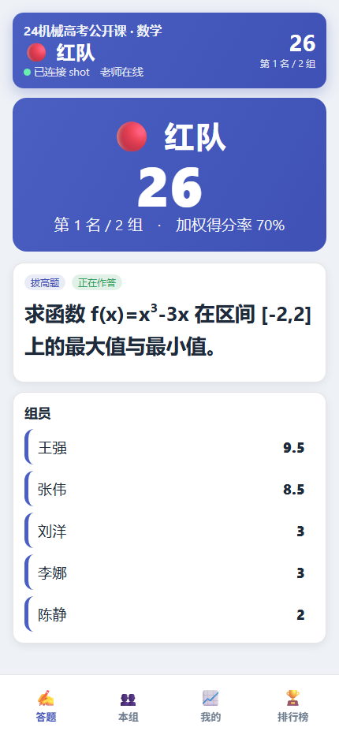
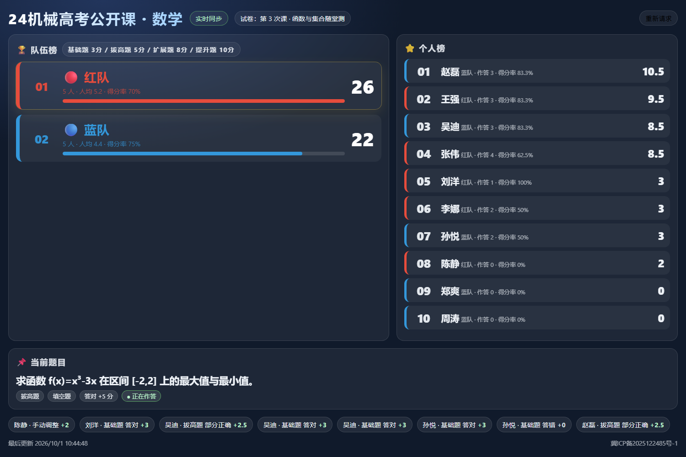

# 课堂积分系统 v3 · 开发文档

> 教师机本地枢纽 + 学生小组端协同：按题型加权记分 · 题库组卷答题 · 随机点名 · 学情分析 · 大屏实时同步
> 零构建纯静态：`admin.html`（教师端）+ `student.html`（学生端）+ `index.html`（教室大屏）+ `sync-server.js`（教师机本地枢纽）

## 文档地图

| # | 文档 | 适合谁读 | 内容 |
| --- | --- | --- | --- |
| 01 | [项目现状与架构](01-项目现状与架构.md) | 新接手的开发 | v1→v2→v3 变化、文件地图、运行时架构、模块依赖、设计决策、技术债 |
| 02 | [数据模型与存储](02-数据模型与存储.md) | 改数据/写功能 | 完整字段字典、写操作规范、迁移、备份格式、容量与清理 |
| 03 | [加权积分规则](03-加权积分规则.md) | 老师 & 开发 | 题型权重、计分公式、四种记分入口、撤销/归零语义、口径设置 |
| 04 | [题库与组卷答题](04-题库与组卷答题.md) | 老师 & 开发 | 题目字段、客观题/主观题、导入格式、组卷流程、答题判分 |
| 05 | [学情分析与总结](05-学情分析与总结.md) | 老师 & 开发 | 指标口径、薄弱判定、总结模板、导出、性能说明 |
| 06 | [点名系统](06-点名系统.md) | 老师 & 开发 | 三种模式算法、候选过滤、交互与快捷键、与计分/统计的联动 |
| 07 | [通信协议与 API](07-通信协议与API.md) | 开发 & 集成 | 房间/角色/报文格式、快照结构、模块 API 索引、自建客户端示例 |
| 08 | [开发部署与测试](08-开发部署与测试.md) | 开发 & 运维 | 本地/局域网/EasyTier 组网、三层测试、排障表、发布流程 |
| 09 | [路线图与变更记录](09-路线图与变更记录.md) | 所有人 | 各版本交付清单、破坏性变更、已知限制、后续计划、验收清单 |
| 10 | [多端协同架构](10-多端协同架构.md) | 架构 & 开发 | 三端一枢纽、数据流、数据分区理由、权威与容错、房间、组网、安全边界 |
| 11 | [跨平台客户端与数据库方案](11-跨平台客户端与数据库方案.md) | 架构 & 运维 | v4 规划：Tauri 客户端、教师端 SQLite 库表、内置枢纽、EasyTier 缝合、GitHub 构建矩阵、阶段划分与风险 |
| 12 | [v4 验收对照](12-v4验收对照.md) | 所有人 | **逐条对照六项目标**：状态（已验证 / 待外部条件）、可复跑的证据、本轮自查发现的 12 个真问题、建议的提交分组、外部条件清单与已知差异 |
| 13 | [新界面（Vue）迁移方案](13-新界面迁移方案.md) | 前端 | 新界面技术选型（Vue3 + Element Plus / Vant）、17 个页面清单与进度、/next/ 预览方式、四步切换旧界面、已知取舍 |

> **v4 进展**：教师端 SQLite 已落地并可选启用（网页版与客户端共用 `/api/state`，见 [11 §4](11-跨平台客户端与数据库方案.md#4-数据层sqlite-设计)）；
> Tauri 客户端骨架、EasyTier sidecar 脚本与 GitHub 构建流水线已就位（`apps/`、`scripts/`、`.github/workflows/`）。

## 界面预览

截图由 `tests/shot.js` 用无头浏览器自动生成（演示数据，非真实班级）：

> 🎬 **整堂演示**：`npm run demo` 会自起隔离枢纽，用教师端 / 学生端 / 大屏三个真实页面走完整条课堂链路
> （建班 → 组卷 → 推题 → 入座 → 答题 → 自动判分 +3 → 公布答案 → 抢答），逐步骤截图并生成实录，
> 产物见 [docs/demo/](demo/README.md)。实测分数 `[0,0,0,0,0] → [0,3,0,0,0]`、无页面错误。

| 页面 | 截图 |
| --- | --- |
| 教师端 ① 班级与积分（题型快捷加分 + 手动调整） |  |
| 教师端 ② 组卷与答题（当前题判定 + 流水） |  |
| 教师端 ③ 点名（点完即判分） |  |
| 教师端 ④ 题库与题型（权重、题型、选项） |  |
| 教师端 ⑤ 学情分析（题型矩阵 + 学生明细） |  |
| 教师端 ⑦ 课堂协同（房间码 / 二维码 / 在线小组 / 待确认） |  |
| 学生端（手机，按小组入座答题） |  |
| 学生端 小组公屏模式（`?view=board`） |  |
| 教室大屏（队伍榜 + 个人榜 + 当前题 + 抢答榜） |  |

重新生成：先起枢纽 `$env:PORT=8123; node sync-server.js`（截图脚本只访问 admin/student/index，不需要 `SERVE_TESTS=1`），再 `npm run screenshots`。

## 三条上手路径

按你的目的挑一条，彼此不冲突（后续可以叠加）。

### 路径 A · 网页版（最快，60 秒就能上课）

```powershell
npm install
npm start          # 或双击「启动课堂.cmd」；教师机即本地枢纽，无需公网服务器
```

- 教师端：<http://localhost:8080/admin.html>
- 学生端：`http://<教师机IP>:8080/join`（学生手机/平板输入，或扫「⑦ 课堂协同」页的二维码）
- 教室大屏：<http://localhost:8080/stage>

**适合**：临时借电脑上课、只想先看效果。**数据落点**：枢纽所在机器的 `data/classroom.db`（SQLite；Node 22 以下自动退回 `rooms/*.json`）。

### 路径 B · 跨平台客户端（正式形态，需要构建）

```powershell
node scripts/sync-ui.mjs                 # 把网页版界面同步进客户端
node scripts/gen-protocol.mjs            # 契约 → Rust 常量
node scripts/fetch-easytier.mjs          # 教师端：放好 EasyTier sidecar（组网用）
cd apps/teacher && npm install && npm run dev      # 桌面教师端（需 rustup + MSVC）
cd apps/student && npm install && npm run android:build   # Android 学生端（需 JDK 17 + Android SDK/NDK）
```

**适合**：常态化教学、要装机、要离线可用、要跨网络组网。**数据落点**：教师机 App 数据目录下的 `classroom.db`（不依赖浏览器）。
出包由 GitHub Actions 完成：推 tag `v*` 触发 [build.yml](../.github/workflows/build.yml)，产物进 Release；Rust 侧编译验证见 [rust.yml](../.github/workflows/rust.yml)。
首次跑 CI 的排障清单见 [apps/README.md](../apps/README.md)。

### 路径 C · 只要"教师端本地数据库"

不想要客户端、也不想让数据停在浏览器里：

```powershell
npm install
npm start                     # 起枢纽（默认 8080）
# 教师端用 http://localhost:8080/admin.html 打开 → 顶部显示「存储：本地数据库 SQLite（classroom.db）」
```

- 数据落在 `data/classroom.db`（`DATA_DIR` / `DB_FILE` 可改）；`GET /api/state`、`/api/stats`、`/api/backup`、`POST /api/restore` 可直接被脚本调用；
- 备份就是复制这个 `.db` 文件，或走「导出全部数据」（JSON 与网页版/客户端互通）；
- 无需 SQLite 时：`NO_PERSIST=1 npm start` 全程只跑内存。

**适合**：想用自己的脚本/看板读数据，或只想把存储从浏览器搬出来。

## 一节课的标准流程

1. **建名单**：教师端① →「批量添加」粘贴学生姓名并选队伍（队伍 = 学生端的入座身份）；
2. **建题库**：教师端④ →「批量导入」粘贴题目（`题干 | 答案`；选择题写 `题干 | 选项1 ; 选项2 ; 选项3 | 答案字母`）；
   ⚠️ 选择题答案必须是**字母**（如 `B`/`AC`）；写成选项原文（`8`）会让所有提交判错——导入时会被拦下提示；
3. **组一套题**：教师端② →「新建一套题」→ 从题库勾选 →「加入试卷」；
4. **学生入座**：学生手机打开 `/join` → 点自己小组；
5. **上课**：教师端⑦ →「开始接收作答」→ 学生端抢答/作答 → 客观题自动判分、主观题进「待确认」由老师点判定；
   也可继续用教师端③ 随机点名 + 快捷键 1/2/3/4 判分；
6. **看数据**：教师端⑤ →「生成学情总结」，得到班级小结与每人总结（可复制/下载）；
7. **投大屏**：教室电脑打开 `/stage`，1 秒内实时同步。

> 想先看整条链路长什么样：`npm run demo` 会自起枢纽，用三个真实页面走一遍并逐步截图（产物在 [docs/demo/](demo/README.md)）。

## 术语速查

| 术语 | 含义 |
| --- | --- |
| 枢纽（hub） | 跑在教师机本地的 `sync-server.js`：静态托管 + 房间 + 角色 + 状态缓存 + 命令转发 |
| 角色 | `host` 教师端（唯一写入者）/ `stage` 大屏（只读）/ `team` 学生端（只发命令） |
| 房间 | 隔离单元，默认 `default`；学生端用 `/join?room=xxx` 进入 |
| 题型 tier | 基础题 / 拔高题 / 扩展题 / 提升题，各自带默认加权分 |
| 基准分 base | 某题实际计分值 = 题目自定义分值（若有）否则题型权重 |
| 判定 result | 答对 `correct` / 部分正确 `half` / 答错 `wrong` / 跳过 `skip` |
| 流水 record | 一次记分记录；**学生积分 = 其全部流水 `points` 之和**；`source` 可为 `quiz/quick/rollcall/manual/reset/student` |
| 加权得分率 creditRate | (答对数 + 部分正确数 × halfRatio) / 作答次数，学情判定用它 |
| 待确认（pending） | 学生提交的主观题，等老师在「课堂协同」页判定后才写分 |
| 轮次池 roundPool | 均匀点名模式下"本轮还没被点到"的学生 id 列表 |

## 质量现状（代码冻结时的实测）

| 项目 | 结果 |
| --- | --- |
| `npm test`（逻辑 153 项 + 接线自检） | ✅ 全绿 |
| `npm run test:e2e`（教师端真实浏览器 52 项） | ✅ 52 pass / 0 fail |
| `npm run test:e2e:class`（多端协同：枢纽 + 教师端 + 学生端 + 大屏 58 项） | ✅ 58 pass / 0 fail |
| 浏览器控制台错误 | 无 |
| 文档行号审计 | `node tests/doc-refs.js [--broken]` 一键复核 600+ 处 `文件:行号` 引用 |

## 相关约定

- **唯一数据源**：`assets/js/store.js`；任何写操作走 `CI.store.tx()` 或已封装方法，保证"落盘 + 日志 + 广播"三件事一起发生。
- **唯一写入者**：教师端。学生端只发命令（`{type:'cmd'}`），判定与计分都在教师端完成。
- **零构建**：不使用打包器与 ES Module（保证 `file://` 双击可运行），脚本按固定顺序用 `<script src>` 加载，顺序由 `tests/dom-check.js` 守护。
- **数据在浏览器**：localStorage 存全量状态，换设备/清缓存前必须「导出全部数据」；枢纽的 `rooms/` 是缓存副本，不是主库。
