# 教师端界面 · 完整说明文档

> 适用版本：**v5**（Vue 3 + Element Plus，界面已统一到 Vue 构建产物）
> 打开地址：<http://localhost:8080/admin.html>（`/` 与 `/admin` 等价）
> 本文全部截图由 `node tests/shots-docs.js --only=teacher` 在**真实运行**的界面上自动产出，
> 数据为模拟数据（4 支队 / 16 名学生 / 10 道题 / 1 套卷 / 79 条作答记录）。
> 截图走的枢纽是 **Rust 核心**（`ci-hub-server`），所以页面上「统计来源」显示的是「Rust 核心」。

---

## 0. 教师端是什么 / v5 变了什么

教师端是整堂课**唯一的写入者**：只有它能改名单、改题库、记分、点名、控制课堂环节。
学生端与大屏都是只读展示端（学生端只能"提交"，不能自己加分）。

v5 重构后有三点变化值得先说清楚，后面每一页都能看到它们的影响：

| 变化 | 说明 |
| --- | --- |
| **界面只有一套了** | 旧版"零构建静态页"已删除；网页版、桌面客户端、安卓客户端**共用同一份 Vue 界面**，不会再出现"网页版是新界面、客户端还是旧界面" |
| **规则下沉到 Rust 核心** | 判分 / 计分 / 能力评价 / 点名抽取 / 学情统计都由枢纽的 Rust 实现负责；前端在学情分析页明确标注**「统计来源：Rust 核心」** |
| **大屏不再公开个人排名** | 个人名次从大屏移除，改为显示**全班选项分布**；个人成绩只发给学生自己的手机 |

顶栏常驻四个关键状态：

| 顶栏元素 | 含义 | 正常表现 |
| --- | --- | --- |
| 课程名 | 当前课程 | 你设置的课程名 |
| 房间 | 多端协同的房间号 | 与二维码里的房间一致 |
| 同步 | 与本地枢纽的连接状态 | 「实时同步中 hh:mm:ss」 |
| 存储 | 数据落在哪里 | 「本地数据库 SQLite（classroom.db）」 |

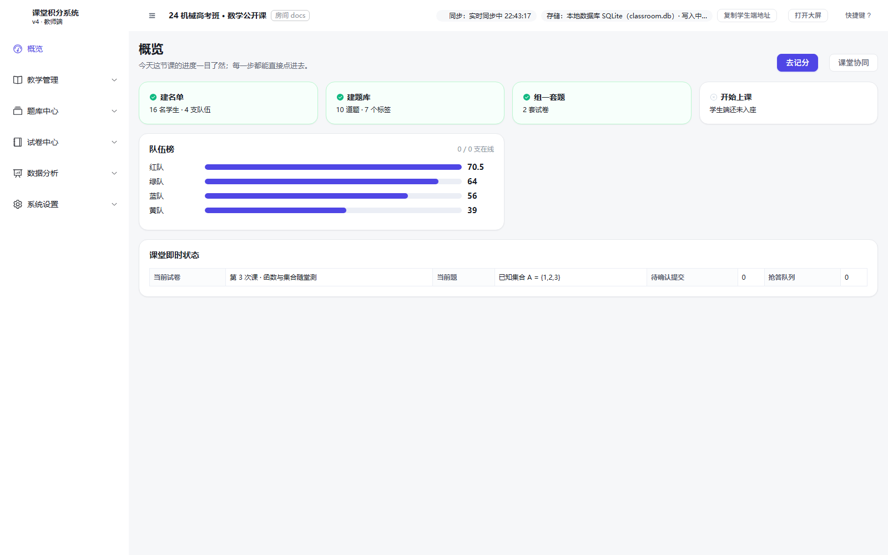

概览页把一节课拆成四步进度：**建名单 → 建题库 → 组一套卷 → 开始上课**。
已完成的一步显示数量（16 名学生 · 4 支队伍 / 10 道题 · 7 个标签 / 2 套试卷），
未完成的一步给出下一步动作提示，右上角按钮可直接跳过去。

---

## 1. 班级与积分

名单是后面一切的前提：**队伍就是学生端的"入座身份"**，学生扫码后选的就是这里建好的队伍。

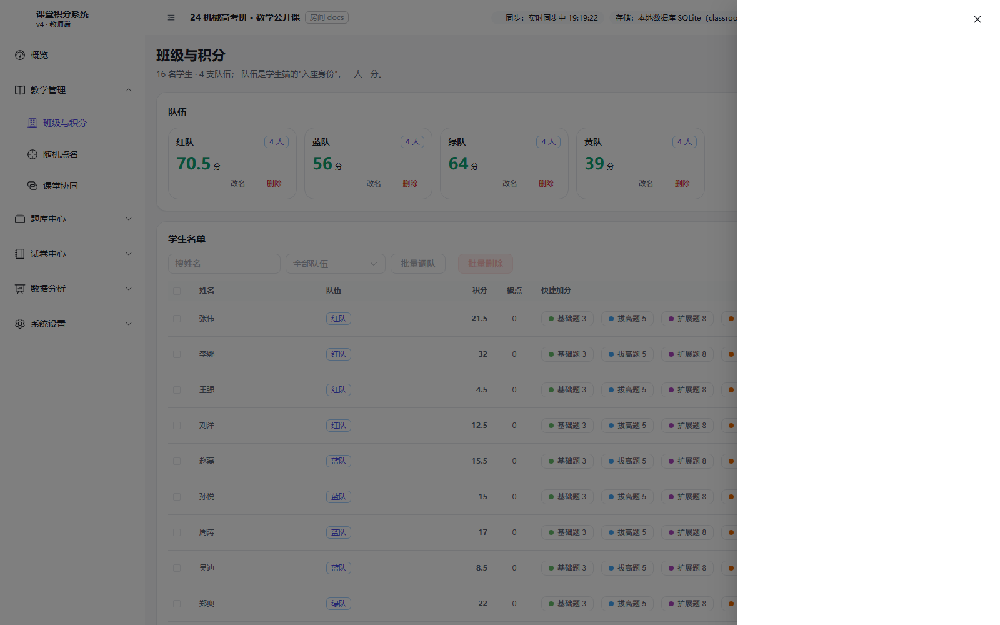

页面分三层：

1. **队伍卡片**：每队一张卡，显示队名、总积分、人数；「新增队伍」加队，卡片上的「改名 / 删除」改队；
2. **学生表格**：姓名、队伍、积分、被点次数、**快捷加分**按钮组，以及右侧一排操作；
3. **底部操作**：「撤销上一条」「清空全部记分」「批量添加学生」。

### 1.1 批量添加学生

1. 点右上角 **「批量添加学生」**；
2. 在「名单」框里粘贴学生姓名，**空格 / 逗号 / 换行分隔都认**；
3. 选择「加入队伍」；
4. 点「添加」。

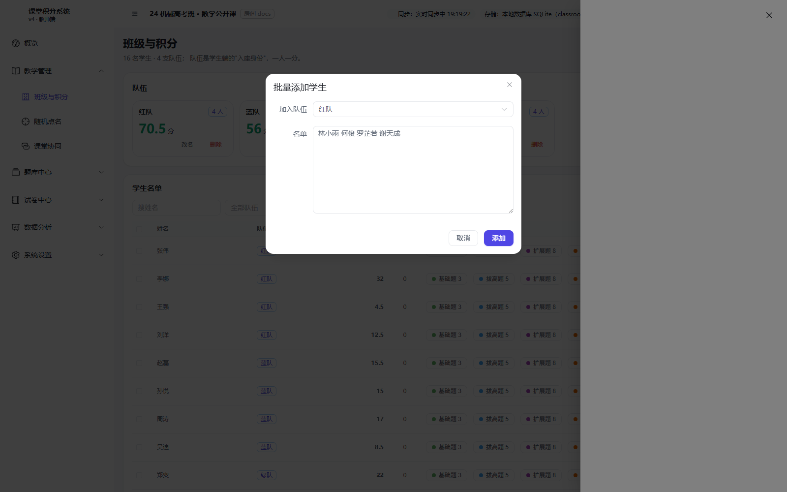

> 从 Excel 复制一列姓名直接粘贴即可，这是上课前最省事的一步。

### 1.2 学生明细

表格右侧点 **「明细」**，抽屉里是这名学生的**逐条记分流水**（哪道题、什么判定、加了几分、谁操作的）。

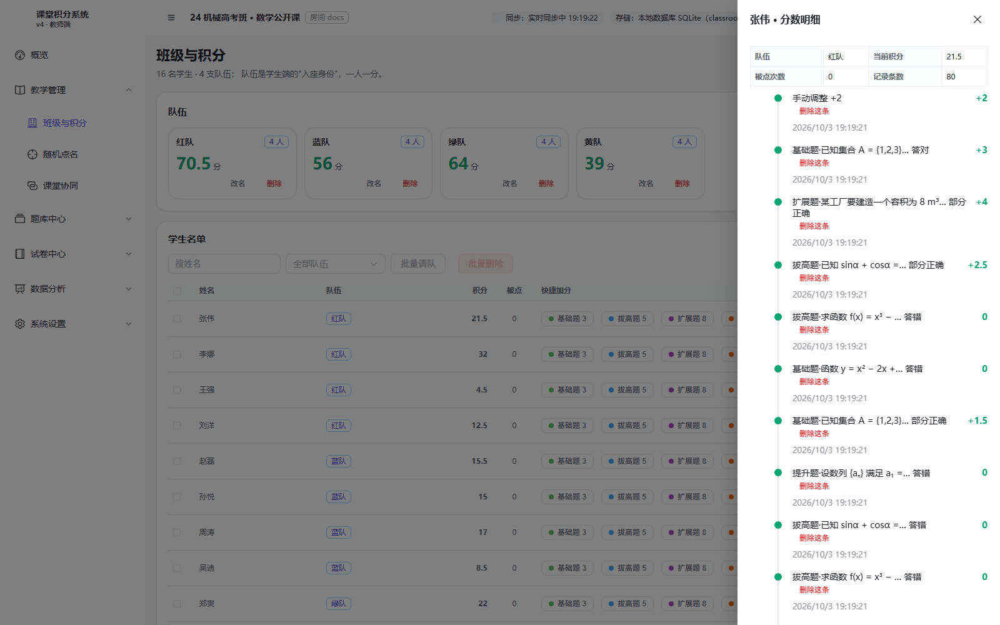

### 1.3 表格上每个操作做什么

| 操作 | 说明 |
| --- | --- |
| 快捷加分 | 点四个题型按钮之一，等于"该生该题型答对"，按权重直接加分（基础 +3 / 拔高 +5 / 扩展 +8 / 提升 +10） |
| 调整 | 手动加减分。**有上下限**（单次 +2 封顶、−1 下限），防止"谁话多谁分高"导致积分通胀 |
| 清零 | 只清这个学生的分，保留他的答题历史 |
| 明细 | 看逐条流水，可单条删除 |
| 改名 / 调队 / 删除 | 维护名单 |
| 撤销上一条 | 记错了不用慌，按时间倒着撤 |
| 清空全部记分 | 保留名单与题库，只清分数 |

---

## 2. 随机点名

点名的目的不是"抽人"，而是**抽完立刻判分**，所以判分按钮就在名字下面。

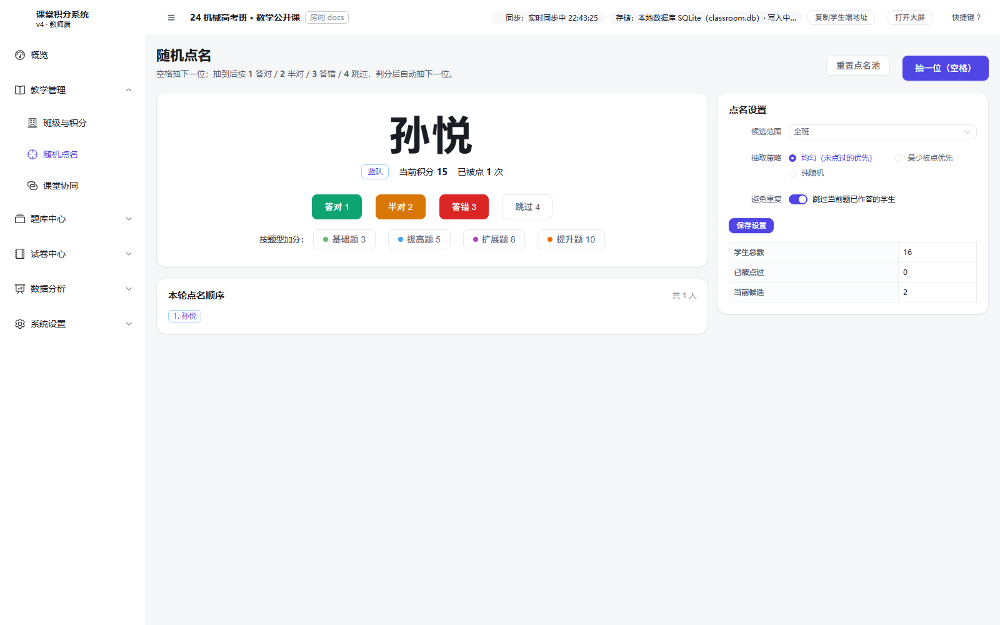

| 区域 | 作用 |
| --- | --- |
| 中央大字 | 被点到的学生（先滚动动画，再定人），下面显示所属队伍、当前积分、已被点次数 |
| 判分按钮 | 答对 1 / 半对 2 / 答错 3 / 跳过 4 —— **键盘数字键直接按**，不用鼠标 |
| 按题型加分 | 不走题库时的快捷方式：点一下 = 该生该题型答对 |
| 右侧点名设置 | 候选范围（全班 / 指定队）、抽取策略、避免重复 |
| 本轮点名顺序 | 本轮已经点过谁，一目了然 |

三种抽取策略（都对应真实课堂诉求，不是随手写的）：

- **均匀（未点过的优先）**——默认。一轮之内不重复点同一个人，保证覆盖面；
- **最少被点优先**——拉平被点次数，适合"总有人没被点过"的班；
- **纯随机**——真随机，可能重复。

「避免重复」开关可跳过**当前题已经作答过的学生**，避免"点了已经答过的人"这种尴尬。

> v5 起，抽取本身由 **Rust 核心**负责（`/api/domain/pick`），而且**支持注入随机种子** ——
> 同一个种子必然抽出同一个人，测试才能断言具体结果。

---

## 3. 课堂协同（上课时一直开着的那一页）

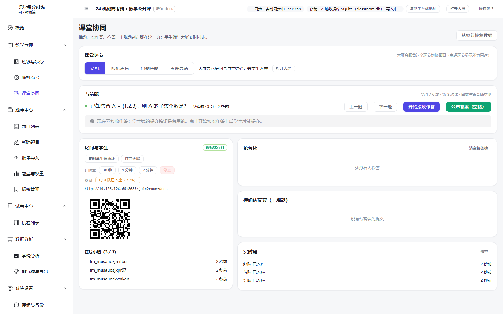

### 3.1 四个课堂环节

大屏会跟着环节自动切屏，这是"老师不用管大屏"的关键：

| 环节 | 大屏显示什么 |
| --- | --- |
| 待机 | 超大二维码 + 房间号，等学生入座 |
| 随机点名 | 放大显示被点到的同学 |
| 出题答题 | 题干 + 四色选项块 |
| 点评总结 | 各队答对情况 + **本题选项分布** + 能力雷达 + 讲评建议 |

### 3.2 上课的完整操作顺序

1. **选中当前题**（「上一题 / 下一题」）；
2. 点 **「开始接收学生作答」**（不点这个，学生提交会被忽略）；
3. 需要限时的话点 **30 秒 / 1 分钟 / 2 分钟** 起倒计时；
4. 学生答题 → 客观题**自动判分**，主观题落进「待确认提交」；
5. 主观题点「答对 / 半对 / 答错 / 丢弃」一键判定；
6. 点 **「公布答案」**（或按**空格**）→ 学生端与大屏同时显示答案；
7. 下一题，重复。

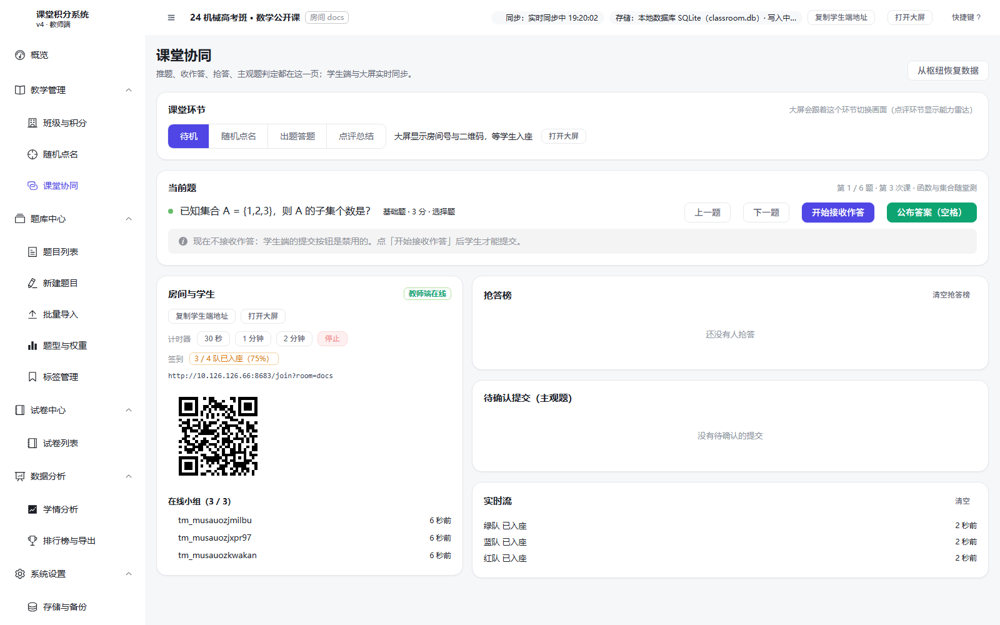

### 3.3 右栏三块反馈

- **抢答榜**：学生点「⚡ 抢答」后的顺序，前几名一目了然；
- **待确认提交**：主观题等老师判定的队列；
- **实时流**：每一次记分的文字流水（"张伟 答对（+3）"），可清空。

学生抢答后，教师端**立刻**能看到：

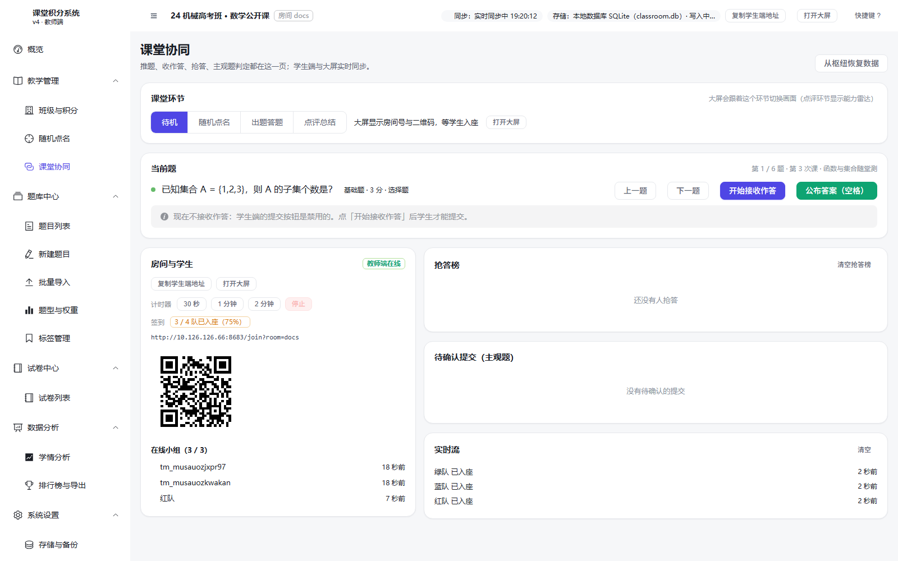

> 客户端（桌面 / 安卓）在这一页上多一个优势：**内置枢纽已经跑着**，
> 打开就能看到二维码与学生端地址，不需要另开终端跑 `node sync-server.js`。

---

## 4. 题库中心

### 4.1 题目列表

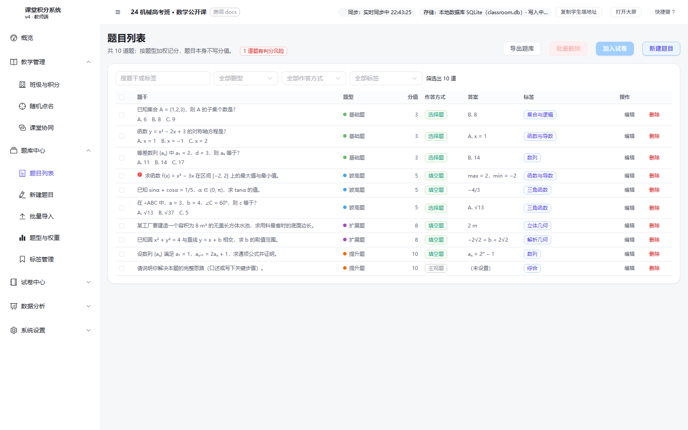

支持按题干搜索、按题型与标签筛选、排序；可勾选后「批量删除」，或把选中的题「加入试卷」；
「导出题库」导出为 JSON。

### 4.2 新建题目

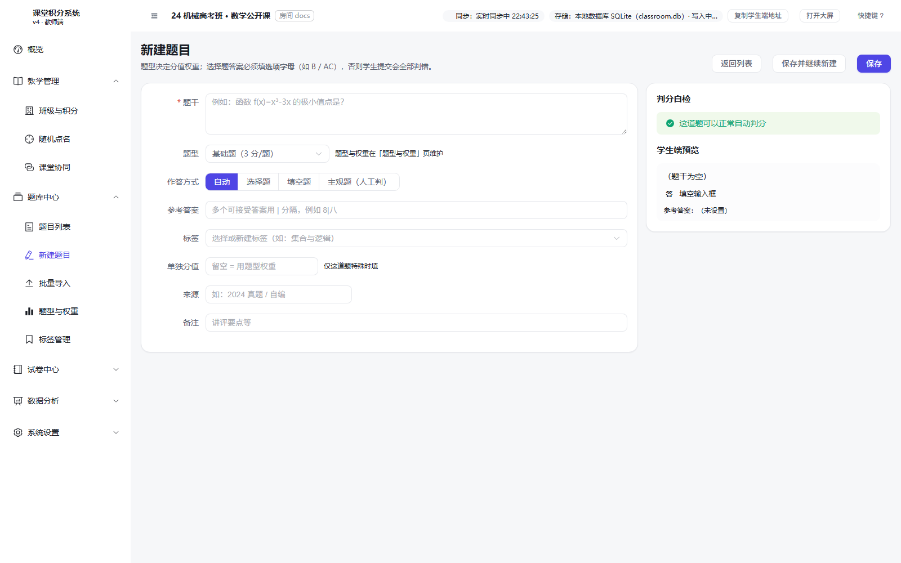

| 字段 | 说明 |
| --- | --- |
| 题干 | 必填 |
| 题型 | 基础 / 拔高 / 扩展 / 提升 —— **决定这道题值多少分**（+3 / +5 / +8 / +10） |
| 作答方式 | 自动识别 / 选择题 / 填空题 / 主观题。选"自动"时，填了选项就按选择题判、没选项就按填空判 |
| 选项 | 选择题的选项，一行一个 |
| 参考答案 | 客观题用于**自动判分**；主观题留空，交给老师「待确认」判定 |
| 标签 | 知识点，用于学情分析按知识点归因 |
| 单独分值 | 覆盖题型权重，只对这一道题生效 |
| 来源 / 备注 | 备注会作为"讲评要点"，**公布答案后**才下发给学生端 |

### 4.3 批量导入

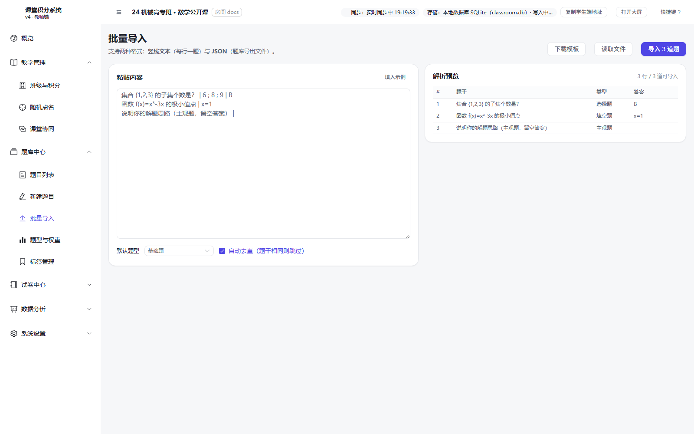

三种格式（点「填入示例」直接看例子）：

```
填空题/主观题：  题干 | 答案
选择题：        题干 | 选项1 ; 选项2 ; 选项3 | 答案字母
```

可以「下载模板」「读取文件」或直接粘贴文本，右侧**实时预览**解析结果确认无误再「导入」。
默认会**按题干去重**。

> v5 起，这段文本解析也下沉到了领域层（`parseImport`），并有对应单测 —— 不再是界面里的一段正则。

### 4.4 题型与权重

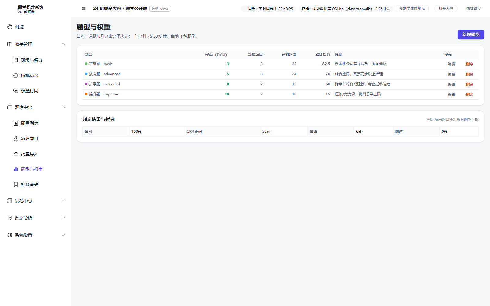

这是"分值政策"页。默认四档：

| 题型 | 默认权重 | 定位 |
| --- | --- | --- |
| 基础题 | **+3** | 课本概念与常规运算，面向全体 |
| 拔高题 | **+5** | 综合应用，需要两步以上推理 |
| 扩展题 | **+8** | 跨章节综合或建模，考查迁移能力 |
| 提升题 | **+10** | 压轴/竞赛级，挑战思维上限 |

权重、颜色、说明都可改，也可以「新增题型」。页面下方还列了四档判定（答对 / 半对 / 答错 / 跳过）的说明。

> **半对怎么算分**：按"部分正确系数"折算（默认 0.5）。
> **答错扣不扣分**：默认不扣；打开后按设定值扣。这两条是课程政策而非写死的规则。

### 4.5 标签管理

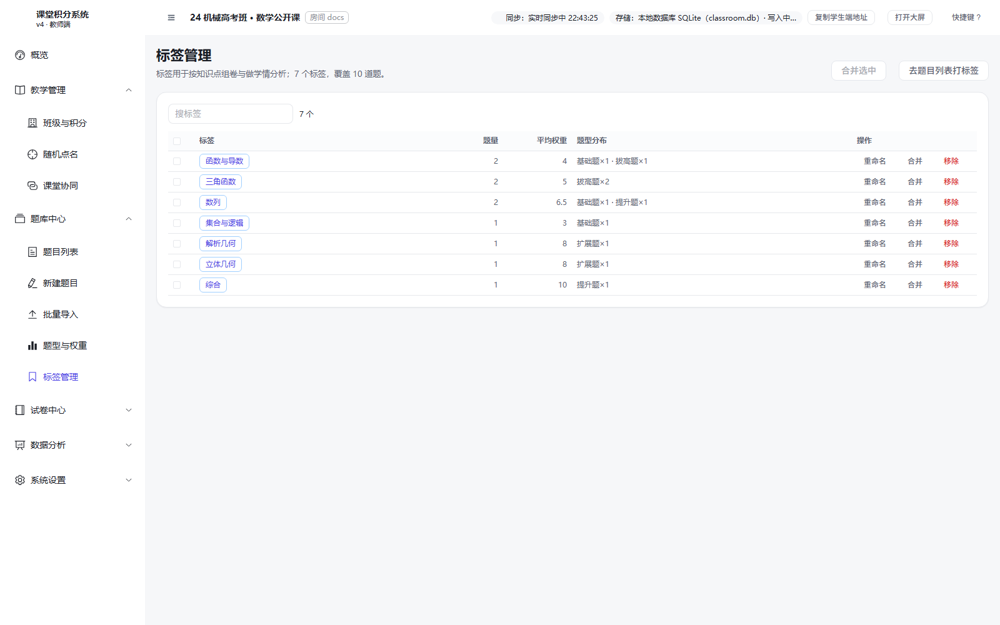

知识点标签与各自的题量统计，用于学情分析里"按知识点归因"。

---

## 5. 试卷中心

### 5.1 试卷列表

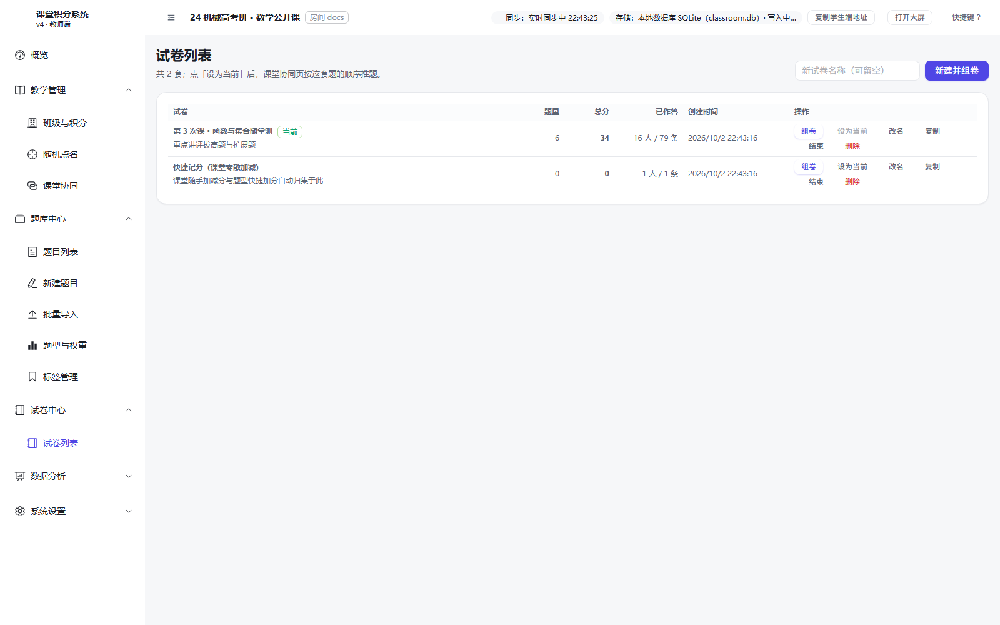

列出每套卷的题量、总分、已作答人数、创建时间。常用操作：「组卷」「设为当前」「改名 / 复制 / 结束 / 删除」。

### 5.2 组卷编辑器

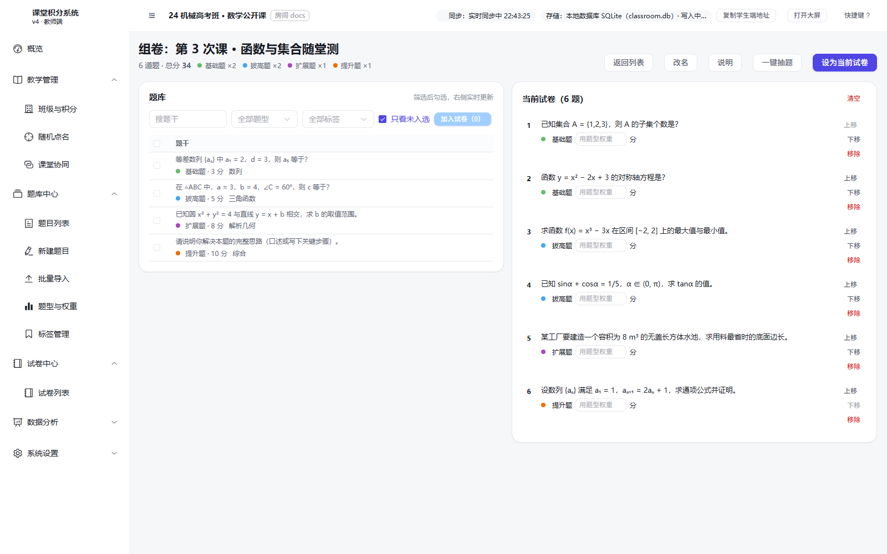

左栏是题库（可按题型 / 标签筛选），勾选后「加入试卷」；右栏是这套卷的题目，可**上移 / 下移 / 移除**调整顺序
（课堂就按这个顺序一题一题走）。还有「一键抽题」按题型随机抽一组题。

### 5.3 一键重测卷（v5 新增）

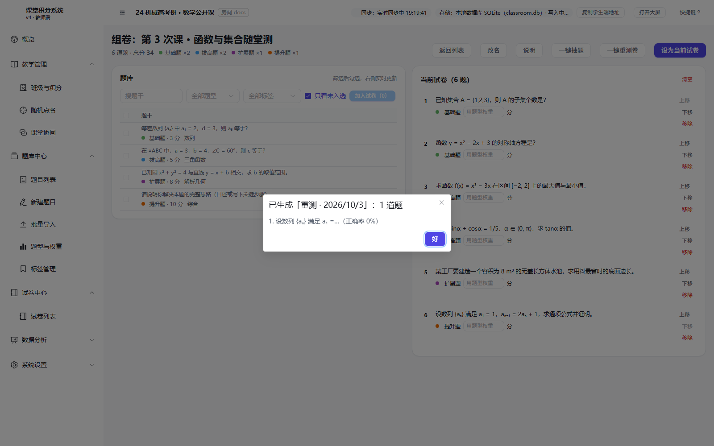

点「一键重测卷」，系统把**答对率低于 35%** 的题单独组成一套新卷（并自动设为当前试卷）。

设计依据写在代码注释里：Roediger & Karpicke (2006) 的**提取练习效应** ——
只做重测不给反馈，一周后回忆率 61%；而重复阅读组读了 14 次也只有 40%。
阈值与形态参照 Kahoot 报告的 Create 功能。

> 注意这是它的**正常行为**：一键重测会把"当前试卷"切到新建的那套空卷上。
> 如果你接着去看学情分析，记得把范围切回原来那套，否则统计会是 0。

---

## 6. 数据分析

### 6.1 学情分析（本页信息量最大，分三段看）

**第一段：能力评价（按题型雷达）**

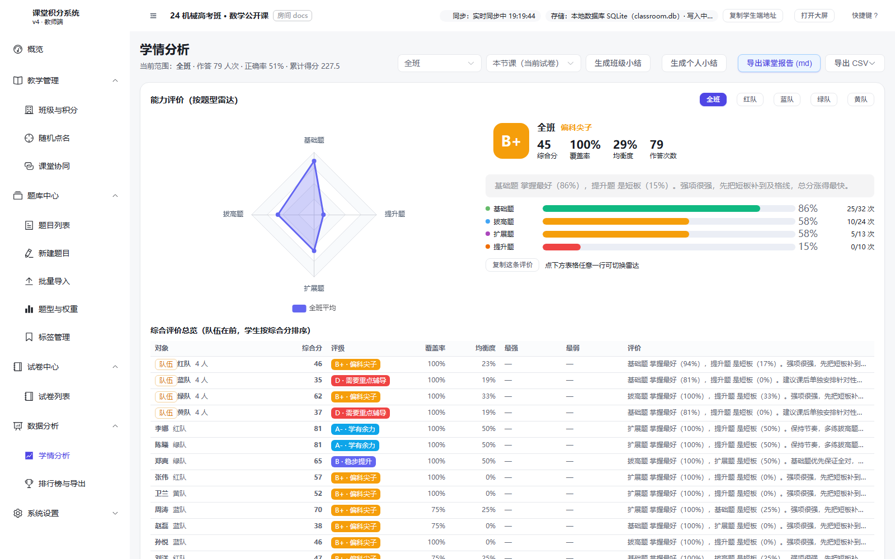

- 左侧雷达图：基础 / 拔高 / 扩展 / 提升四条轴，可切「全班 / 红队 / 蓝队 / 绿队 / 黄队」；
- 右侧大徽章：**综合分 · 覆盖率 · 均衡度 · 作答次数** + 等级（B+ 偏科尖子 等）+ 一句话评语；
- 下面四行是分题型掌握度条（颜色跟着题型走）；
- 「复制这条评价」可把这段话直接发群。

**第二段：综合评价总览 + 图表**

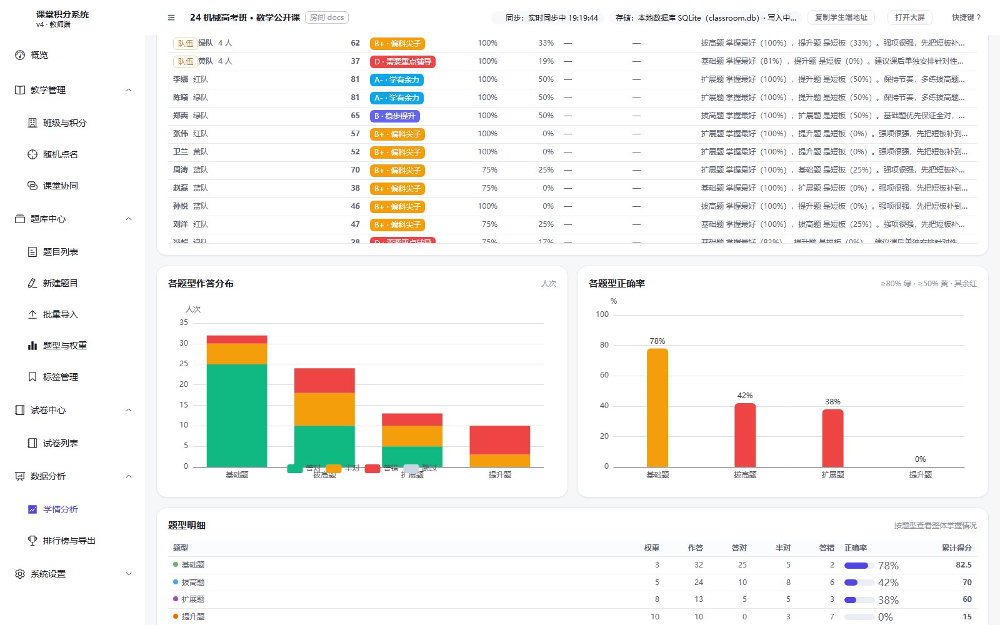

- **综合评价总览**：**队伍在前、学生按综合分排序**，列出综合分 / 评级 / 覆盖率 / 均衡度 / 最强 / 最弱 / 评价；
- **各题型作答分布**（堆叠柱：答对 / 半对 / 答错 / 跳过）与**各题型正确率**（≥80% 绿、≥50% 黄、其余红）；
- **题型明细**表：权重、作答、答对、半对、答错、正确率、累计得分。

**第三段：学生明细 + 个人报告 + 班级小结**

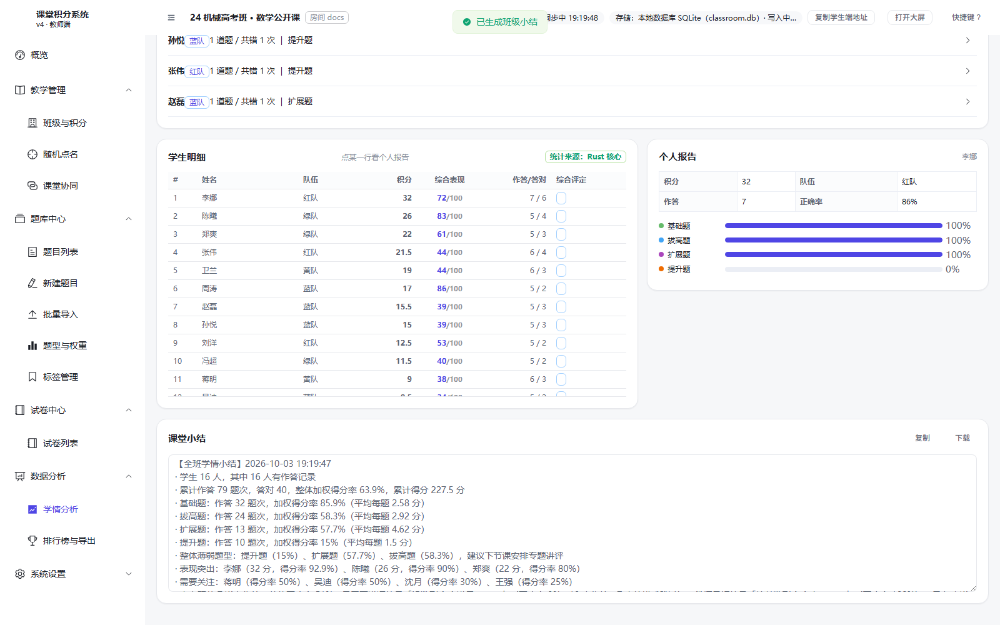

- 标题右侧那枚绿色徽章 **「统计来源：Rust 核心」** 是 v5 新增的：
  统计走的是枢纽的 Rust 实现；万一连不上（比如连的是尚未实现领域端点的旧枢纽），
  会自动回退到本地参考实现并改标「本地参考实现」—— **功能不降级，但口径来自哪里一眼可见**；
- **学生明细**新增 **「综合表现」** 分（如 72/100、83/100），点某一行右侧会切换成该生的**个人报告**（分题型条形图）；
- **课堂小结**：点「生成班级小结」后产出一段可直接发群里的文字：

```
【全班学情小结】2026-10-03 19:05:02
· 学生 16 人，其中 16 人有作答记录
· 累计作答 79 题次，答对 40，整体加权得分率 63.9%，累计得分 227.5 分
· 基础题：作答 32 题次，加权得分率 85.9%（平均每题 2.58 分）
· 拔高题：作答 24 题次，加权得分率 58.3%（平均每题 2.92 分）
· 扩展题：作答 13 题次，加权得分率 57.7%（平均每题 4.62 分）
· 提升题：作答 10 题次，加权得分率 15%（平均每题 1.5 分）
· 整体薄弱题型：提升题（15%）、扩展题（57.7%）、拔高题（58.3%），建议下节课安排专题讲评
· 表现突出：李娜（32 分，得分率 92.9%）、陈曦（26 分，得分率 90%）、郑爽（22 分，得分率 80%）
· 需要关注：蒋明（得分率 50%）、吴迪（得分率 50%）、沈月（得分率 30%）、王强（得分率 25%）
```

注意它是**先给结论再给依据**：整体得分率 → 分题型拆解 → 直接点名"哪几个题型该讲"→ 谁突出、谁需要关注。
右上角还有「复制」「下载」，以及「生成个人小结」「导出课堂报告 (md)」「导出 CSV」。

> 判定"薄弱/优势"用的是**正确率阈值 + 最少样本数**（默认 <60% 薄弱、>85% 优势、至少 5 次作答才算数）——
> 少于 5 题样本的分类极不稳定，所以明确不参与评级（表格里"样本不足"的学生就是这么被排除的）。

### 6.2 排行榜与导出

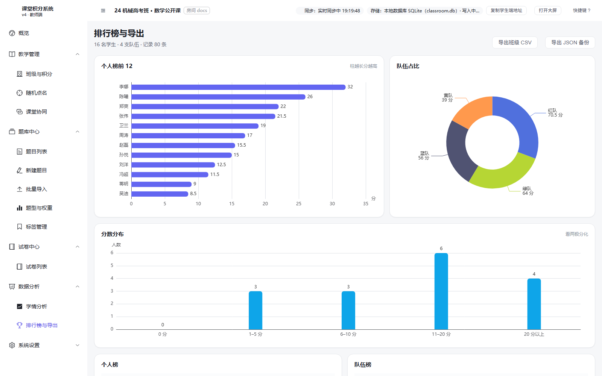

- **个人榜**：按积分排序，带能力画像标签；
- **队伍榜**：总分与人均分；
- 「导出班级 CSV」「导出 JSON 备份」；
- 危险操作区：「清空分数」只清分、「恢复初始状态」连试卷一起清。

> 大屏上看不到个人排名（v5 起刻意去掉），但教师端这里保留 ——
> 老师需要知道谁需要关注，**不需要让全班看到**。

---

## 7. 系统设置

### 7.1 存储与备份

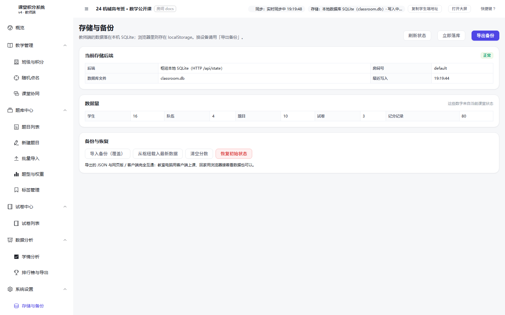

这一页回答"我的数据在哪、丢不丢"：后端是本地 SQLite、数据库文件完整路径、最近写入时间，
以及学生 / 队伍 / 题目 / 试卷 / 记分记录条数。操作有「刷新状态」「立即落库」「导出备份」，
下方可「导入备份（覆盖）」「从枢纽载入最新数据」「清空分数」「恢复初始状态」。

### 7.2 组网（EasyTier）


学生手机与教师机**不在同一个 WiFi** 时用这个：填网络名 / 网络密钥 / 共享节点，点「一键组网」。
「上课前自检」会检查端口、防火墙、网卡地址这些容易踩的坑。

### 7.3 房间与大屏


- **房间号**：多端协同的房间，改完「保存并重连」；
- **大屏地址**：`/stage?room=<房间号>`，可复制或直接打开；
- **学生端地址**：`/join?room=<房间号>`。

> 房间号的作用：同一台教师机上可以并存多个课堂（不同班级）而互不干扰。

### 7.4 关于与文档


显示外壳（浏览器 / Tauri 桌面）、存储后端、房间号、枢纽地址、**报文协议版本**、
本地数据版本（schema v… · rev …）与课程名。排查"学生端连不上"时先看这一页。

### 7.5 键盘快捷键

按 **`?`** 呼出：


| 快捷键 | 作用 |
| --- | --- |
| `Alt + 1…6` | 跳转到 班级 / 点名 / 课堂协同 / 题库 / 试卷 / 学情 |
| `1 / 2 / 3 / 4` | 点名页判分：答对 / 半对 / 答错 / 跳过 |
| `空格` | 课堂协同页：公布答案 / 收起 |
| `Alt + ← / →` | 课堂协同页：上一题 / 下一题 |
| `?` | 打开本面板 |

设计意图很明确：**上课时手不离键盘**，判分不用去够鼠标。

---

## 8. 一节课的最短路径（照做即可）

1. 「班级与积分」→ 批量添加学生，选队伍；
2. 「题库中心 → 批量导入」→ 粘贴题目；
3. 「试卷中心 → 新建并组卷」→ 勾题 → 设为当前；
4. 「课堂协同」→ 打开大屏 + 把二维码投给学生 → 看签到；
5. 选当前题 → 「开始接收学生作答」；
6. 学生答题；客观题自动判分，主观题在「待确认提交」里点一下；
7. 「公布答案」（空格）→ 下一题；
8. 「学情分析」→ 生成班级小结；需要补练就点「一键重测卷」。

---

## 9. 实测记录

```powershell
node tests/shots-docs.js --only=teacher    # 25 张
```

- 驱动方式：无头 Chrome + CDP，**按按钮文字真实点击**（不是调后门接口），逐页截图；
- 枢纽：`ci-hub-server`（Rust 核心），隔离数据目录 + 空闲端口，不碰仓库的 `data/`；
- 结果：**25 张截图，页面错误 0 条**。

### 实测踩到的一个"看起来像 bug"的顺序问题

| 现象 | 原因 | 说明 |
| --- | --- | --- |
| 学情分析里「各题型作答分布 / 正确率 / 题型明细」全是 0 | 上一页点的「一键重测卷」把**当前试卷**切到了新建的空卷上，而统计范围默认是"本节课（当前试卷）" | **不是缺陷**，是重测卷的正常行为；截图脚本在拍完重测卷后会**切回原试卷**再拍学情分析 |

> 这条容易被误判成"统计坏了"，所以写进文档；使用时只要把范围切回原来那套卷即可。
