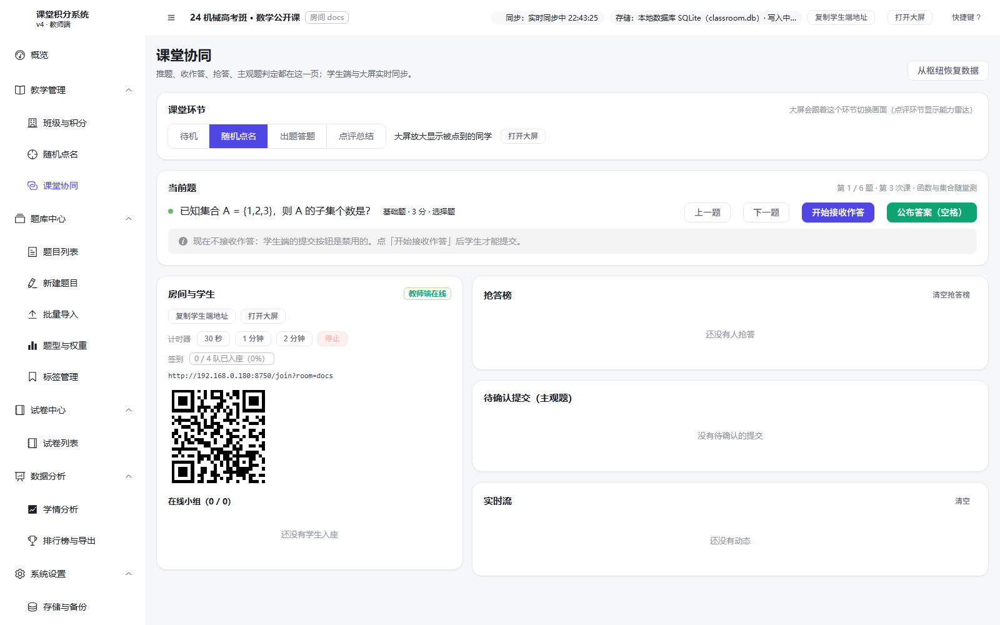
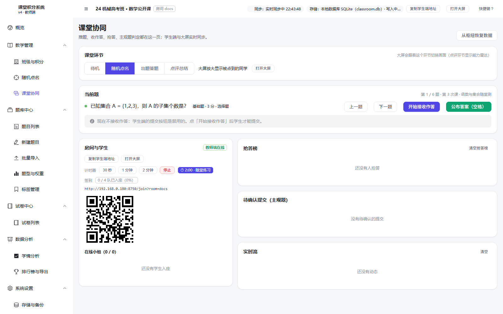
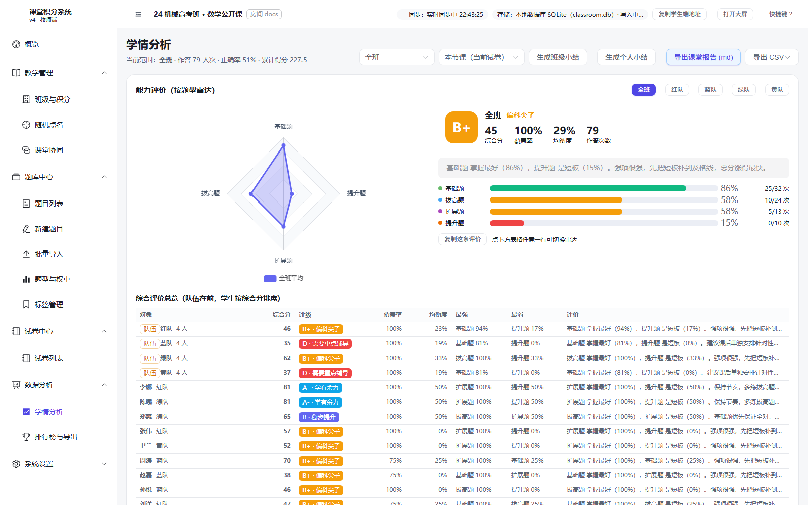
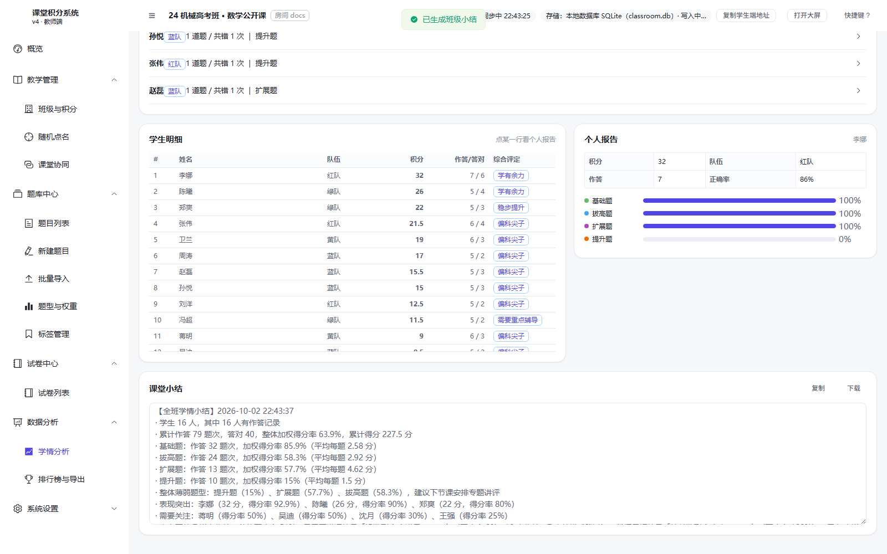
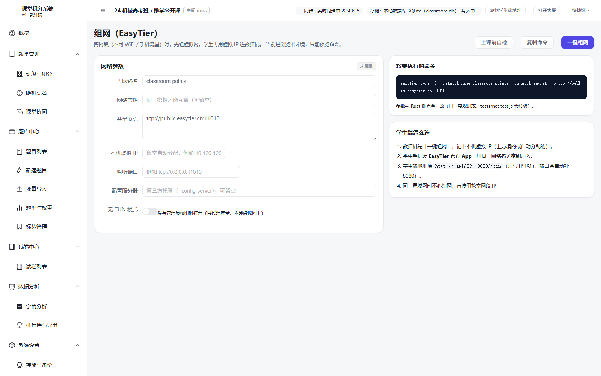
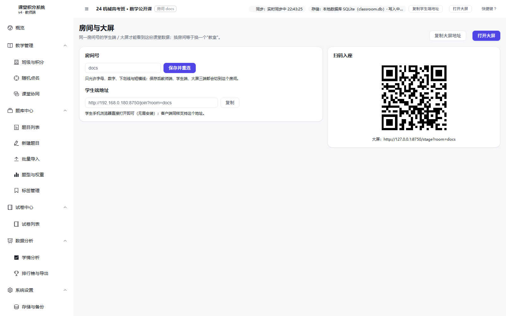
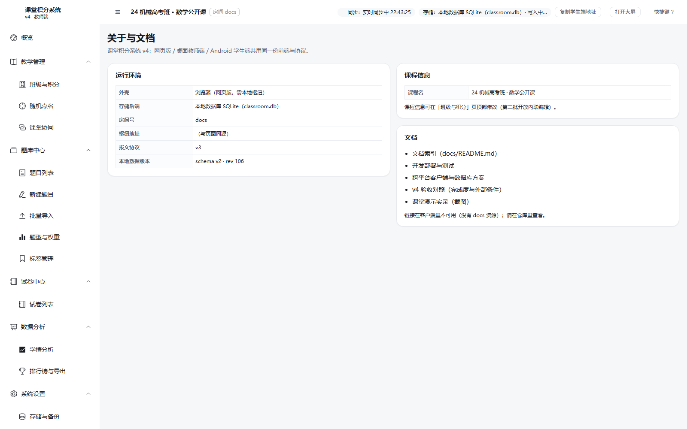
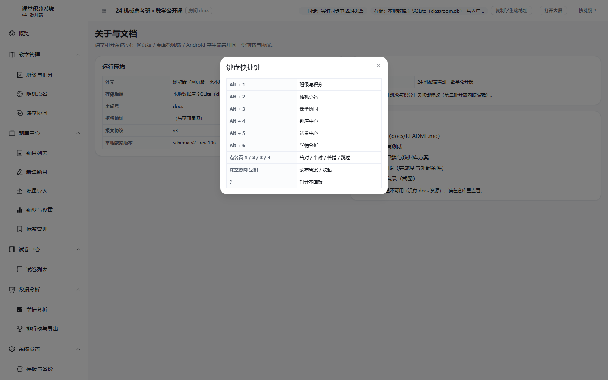

# 教师端界面 · 完整说明文档

> 适用版本：v5（Vue 3 + Element Plus 新版界面，枢纽挂在 `/next/` 下）
> 打开地址：<http://localhost:8080/next/admin.html>
> 本文所有截图均由 `node tests/shots-docs.js --only=teacher` 在**真实运行的界面**上自动产出，
> 数据为模拟数据（4 支队 / 16 名学生 / 10 道题 / 1 套卷 / 79 条作答记录）。

---

## 0. 一句话认识教师端

教师端是整堂课**唯一的写入者**：只有它能改名单、改题库、记分、点名、控制课堂环节；
学生端与大屏都是只读的展示端（学生端只能"提交"，不能自己加分）。

顶栏常驻四个关键信息，一眼就能判断课堂是否正常：

| 顶栏元素 | 含义 | 正常表现 |
| --- | --- | --- |
| 课程名 | 当前课程 | 你设置的课程名 |
| 房间 | 多端协同的房间号 | 与二维码里的房间一致 |
| 同步 | 与本地枢纽的连接状态 | 「实时同步中 hh:mm:ss」 |
| 存储 | 数据落在哪里 | 「本地数据库 SQLite（classroom.db）」 |


概览页把一节课拆成四步进度：**建名单 → 建题库 → 组一套卷 → 开始上课**。
已完成的一步显示名字与数量（16 名学生 · 4 支队伍 / 10 道题 · 7 个标签 / 2 套试卷），
未完成的一步给出下一步动作提示，点右上角按钮可直接跳过去。

---

## 1. 教学管理

### 1.1 班级与积分

名单是后面一切的前提：**队伍就是学生端的"入座身份"**，学生扫码后选的就是这里建好的队伍。


页面分三层：

1. **队伍卡片**：每队一张卡，显示队名、总积分、人数；「新增队伍」加队，卡片上的「改名 / 删除」改队。
2. **学生表格**：姓名、队伍、积分、被点次数、**快捷加分**按钮组、以及右侧一排操作。
3. **底部操作**：「撤销上一条」「清空全部记分」「批量添加学生」。

#### 操作步骤：批量添加学生

1. 点右上角 **「批量添加学生」**；
2. 在「名单」框里粘贴学生姓名，**空格 / 逗号 / 换行分隔都认**；
3. 选择「加入队伍」；
4. 点「添加」。


> 上课前建名单是最省事的一步：从 Excel 里复制一列姓名直接粘贴即可。

#### 操作步骤：查看某个学生的记分明细

表格右侧点 **「明细」**，右侧抽屉里是这名学生的**逐条记分流水**（哪道题、什么判定、加了几分、谁操作的）。


#### 表格上每个操作做什么

| 操作 | 说明 |
| --- | --- |
| 快捷加分 | 点四个题型按钮之一，等于"该生该题型答对"，按权重直接加分（基础 +3 / 拔高 +5 / 扩展 +8 / 提升 +10） |
| 调整 | 手动加减分。**有上下限**（单次 +2 封顶、−1 下限），防止"谁话多谁分高"导致积分通胀 |
| 清零 | 只清这个学生的分，保留他的答题历史 |
| 明细 | 看逐条流水，可单条删除 |
| 改名 / 调队 / 删除 | 维护名单 |
| 撤销上一条 | 记错了不用慌，按时间倒着撤 |
| 清空全部记分 | 保留名单与题库，只清分数 |

### 1.2 随机点名

点名的目的不是"抽人"，而是**抽完立刻判分**，所以判分按钮就在名字下面。


| 区域 | 作用 |
| --- | --- |
| 中央大字 | 被点到的学生（先滚动动画，再定人），下面显示所属队伍、当前积分、已被点次数 |
| 判分按钮 | 答对 1 / 半对 2 / 答错 3 / 跳过 4 —— **键盘数字键直接按**，不用鼠标 |
| 按题型加分 | 不走题库时的快捷方式：点一下 = 该生该题型答对 |
| 右侧点名设置 | 候选范围（全班 / 指定队）、抽取策略、避免重复 |
| 本论点名顺序 | 本轮已经点过谁，一目了然 |

**三种抽取策略**（可用调研结论解释，不是随手写的）：

- **均匀（未点过的优先）**——默认。一轮之内不重复点同一个人，保证覆盖面；
- **最少被点优先**——拉平被点次数，适合"总有人没被点过"的班；
- **纯随机**——真随机，可能重复。

「避免重复」开关可跳过**当前题已经作答过的学生**，避免"点了已经答过的人"这种尴尬。

### 1.3 课堂协同（教师端的指挥台）

这一页是上课时一直开着的页面，上下两栏：**上面控制作答，下面看反馈**。



#### 四个课堂环节

大屏会跟着环节自动切屏，这是"老师不用管大屏"的关键：

| 环节 | 大屏显示什么 |
| --- | --- |
| 待机 | 超大二维码 + 房间号，等学生入座 |
| 随机点名 | 放大显示被点到的同学 |
| 出题答题 | 题干 + 四色选项块 |
| 点评总结 | 各队答对情况 + 能力雷达 + 讲评建议 |

#### 上课的完整操作顺序

1. **选中当前题**（「上一题 / 下一题」或从试卷里点）；
2. 点 **「开始接收学生作答」**（不点这个，学生提交会被忽略）；
3. 需要限时的话点 **30 秒 / 1 分钟 / 2 分钟** 起倒计时；
4. 学生答题 → 客观题**自动判分**，主观题落进「待确认提交」；
5. 主观题点「答对 / 半对 / 答错 / 丢弃」一键判定；
6. 点 **「公布答案」**（或按**空格**）→ 学生端与大屏同时显示答案；
7. 下一题，重复。



#### 下栏三块反馈

- **在线小组 / 签到**：哪几支队已经入座（截图里「签到 3/4」= 4 支队到了 3 支）；
- **抢答榜**：学生点「⚡ 抢答」后的顺序，前几名一目了然；
- **实时流**：每一次记分的文字流水（"张伟 答对（+3）"），可清空。

还有两个兜底按钮：**「从枢纽恢复数据」**（教师机换了设备，从枢纽把课堂数据拉回来）和 **「打开大屏」**。

---

## 2. 题库中心

### 2.1 题目列表


支持按题干搜索、按题型与标签筛选、排序；可勾选后「批量删除」，或把选中的题「加入试卷」；
「导出题库」导出为 JSON。

### 2.2 新建题目


| 字段 | 说明 |
| --- | --- |
| 题干 | 必填 |
| 题型 | 基础 / 拔高 / 扩展 / 提升 —— **决定这道题值多少分**（+3 / +5 / +8 / +10） |
| 作答方式 | 自动识别 / 选择题 / 填空题 / 主观题。选"自动"时，填了选项就按选择题判、没选项就按填空判 |
| 选项 | 选择题的选项，一行一个 |
| 参考答案 | 客观题用于**自动判分**；主观题留空，交给老师「待确认」判定 |
| 标签 | 知识点，用于学情分析按知识点归因 |
| 单独分值 | 覆盖题型权重，只对这一道题生效 |
| 来源 / 备注 | 备注会作为"讲评要点"，**公布答案后**才下发给学生端 |

### 2.3 批量导入


三种格式（点「填入示例」直接看例子）：

```
填空题/主观题：  题干 | 答案
选择题：        题干 | 选项1 ; 选项2 ; 选项3 | 答案字母
```

可以「下载模板」「读取文件」或直接粘贴文本，右侧**实时预览**解析结果（题型、答案、是否可自动判分）确认无误再「导入」。
默认会**按题干去重**。

### 2.4 题型与权重


这是"分值政策"页。默认四档：

| 题型 | 默认权重 | 定位 |
| --- | --- | --- |
| 基础题 | **+3** | 课本概念与常规运算，面向全体 |
| 拔高题 | **+5** | 综合应用，需要两步以上推理 |
| 扩展题 | **+8** | 跨章节综合或建模，考查迁移能力 |
| 提升题 | **+10** | 压轴/竞赛级，挑战思维上限 |

权重、颜色、说明都可改，也可以「新增题型」。页面下方还列了四档判定（答对 / 半对 / 答错 / 跳过）的说明。

> **半对怎么算分**：按"部分正确系数"折算（默认 0.5，可在「设置」里改）。
> **答错扣不扣分**：默认不扣；打开后按设定值扣。这两条都在全局设置里，是课程政策而非写死的规则。

### 2.5 标签管理


知识点标签与各自的题量统计，用于学情分析里"按知识点归因"。

---

## 3. 试卷中心

### 3.1 试卷列表


列出每套卷的题量、总分、已作答人数、创建时间。常用操作：「组卷」进编辑器、「设为当前」（决定课堂按哪套卷推进）、
「改名 / 复制 / 结束 / 删除」。

### 3.2 组卷编辑器


左栏是题库（可按题型 / 标签筛选），勾选后「加入试卷」；右栏是这套卷的题目，可**上移 / 下移 / 移除**调整顺序
（课堂就按这个顺序一题一题走）。还有「一键抽题」按题型随机抽一组题，以及「设为当前试卷」。

---

## 4. 数据分析

### 4.1 学情分析



先选**统计范围**（全班 / 某一队）+ **课次范围**（本节课（当前试卷）/ 全部课次），然后：

| 表格 | 看什么 |
| --- | --- |
| 题型维度 | 每个题型的作答数、答对/半对/答错、**正确率**、累计得分 —— 一眼看出哪个题型是短板 |
| 每题正确率 | 每道题的正确率、掌握度、需要关注的学生名单 |
| 学生掌握度 | 每个学生的积分、作答/答对、综合评定 |

点 **「生成班级小结」**会产出一段可直接发群里的文字总结：



实测产出（模拟数据）：

```
【全班学情小结】2026-10-02 22:43:37
· 学生 16 人，其中 16 人有作答记录
· 累计作答 79 题次，答对 40，整体加权得分率 63.9%，累计得分 227.5 分
· 基础题：作答 32 题次，加权得分率 85.9%（平均每题 2.58 分）
· 拔高题：作答 24 题次，加权得分率 58.3%（平均每题 2.92 分）
· 扩展题：作答 13 题次，加权得分率 57.7%（平均每题 4.62 分）
· 提升题：作答 10 题次，加权得分率 15%（平均每题 1.5 分）
· 整体薄弱题型：提升题（15%）、扩展题（57.7%）、拔高题（58.3%），建议下节课安排专题讲评
· 表现突出：李娜（32 分，得分率 92.9%）、陈曦（26 分，得分率 90%）、郑爽（22 分，得分率 80%）
· 需要关注：蒋明（得分率 50%）、吴迪（得分率 50%）、沈月（得分率 30%）、王强（得分率 25%）
```

注意它是**先给结论再给依据**：整体得分率 → 分题型拆解 → 直接点名"哪几个题型该讲"→ 谁表现突出、谁需要关注。
老师可以原样复制到班级群，不需要自己再组织语言。
右上角还有「复制」「下载」，以及「生成个人小结」「导出课堂报告 (md)」「导出 CSV」。

> 判定"薄弱/优势"用的是**正确率阈值 + 最少样本数**（默认 <60% 为薄弱、>85% 为优势、至少 5 次作答才算数）——
> 少于 5 题样本的统计极不稳定，所以明确不参与评级（截图里"样本不足"的学生就是这么被排除的）。

### 4.2 排行榜与导出


- **个人榜**：按积分排序，带能力画像标签（A+ 学有余力 / B+ 偏科尖子 / D 需要重点辅导 …）；
- **队伍榜**：总分与人均分；
- 「导出班级 CSV」「导出 JSON 备份」；
- 危险操作区：「清空分数」只清分、「恢复初始状态」连试卷一起清。

---

## 5. 系统设置

### 5.1 存储与备份


这一页回答"我的数据在哪、丢不丢"：

- **后端**：`本地数据库 SQLite（classroom.db）`；
- **数据库文件**：完整路径；
- **最近写入**：时间戳，以及是否已落库；
- **数据量**：学生 / 队伍 / 题目 / 试卷 / 记分记录条数。

操作：「刷新状态」「立即落库」「导出备份」；下方可「导入备份（覆盖）」「从枢纽载入最新数据」「清空分数」「恢复初始状态」。

> 为什么断电最多只丢 1 秒：教师端每次改动都会推给枢纽并写库，浏览器 `localStorage` 只是兜底。

### 5.2 组网（EasyTier）



学生手机与教师机**不在同一个 WiFi** 时用这个：填网络名 / 网络密钥 / 共享节点，点「一键组网」，
学生设备加入同一个虚拟网后就能直连。「上课前自检」会检查端口、防火墙、网卡地址这些容易踩的坑。

### 5.3 房间与大屏



- **房间号**：多端协同的房间，改完「保存并重连」；
- **大屏地址**：`/stage?room=<房间号>`，可「复制大屏地址」「打开大屏」；
- **学生端地址**：`/join?room=<房间号>`，可复制。

> 房间号的作用：同一台教师机上可以并存多个课堂（不同班级）而互不干扰。

### 5.4 关于与文档



显示外壳（浏览器 / Tauri 桌面）、存储后端、房间号、枢纽地址、**报文协议版本**、本地数据版本（schema v… · rev …）与课程名。
排查"学生端连不上"时，先看这一页的枢纽地址与协议版本。

### 5.5 键盘快捷键

按 **`?`** 呼出：



| 快捷键 | 作用 |
| --- | --- |
| `Alt + 1…6` | 跳转到 班级 / 点名 / 课堂协同 / 题库 / 试卷 / 学情 |
| `1 / 2 / 3 / 4` | 点名页判分：答对 / 半对 / 答错 / 跳过 |
| `空格` | 课堂协同页：公布答案 / 收起 |
| `Alt + ← / →` | 课堂协同页：上一题 / 下一题 |
| `?` | 打开本面板 |

设计意图很明确：**上课时手不离键盘**，判分不用去够鼠标。

---

## 6. 一节课的最短路径（照做即可）

1. 「班级与积分」→ 批量添加学生，选队伍；
2. 「题库中心 → 批量导入」→ 粘贴题目；
3. 「试卷中心 → 新建并组卷」→ 勾题 → 设为当前；
4. 「课堂协同」→ 打开大屏 + 把二维码投给学生 → 看签到；
5. 选当前题 → 「开始接收学生作答」；
6. 学生答题；客观题自动判分，主观题在「待确认提交」里点一下；
7. 「公布答案」（空格）→ 下一题；
8. 「学情分析」→ 生成班级小结。

---

## 7. 实测记录

本轮文档的全部截图都是**真跑出来的**，驱动脚本见 [tests/shots-docs.js](../../tests/shots-docs.js)：

```powershell
node tests/shots-docs.js --only=teacher    # 22 张
```

- 驱动方式：无头 Chrome + CDP，**按按钮文字真实点击**（不是调后门接口），逐页截图；
- 模拟数据：4 支队 / 16 名学生 / 10 道题（含选择、填空、主观）/ 1 套 6 题试卷 / 79 条作答记录；
- 结果：**22 张截图，页面错误 0 条**。

### 实测发现并修复的问题

| 问题 | 现象 | 根因 | 处理 |
| --- | --- | --- | --- |
| **「生成班级小结」完全没反应** | 点按钮后既没有文字，也没有任何提示；「复制 / 下载」始终是灰的 | `AnalysisPage.vue` 里 `CI.analysis.summarizeClass(...).join('\n')` —— 但该函数返回的是**对象** `{title, lines, text, stats}` 而不是数组，`.join` 抛 `TypeError`，把整段处理函数打断（连后面那句"已生成"提示都执行不到） | 已修：改成读 `res.text`（并对数组/字符串做兼容），与 `summarizeStudent` 的写法保持一致 |
| 当前试卷恒为"未选择" | 概览显示「当前试卷 未选择」、课堂协同进度恒为 0/0 | `web/src/shared/class-store.ts` 调用 `CI.store.quiz(state)` 时**漏传了 `currentQuizId`**，选择器收到 `undefined` 永远返回 null | 已修：补上 `state.value.currentQuizId` |

> 这两个问题都是"**类型检查不会报、单测也没覆盖**"的那一类：
> 前者参数是可选的、后者是可选参数传漏 —— 只有把界面真跑起来、真点一下才会暴露。
> 尤其第一个：**学情小结是这个系统对外宣传的核心功能之一，在新版界面里却完全不可用**。
