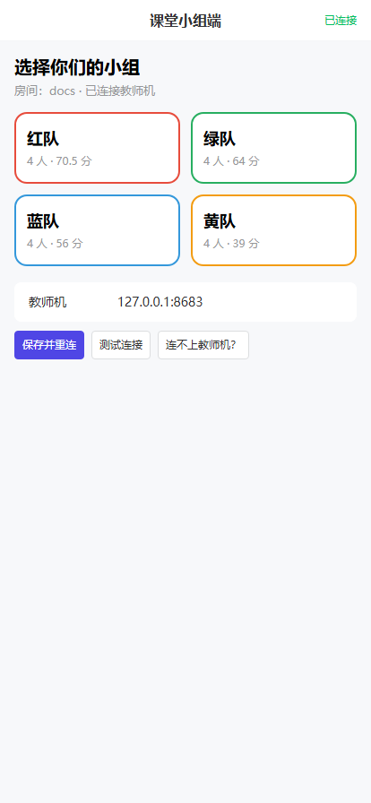
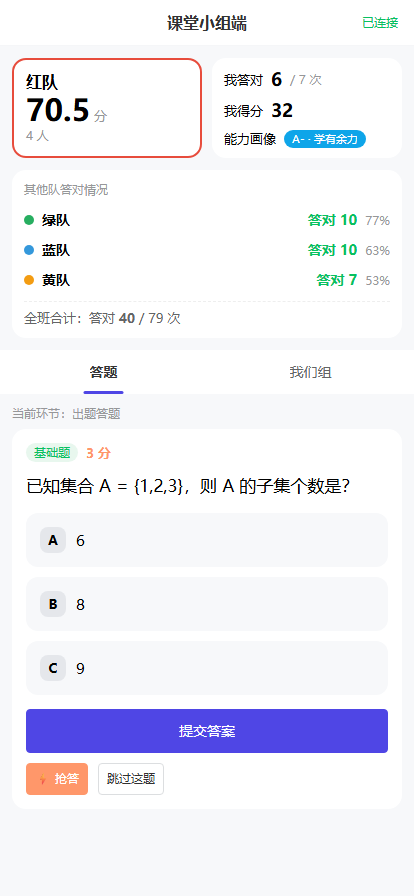
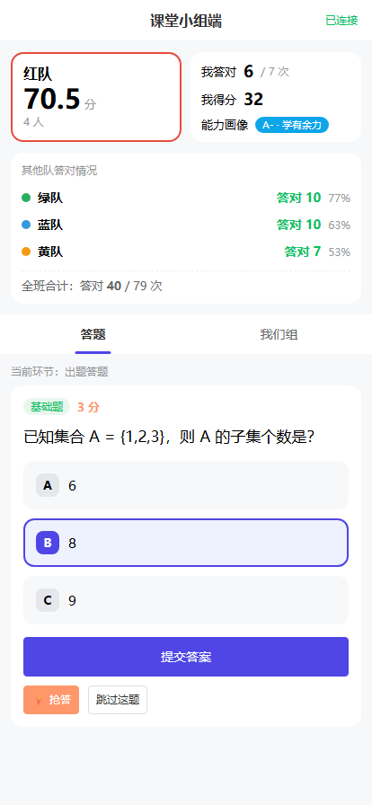
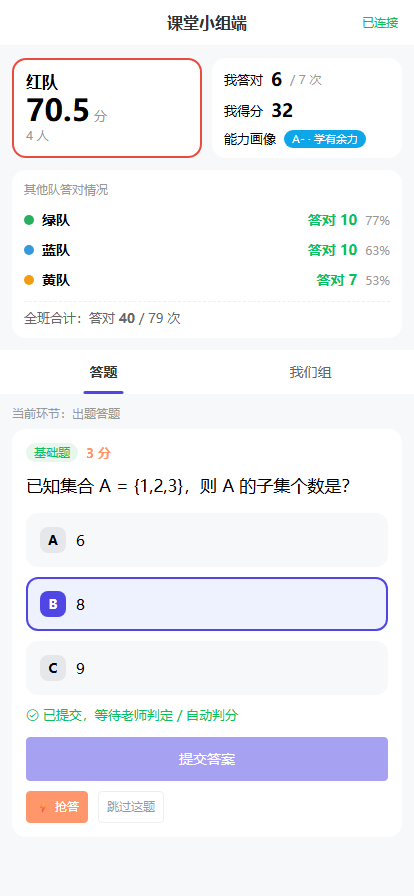
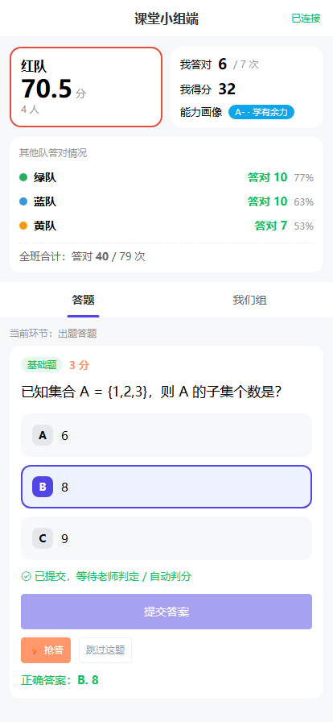
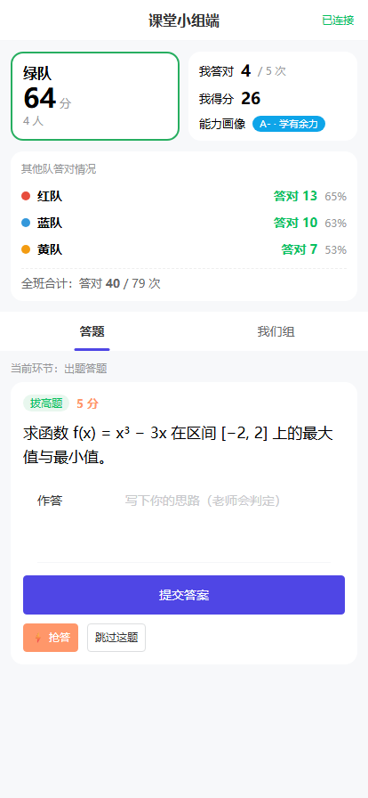
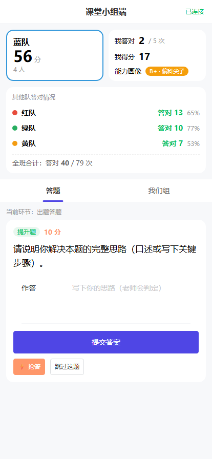
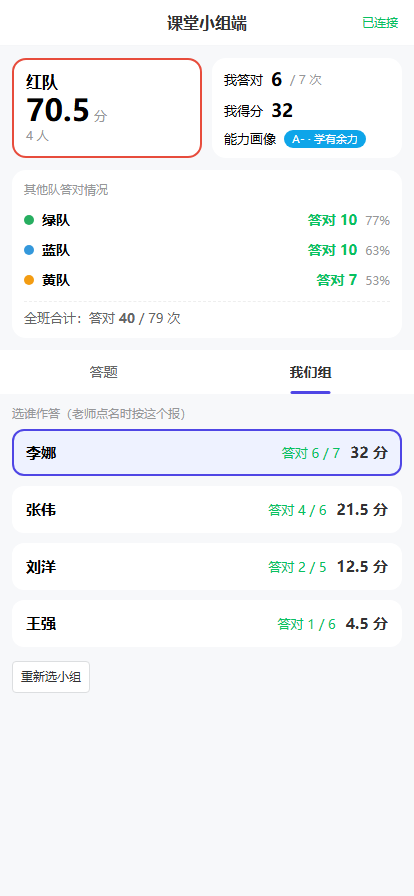
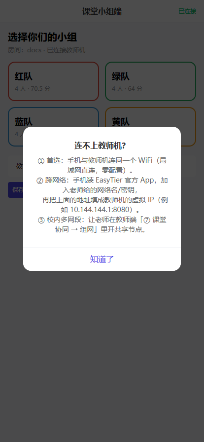
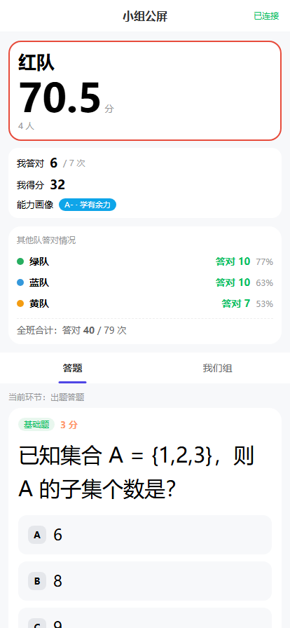

# 学生端界面 · 完整说明文档

> 适用版本：**v5**（Vue 3 + Vant，移动优先；网页版与安卓客户端共用同一套界面）
> 打开地址：`http://<教师机IP>:8080/join?room=<房间号>`（`/s`、`/student` 等价）
> 最省事的进入方式：**扫教师端「课堂协同」页上的二维码**，房间号会自动带上。
> 本文截图由 `node tests/shots-docs.js --only=student` 在真实界面上产出（414×896 手机视口）。

---

## 0. 一句话认识学生端

学生端是**无状态客户端**：它不存课堂数据，只做两件事 —— **渲染老师推过来的最新快照**，
和**把本组的动作发回去**。所以刷新页面、手机换人、锁屏回来，都不需要"恢复"，重新入座即可。

界面上所有"我答对多少 / 我得了多少分 / 其他队答对多少"都是**教师端算好放在快照里**的，
学生端只负责显示 —— 这也是它轻到 238 KB（gzip 85 KB）、老旧手机也跑得动的原因。

> v5 之后，**网页版和安卓 App 是同一套界面**，截图两边通用；差异只在"怎么进入"和"壳提供了什么"。

---

## 1. 第一步：入座

学生打开链接后看到的是**选择小组**页：



| 元素 | 说明 |
| --- | --- |
| 房间 | 当前房间号；右上角显示「已连接 / 未连接」 |
| 队伍卡片 | 每队一张卡，显示**队名、人数、当前积分** —— 学生按自己队伍的卡片点一下即入座 |
| 教师机 | 手输教师机地址（见 §5） |

> **不需要注册、不需要登录、不需要装 App**。选队伍就是"入座"，一支队共用一台设备也可以。

选好队伍后立刻进入答题页：



---

## 2. 答题页（默认标签页）

页面自上而下四块：

### 2.1 我们组的成绩卡

左侧是本队（队名、**当前积分**、人数），右侧是"我"：

- **我答对** 6 / 7 次 —— 本轮课堂的个人正确数；
- **我得分** 32 —— 个人积分；
- **能力画像** A+ · 学有余力 —— 由教师端按题型覆盖率与均衡度算好的评级。

### 2.2 其他队答对情况

其他各队"答对几题 / 正确率百分比"，底部是全班合计。
这是**课堂竞争感**的来源，同时不会泄露别人答了什么。

### 2.3 当前题卡片

老师推题后，这里出现题目：

| 元素 | 说明 |
| --- | --- |
| 题型标签 | 拔高题（颜色跟着教师端设置的题型颜色走） |
| 分值 | 5 分 —— 该题按题型权重折算的分值 |
| 作答方式 | 选择题 / 填空题 / 主观题 |
| 题干 | 题目正文 |

### 2.4 作答与提交

**选择题**：点选项即选中（再点取消），确认后点「提交答案」。



**提交反馈**：提交后按钮禁用并显示「已提交，等待老师判定 / 自动判分」。


> 同一题**重复提交会被忽略**（防重复计分）—— 学生狂点也不会重复加分。

**抢答**：点「⚡ 抢答」把本队排进抢答队列，教师端「抢答榜」立刻出现本队，**抢答顺序即显示顺序**。



> ⚠️ **实测发现的体验缺口**：上面这张截图和「已提交」那张**一模一样** —— 这不是截图失误，
> 而是真实现象：**新版学生端点抢答后，界面上没有任何变化**。追下去是两层原因：
> 1. `assets/js/student.js` 的 `buzz()` 只把命令发出去，**没有更新本地 `buzzed` 状态**，
>    所以按钮不会置灰、页面上也不会留下"我已抢答"的痕迹；
> 2. 它接着调用的 `toast('已抢答！')` 写的是**旧版 DOM**（`var t = $('toast'); if (!t) return;`），
>    而 Vue 界面里根本没有 `#toast` —— 于是 `toast()` **静默返回**，连那 2 秒提示都没有。
>
> 服务端是好的，**反证如下**（同一次操作，教师端立刻收到了）：
>
> 
>
> 而且 `classroom.js` 的 `addBuzz()` 按 `teamId + qid` **去重**，狂点也不会刷榜 ——
> 所以不会记错分，只是学生"不知道点上了没有"，课堂上很容易反复戳。
>
> 建议修法：抢答成功后把 `buzzed` 落到本地状态、按钮置为"已抢答"。

**跳过这题**：不会作答时点它，教师端记为"跳过"（默认不加分也不扣分）。

**老师还没开始接收作答**时，按钮是禁用的，并明确提示 —— 避免学生以为"交了没反应"。

### 2.5 公布答案

老师点「公布答案」后，学生端显示正确答案：



主观题还会额外显示 **💡 讲评要点**（教师端"备注"字段）—— 这是"反馈三件套"的第三件：
对错之外，还告诉学生**为什么**。

---

## 3. 填空题与主观题

**填空题**：一个输入框，提交后与参考答案**归一化比对**（忽略首尾空格、全角半角差异），答对自动加分。



**主观题**（口述 / 写思路）：多行文本域，提交后不会自动判分，而是进入教师端「待确认提交」，
由老师点「答对 / 半对 / 答错」判定。



> 这样设计的理由：主观题无法可靠自动判分，与其做不准的 AI 判分，不如让老师一键判定（一次点击的成本很低）。

---

## 4. 我们组

切到「我们组」标签页：



- **选谁作答**：点组员名字把它设为"当前作答人"。老师点名时，学生按这个报名字即可对上；
- 组员列表显示每人的 **答对 / 作答次数** 与 **个人积分**；
- 底部「重新选小组」可以换队（换错了不用刷新页面）。

---

## 5. 连不上教师机怎么办

学生端把"排障"做进了界面，而不是让学生去问老师。

### 5.1 手输教师机地址

未入座时页面下方就有输入框：


- 地址写法很宽容：**只写 IP 也行**，会自动补 `:8080`；写 `192.168.0.180:8080` 也行；
- 「保存并重连」→ 存下来并立即重连；
- 「测试连接」→ 立刻探测教师机是否在线，给一句人话结论。

> **本轮实测修掉的一个真 bug**：Vue 界面把输入框的值作为参数传给 `CIStudent.saveHost(v)`，
> 但领域层的 `saveHost()` **不接参数**，而是去读旧版 DOM 的 `#hubInput` ——
> Vue 界面里没有这个元素，于是**学生填了 IP、点保存、地址却存成空字符串**：
> 看起来"点了没反应"，实际上永远不会连上，而且界面上没有任何报错。
> 已修（优先用传入值，旧 DOM 只作兜底），并用安卓客户端**实测走通了完整连接**。

### 5.2 自助指引

点「连不上教师机？」弹出：



指引覆盖了实际课堂上最常见的原因：是否同一个 WiFi、地址该用哪一条、防火墙是否放行、跨网段要不要组网。

---

## 6. 小组公屏（`?view=board`）

给平板 / 备用机用的**放大模式**：地址后面加 `&view=board`，页面切到"小组公屏"，
只保留大字号的组内信息，适合把平板挂在墙上当小组显示屏。



---

## 7. 学生端的设计取舍

| 取舍 | 原因 |
| --- | --- |
| **无状态**，不存课堂数据 | 移动端兼容性与存储成本：不用 IndexedDB，不做离线冲突合并；刷新即重新入座 |
| 移动优先（Vant） | 答题卡、Popup、Tabbar、Toast 都是现成的移动端手感；点击区域按手指尺寸放大 |
| 只发命令、不自己算分 | 计分规则只有一份（在 Rust 核心），学生端改不了分，也吵不起来 |
| 不显示个人排名 | 只显示"我们组"和"其他队答对情况"，避免公开处刑；个人数据只在组内可见 |

---

## 8. 实测记录

```powershell
node tests/shots-docs.js --only=student    # 12 张
```

- 驱动方式：414×896 手机视口 + CDP，真实点击（选项、提交、抢答、切标签页）；
- 三支队伍同时在线（用于验证「在线小组 / 签到」）；
- 覆盖：入座 → 已入座 → 选择题作答 → 提交 → 抢答 → 公布答案 → 我们组 → 小组公屏 → 填空题 → 主观题 → 排障；
- 结果：**12 张截图，页面错误 0 条**。

### 实测发现的问题（本轮）

| 问题 | 现象 | 根因 | 处理 |
| --- | --- | --- | --- |
| **「保存并重连」存的是空地址** | 学生填了教师机 IP，点保存毫无反应，永远连不上 | Vue 传值、领域层却去读已删除的旧 DOM `#hubInput` | **已修**（§5.1），并在安卓客户端上实测连上了教师机 |
| 抢答无任何视觉反馈 | 点「⚡ 抢答」后界面零变化，按钮不置灰、无提示 | `buzz()` 不写本地状态；`toast()` 写的是已删除的 `#toast` | 已记录（§2.4），建议同修 |
| 没有倒计时显示 | 老师发起倒计时后，学生端只显示「当前环节：出题答题」，看不到还剩多久 | `web/src/student/App.vue` 未渲染 `meta.timerEndsAt`（数据其实已经下发，大屏就渲染了） | 已记录，建议补上 |

> 后两条都属于"**数据到位、界面没接**"：服务端与学生端快照里都有，只是没渲染出来。

### 同类问题的一个规律

本轮在学生端抓到 3 个问题，其中 2 个是同一类：**v5 把旧版 DOM 渲染删掉后，
领域层里仍有代码去读那些已不存在的元素或调用已删除的函数**（`saveHost` 读 `#hubInput`、
`buzz` 调 `toast` 写 `#toast`、以及本轮另外修掉的 5 处 `renderHeader/renderQA/...` 悬空调用）。
这类问题静态检查发现不了（都是运行时才炸或静默失效），**只有真的把界面点一遍才会暴露**。
