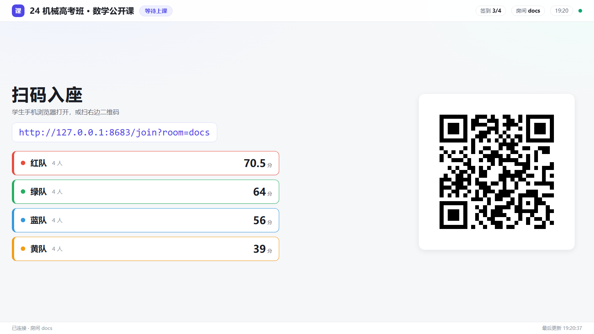
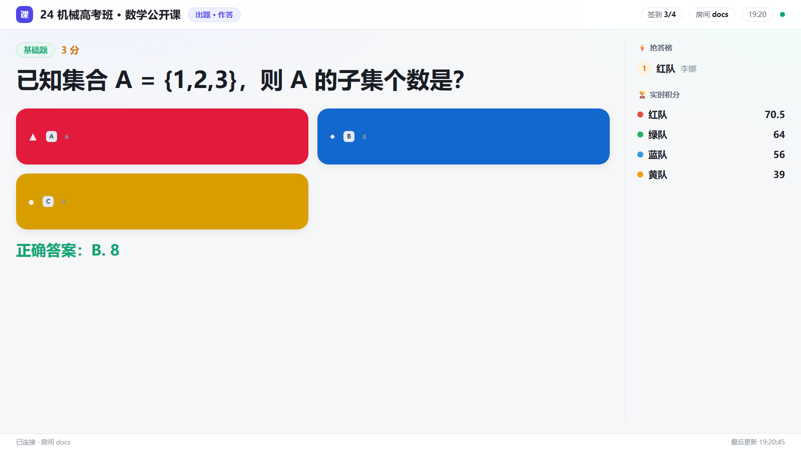
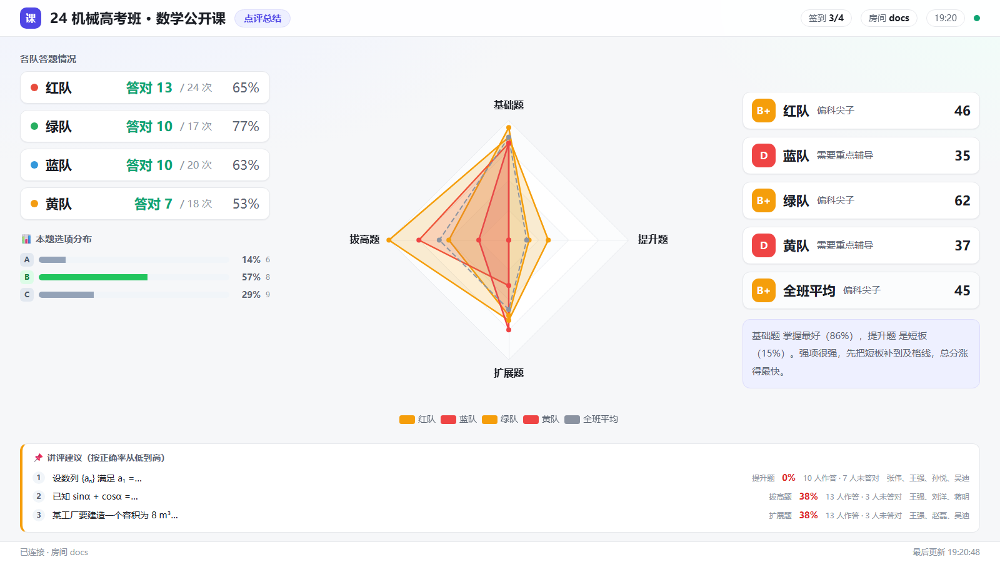

# 教室大屏 · 完整说明文档

> 适用版本：**v5**（Vue 3，浅色主题；与教师端/学生端同为 Vue 构建产物）
> 打开地址：`http://localhost:8080/stage?room=<房间号>`（`/big`、`/screen` 等价）
> 也可在教师端「课堂协同」页或「设置 → 房间与大屏」点「打开大屏」。
> 本文截图由 `node tests/shots-docs.js --only=stage` 在真实界面上产出（1600×900 投影视口）。

---

## 0. 一句话认识大屏

大屏是**只读的投影端**：它自己不做任何判断，只是通过 WebSocket 订阅教师机枢纽的课堂快照，
**跟着教师端选的"课堂环节"自动切成四屏之一**，1 秒内同步。

投影场景的三条硬约束决定了它的设计：

1. **后排要看清** → 超大题干、寡字、高对比；
2. **老师不该管它** → 环节由教师端切换，大屏自动跟随，不需要第二个人操作；
3. **不能反客为主** → 只读，任何数据都不落在大屏上，关掉不影响课堂。

配色与版面参考了 Kahoot（四色选项块）、班级优化大师 / 希沃（大色块、实时榜）、ClassDojo（鼓励式文案）。

---

## 1. 四屏总览

| 环节 | 大屏显示 | 谁来切 |
| --- | --- | --- |
| **待机** | 超大二维码 + 房间号，等学生入座 | 教师端「课堂协同 → 待机」 |
| **随机点名** | 放大显示被点到的同学与所属队伍 | 教师端「随机点名」环节 |
| **出题作答** | 题干 + 四色选项块 + 倒计时 + 抢答榜 + 实时积分 | 教师端「出题答题」 |
| **点评总结** | 各队答对情况 + **本题选项分布** + 能力雷达 + 评级 + 讲评建议 | 教师端「点评总结」 |

顶部常驻：课程名、当前环节徽标、**签到率**、房间号、当前时间、连接状态点。

---

## 2. 待机屏：扫码入座



- **超大二维码**：学生用手机相机一扫就进班，房间号自动带上 —— 这是每节课的第一个动作，所以给到最大；
- 二维码下方是房间号与入座地址；
- 右上角**签到 3/4**：4 支队到了 3 支，还差哪支队老师一眼就知道，不用挨个问。

> 二维码由枢纽的 `/qr.png` 现算（**Rust 枢纽也实现了这个端点**，返回 SVG）。
> 注意：网页版与客户端都能出二维码 —— 早期版本客户端因为没打包 Node 的 `qrcode` 模块而显示不了，
> 这个问题在 v5（Rust 核心统一提供）之后已经不存在。

---

## 3. 随机点名屏


被点到的学生姓名以最大字号居中显示，下面一行是**所属队伍**。
配合教师端的"均匀 / 最少被点优先"策略，一轮课下来能保证覆盖面，而不是反复点同几个人。

点完名老师直接在教师端点判分（或用键盘 `1/2/3/4`），大屏不需要变。

---

## 4. 出题作答屏


这是投影时间最长的一屏，做了三件事：

1. **超大题干**：按投影距离放大，后排也能读；
2. **Kahoot 式四色选项块**：A 红 ▲ / B 蓝 ◆ / C 黄 ● / D 绿 ■ —— **颜色 + 形状双重编码**，
   色弱学生也能区分（只靠颜色是不够的）；选项超过 4 个时循环取色；
3. **右栏实时反馈**：抢答榜 + 各队实时积分。

### 4.1 右栏：抢答榜 + 实时积分


- **抢答榜**：学生点「⚡ 抢答」的顺序，带队伍名与作答人；
- **实时积分**：各队当前积分（1 秒内同步）。

> **v5 起大屏不再显示个人排名**。原来这里是「🏆 光荣榜」（个人积分前 6 名），
> 按调研结论去掉了：公开的个人排名有实证风险（国内教师反馈"垫底的学生每次抬头就看见自己名字在最后面，
> 逐渐产生抵触心理"；国外 n=176 的真实课堂里 16% 学生因速度计分与公开排名退出评价）。
> 个人成绩只发给学生自己的手机；大屏改为显示**全班分布**（见 §5 的选项分布）。

### 4.2 公布答案

老师点「公布答案」后，大屏高亮正确选项：



### 4.3 倒计时

老师发起 30 秒 / 1 分钟 / 2 分钟后，大屏显示倒计时（按结束时刻本地渲染，
不走每秒广播，所以既省流量又不会因为网络抖动而不一致）：


最后 10 秒变红提示收尾。

> ⚠️ **实测发现的差异**：项目 `README.md` 写的是"大屏与**学生端**显示同一个倒计时"，
> 但本轮实测（并核对 `web/src/student/App.vue` 源码）确认：**学生端目前没有任何倒计时渲染**，
> 学生只看到一行「当前环节：出题答题」。倒计时数据（`meta.timerEndsAt`）其实已经下发到学生端快照里，
> 只是界面没接 —— 属于"数据到位、界面没接"的缺口，建议补上。本文以**实测**为准。

---

## 5. 点评总结屏



一节课的收尾，一屏给全：

| 区域 | 内容 |
| --- | --- |
| 左上：各队答题情况 | 每队答对数 / 作答次数 / 正确率（红队 13/24 · 65% …） |
| 左下：**本题选项分布** | 每个选项的**选择比例条形图**，正确项绿色、干扰项灰色（A 14% / B 57% / C 29%） |
| 中：能力雷达 | 基础 / 拔高 / 扩展 / 提升四条轴，四支队 + 全班平均叠加对比 |
| 右：评级 | 每队的等级与一句话画像（B+ 偏科尖子 / D 需要重点辅导）与综合分 |
| 右下：评语 | 自动生成的文字建议（"基础题 掌握最好（86%），提升题 是短板（15%）。强项很强，先把短板补到及格线…"） |
| 底部：讲评建议 | 按正确率从低到高排的题，标注正确率与未答对的学生名单 |

**这一屏最值得说的是「本题选项分布」**（v5 新增）：它回答的不是"谁对谁错"，
而是"**哪个干扰项最吸引人**" —— 上面的例子里 B 是正确项（57% 选对），
但 A 有 14%、C 有 29% 的学生选了，讲评时就知道该重点拆解哪个错误思路。
这比公开个人排名更有教学价值，也正是它取代光荣榜的原因。

> 数据来源：`optionDistribution(state, qid)`，按每条作答记录里的 `picked`（学生实际选了哪些字母）统计；
> 跳过与空答案**不进分母**。

---

## 6. 连接与排障

大屏左下角常驻一行状态：**「已连接 · 房间 docs」**，右下角是**最后更新时间**。
两行合起来就能判断"大屏是不是活的"：

| 现象 | 原因 | 处理 |
| --- | --- | --- |
| 显示「等待数据…」 | 教师端还没产生任何数据 | 教师端随便记一次分，或点大屏「重新请求」 |
| 左下角显示「已断开，N 秒后重连…」 | 教师端枢纽没起（`npm start` 没跑）或端口被占 | 起枢纽；大屏会自己按 0.8→5 秒退避重连 |
| 显示的不是这个班的榜 | 房间号不一致 | 用教师端「房间与大屏」页复制的地址重新打开 |

> 大屏是**只读且无状态**的：连不上不会污染课堂数据，关掉再开即可。

---

## 7. 实测记录

```powershell
node tests/shots-docs.js --only=stage    # 7 张
```

- 驱动方式：1600×900 投影视口；用教师端真实切换四个环节，大屏经 WebSocket 收到快照后截图；
- 大屏截图是**真实同步结果**，不是静态假图：每张都对应教师端的一次真实操作；
- 脚本里还带一条断言：切到点名环节后会检查大屏的环节徽标是否真的变成「随机点名」，
  没变就记为交互告警（本轮加这条断言，是因为第一遍跑时出现过"推送还没到就截图"导致的重复图）；
- 结果：**7 张截图，页面错误 0 条**（连接状态显示「已连接 · 房间 docs」）。

---

## 8. 三端之间的关系（放一起看更清楚）

```
                    ┌──────────────────────────┐
   教师端（唯一写入） │  写：名单/题库/记分/环节   │
                    └────────────┬─────────────┘
                                 │ WebSocket 推送快照
                    ┌────────────▼─────────────┐
                    │  教师机枢纽 :8080          │
                    │  Rust 核心（ci-hub-server）│
                    │  房间状态 + 快照广播       │
                    └───────┬──────────┬────────┘
              订阅快照       │          │      订阅快照
                    ┌────────▼───┐  ┌───▼────────┐
                    │  大屏（只读）│  │ 学生端（只读）│
                    │  跟着环节切屏│  │ 提交/抢答    │
                    └────────────┘  └─────────────┘
```

大屏与学生端都不写课堂数据：学生端的"提交"也只是把命令发给枢纽，由教师端判定后写库。
这样**计分规则只有一份**（v5 之后这份规则在 Rust 核心里），三端不可能算出不同的分数。
