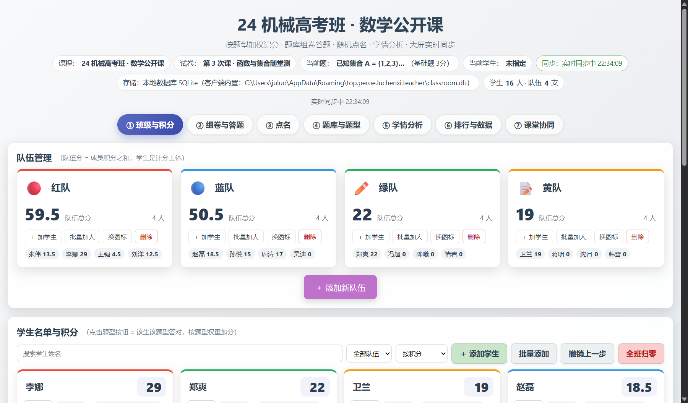
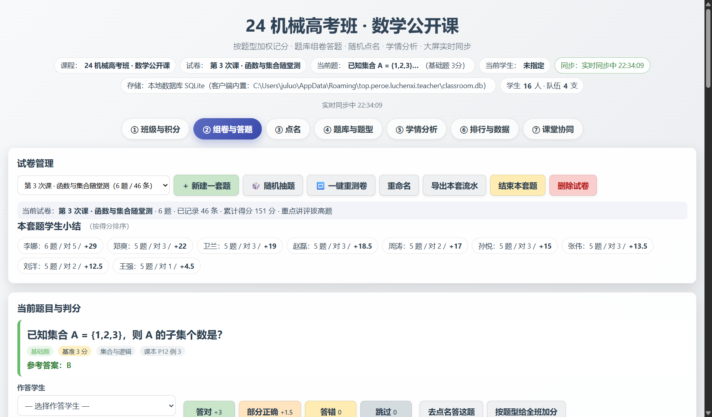
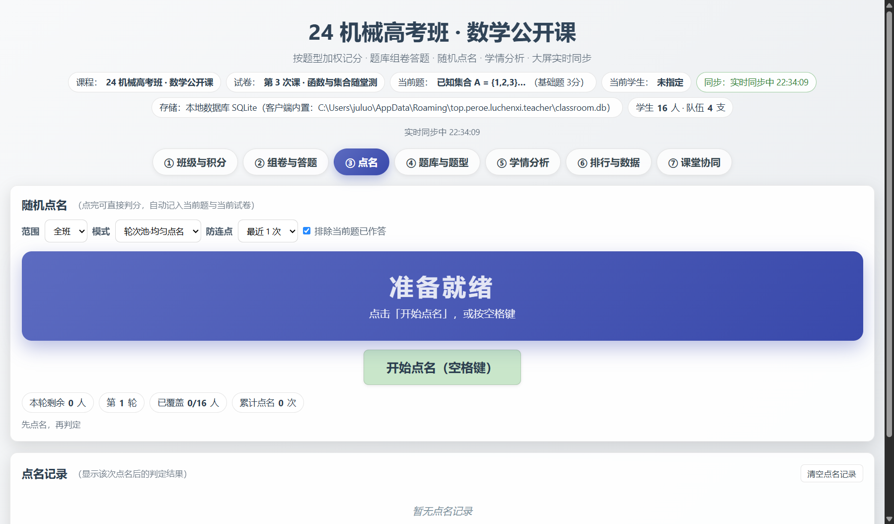
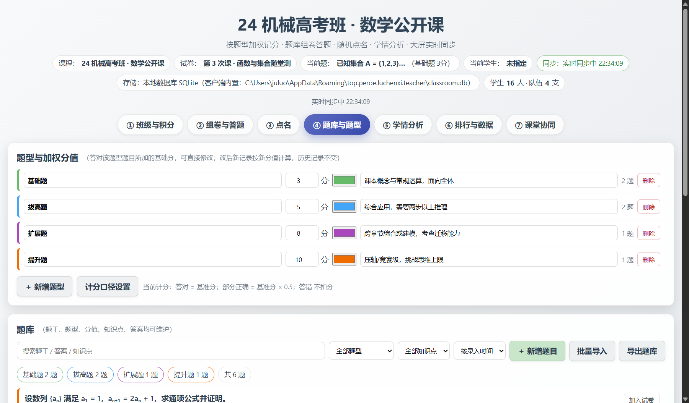
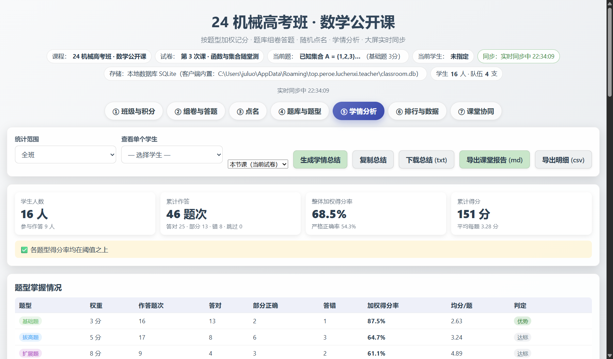
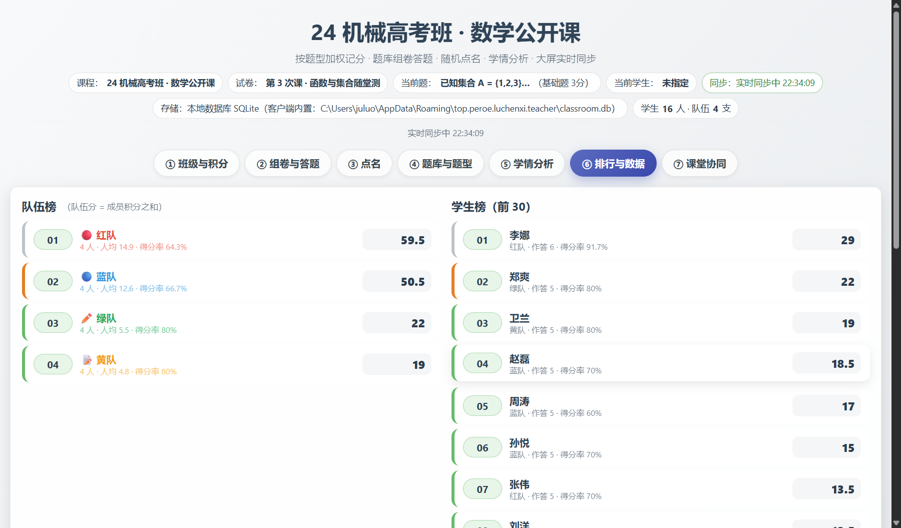
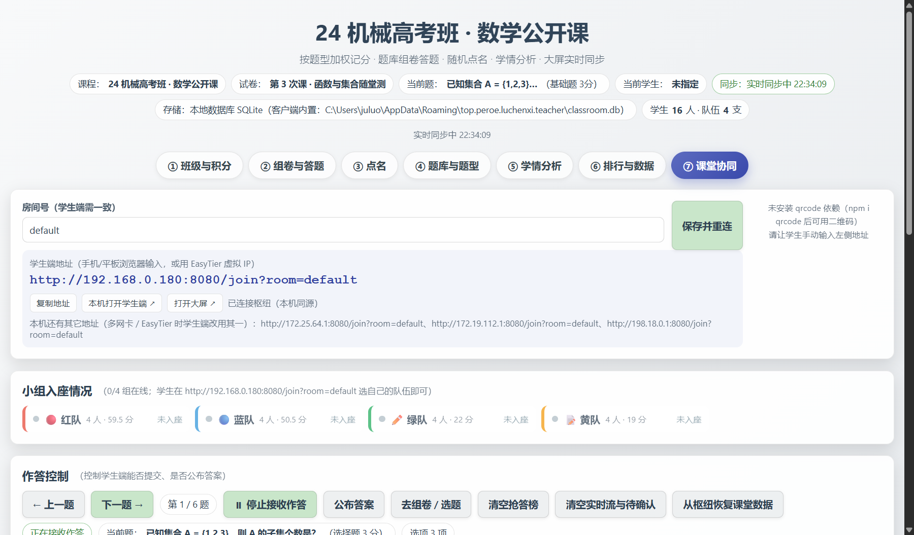

# 教师端桌面客户端（Tauri）· 完整说明文档

> 产物：Windows `.msi` / `.exe`(NSIS)，macOS `.dmg`，Linux `.deb` / `.AppImage`
> 工程：`apps/teacher/`（Tauri v2 薄壳 + Rust 内置枢纽 + EasyTier sidecar）
> 本文截图为**真实运行的应用窗口**（不是浏览器里的同一套页面）：通过 WebView2 的远程调试端口截取，
> 脚本见 [tests/shot-tauri.js](../../tests/shot-tauri.js)。

---

## 0. 它到底是什么

一句话：**把已经能跑的网页版装进一个桌面窗口，再补上浏览器做不到的三件事**。

| 能力 | 浏览器版 | 桌面客户端 |
| --- | --- | --- |
| 界面 | ✅ | ✅（**同一份代码**，由 `scripts/sync-ui.mjs` 同步进 `ui/`） |
| 数据落盘 | 浏览器存储 + 本地枢纽 SQLite | ✅ **应用内直接读写本机 SQLite**，不经浏览器 |
| 局域网枢纽 | 需要另跑 `node sync-server.js` | ✅ **Rust 内置枢纽**，开箱即用 |
| 跨网段组网 | 手动装 EasyTier | ✅ 内置 EasyTier sidecar，界面上一键组网 |
| 安装 | 无 | `.msi` / `.exe` / `.dmg` / `.deb` |

```
apps/teacher/
├─ ui/                 ← 由 scripts/sync-ui.mjs 生成（勿手改）
└─ src-tauri/          Rust：SQLite 命令 + 内置枢纽 + 组网
   ├─ src/lib.rs       业务（Tauri 命令注册）
   ├─ src/db.rs        SQLite 持久层（与 packages/db/schema.sql 同源）
   ├─ src/hub.rs       内置枢纽（协议与 Node 版逐字一致）
   ├─ src/net.rs       EasyTier sidecar 管理
   └─ binaries/        easytier-core / easytier-cli
```

数据落在 `%APPDATA%\top.peroe.luchenxi.teacher\classroom.db`（macOS/Linux 为对应 app_data_dir），
换机器时直接拷这个文件，或用界面上的「导出全部数据 / 导入备份」。

---

## 1. 实测：应用跑起来是什么样

### 1.1 班级与积分



顶栏一眼可见四个关键状态：**课程名、当前试卷、当前题**，以及右上两个芯片 ——
**同步：实时同步中 hh:mm:ss** 与 **存储：本地数据库 SQLite（客户端内置：…\classroom.db）**。
注意存储那条写的是 `客户端内置`：这条路径由 Rust 侧直接给出，不是浏览器猜的。

### 1.2 组卷与答题



### 1.3 点名



### 1.4 题库与题型



### 1.5 学情分析



### 1.6 排行与数据



### 1.7 课堂协同（客户端最有价值的一页）



这一页能看出客户端相对网页版的核心优势：

- **内置枢纽已在运行**：顶部显示「已连接枢纽（本机同源）」，**不需要另外开一个终端跑 `node sync-server.js`**；
- **学生端地址直接给出**：`http://192.168.0.180:8080/join?room=default`，
  下面还列了本机其它网卡地址（多网卡 / EasyTier 虚拟网时改用其中一条）；
- 小组入座情况（红/蓝/绿/黄 4 队，各 4 人）实时显示在线状态；
- 作答控制：上一题 / 下一题 / 第 N 题 / 停止接收作答 / 公布答案 / 清空抢答榜 / **从枢纽恢复课堂数据**。

> ⚠️ 截图里那行 **「未安装 qrcode 依赖（npm i qrcode 后可用二维码）」** 是真实提示：
> 桌面壳没有打包 Node 的 `qrcode` 模块，所以客户端里**暂时不显示二维码**，需要学生手输地址。
> 网页版（由枢纽托管）是有的。这是一处已知差异，不是截图错误。

### 1.8 内置枢纽的实测输出

应用启动后，内置枢纽会在 8080 上监听（可用 `CLASSROOM_PORT` 覆盖）。实测：

```jsonc
// GET http://127.0.0.1:8080/health
{
  "ok": true,
  "service": "classroom-hub-rust",     // ← Rust 实现（网页版是 classroom-hub）
  "storage": "sqlite",
  "db": "classroom.db",
  "port": 8080,
  "qrcode": false,                     // ← Rust 枢纽没实现 /qr.png
  "rooms": ["default"],
  "ips": ["192.168.0.180", "172.25.64.1", "172.19.112.1", "198.18.0.1"],
  "counts": { "questions": 0, "quizzes": 0, "records": 0, "students": 0, "teams": 0 }
}
```

`ips` 里就是"该发给学生哪条地址"的依据 —— 多网卡时按局域网/组网网段优先排序。

---

## 2. 怎么构建

```powershell
# 前置：Node 22+、Rust（rustup + MSVC 生成工具）
node scripts/sync-ui.mjs teacher       # 把网页版前端同步进 apps/teacher/ui
node scripts/fetch-easytier.mjs        # 放好 easytier-core / easytier-cli sidecar（打包必需）

cd apps/teacher
npm install
npm run dev                            # 开发模式
npm run build                          # 出安装包（.msi / .exe / .dmg / .deb / .AppImage）
```

> **sidecar 必须存在**，否则 `tauri build` 会报找不到 `externalBin`。
> 只想快速验证二进制可加 `-- --no-bundle`（只编译可执行文件，不产安装包）。

已产出过的安装包（`apps/teacher/src-tauri/target/release/bundle/`，以下为本机实测文件大小）：

| 产物 | 实测大小 |
| --- | --- |
| `课堂积分-教师端_4.0.0_x64_zh-CN.msi` | 8.92 MB |
| `课堂积分-教师端_4.0.0_x64-setup.exe`（NSIS） | 6.30 MB |

（MSI 必须设 `bundle.windows.wix.language = "zh-CN"`：WiX 默认 `en-US` 用代码页 1252，装不下中文产物名。）

---

## 3. 本轮实测发现并修复的两个真问题

这两个都是"编译得过、测试也绿，但装出来的 App 实际不好用"的问题 —— 只有把应用**真的跑起来**才会暴露。

### 3.1 应用打开的是大屏页，不是教师端主控台 🔴→✅

| 项 | 内容 |
| --- | --- |
| 现象 | 双击应用后窗口标题是「教师端」，但里面显示的是**教室大屏**（🏆 队伍榜 / ⭐ 个人榜 / ⚡ 抢答榜），并且一直是"连接断开，重试中…" |
| 根因 | `apps/teacher/src-tauri/tauri.conf.json` 的窗口配置**没有 `url` 字段**。Tauri 此时默认加载 `index.html`，而 `ui/` 里同时存在 `admin.html`（教师端）与 `index.html`（大屏），于是加载到了大屏页 |
| 修法 | 给窗口加 `"url": "admin.html"` |
| 验证 | 修复后实测：`url = http://tauri.localhost/admin.html`，标题为「课堂积分主控台 · 加权记分 / 题库组卷 / 点名 / 学情分析」 |

```diff
   "windows": [
     {
       "title": "课堂积分 · 教师端",
+      "url": "admin.html",
       "width": 1440,
```

### 3.2 客户端永远连不上自己的内置枢纽（一直"单机模式"）🔴→✅

| 项 | 内容 |
| --- | --- |
| 现象 | 内置枢纽明明在 8080 上跑着，界面却显示「**同步：与枢纽断开，重试中…（单机模式仍可继续记分）**」。本机记分正常，但**学生端与大屏永远收不到数据** |
| 根因 | `assets/js/sync.js` 的 `servedOverHttp()` 只看"协议是不是 http、host 是否非空"。Tauri v2 在 Windows 上把前端挂在 `http://tauri.localhost` 下，于是被判成"与枢纽同源"，去连 `ws://tauri.localhost/?room=…` —— 这个地址根本不存在。而它本该走下面的 `http://localhost:8080` 兜底分支 |
| 修法 | `servedOverHttp()` 排除 Tauri 的伪源：`if (/^tauri\.localhost$/i.test(loc.host)) return false;` |
| 验证 | 清空 `localStorage`（`ci_ws_host` / `ci_room` 均为 `null`）后重启应用，**零配置**即显示「同步：实时同步中 22:33:19」 |

修复前的实测证据（同一个应用、同一个内置枢纽）：

```
同步：与枢纽断开，重试中…（单机模式仍可继续记分）      ← 修前
url = http://tauri.localhost/admin.html
lsHost = null

同步：实时同步中 22:33:19                              ← 修后
url = http://tauri.localhost/admin.html
lsHost = null                                        ← 依然是零配置
```

> **临时绕法**（不想改代码时）：在应用里把枢纽地址手动设成 `localhost:8080`（旧版 ⑥ 页签的同步设置），
> 或直接写 `localStorage.ci_ws_host = 'localhost:8080'`，界面立刻变成"实时同步中"。本轮已实测通过。

### 3.3 已知差异（未修，记录在案）

| 项 | 说明 |
| --- | --- |
| 无二维码 | 桌面壳未打包 `qrcode` 模块，界面提示"请让学生手动输入左侧地址"；网页版有二维码 |
| 界面是新旧两套 | 客户端目前套的是**旧版零构建界面**（`admin.html`，7 个页签）。v5 的 Vue 新版界面（`web/dist`）仍只在网页版 `/next/` 下提供，尚未同步进 `ui/` |
| 端口被占 | 若 8080 已被别的进程（比如另开的 Node 枢纽）占用，应用的内置枢纽起不来，但**不挡主界面**，只在 stderr 留一行 |

---

## 4. 排障速查

| 现象 | 处理 |
| --- | --- |
| 应用起来了但"与枢纽断开" | 见 §3.2；先确认 8080 没被别的进程占用 |
| 学生端连不上 | 用「课堂协同」页显示的那条网卡地址（多网卡时别用 `127.0.0.1`）；放行防火墙 |
| 换电脑后没有名单 | 数据在 `%APPDATA%\top.peroe.luchenxi.teacher\classroom.db`；拷这个文件，或用「导出/导入备份」 |
| 装完打不开 | 检查 `identifier` 是否与应用数据目录一致、`ui/` 是否被正确打包（`frontendDist`） |
| 构建报找不到 sidecar | 先跑 `node scripts/fetch-easytier.mjs` |

---

## 5. 实测环境

| 项 | 值 |
| --- | --- |
| 平台 | Windows（x64） |
| 应用二进制 | `target/release/luchenxi-teacher.exe`，15,631,360 字节 |
| WebView2 | `Edg/154.0.4258.48` |
| 内置枢纽 | `service=classroom-hub-rust`，`storage=sqlite`，端口 8080 |
| 截图方式 | `WEBVIEW2_ADDITIONAL_BROWSER_ARGUMENTS=--remote-debugging-port=9333` 启动应用 → CDP `Page.captureScreenshot` |
| 截图数量 | 7 张（7 个页签） |

> 为什么不用 `PrintWindow` 截窗口：WebView2 走 GPU 合成，`PrintWindow` 只能拿到**全黑图**（本轮实测 1454×882 全黑，6 KB）。
> 走 WebView2 自带的调试端口才是可靠办法，而且拿到的是**应用窗口内真实渲染的界面**。
