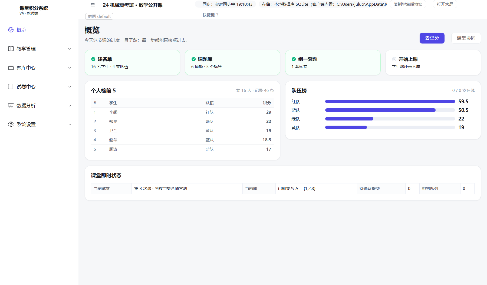
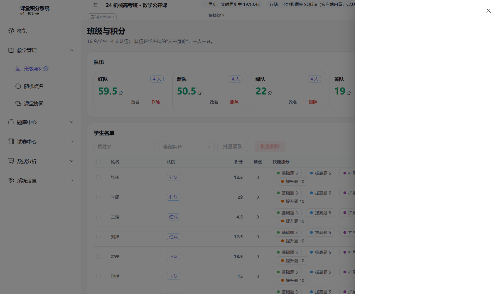
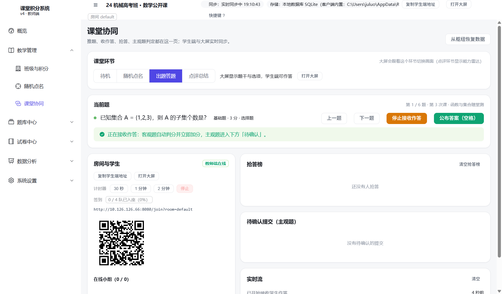
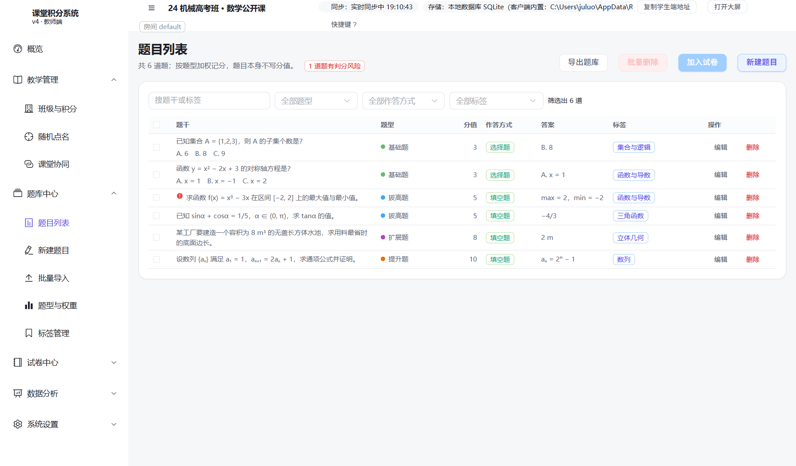
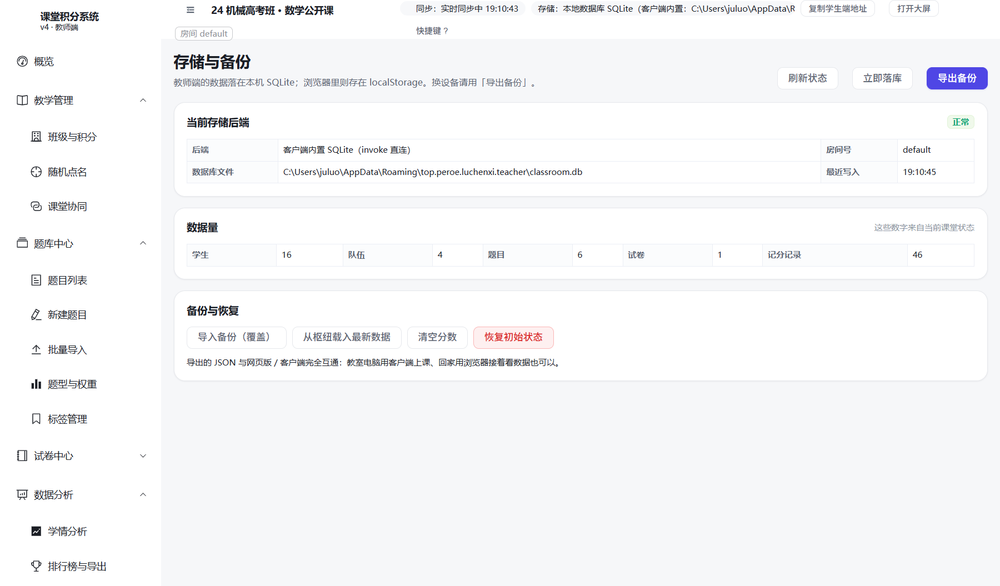
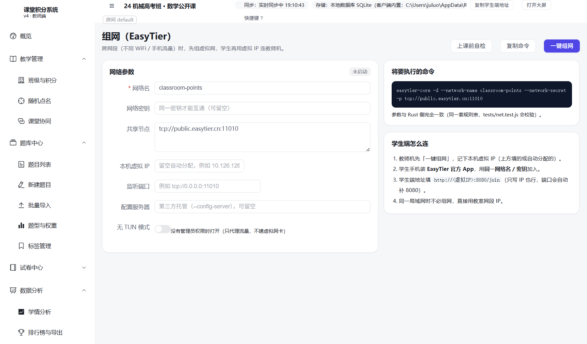
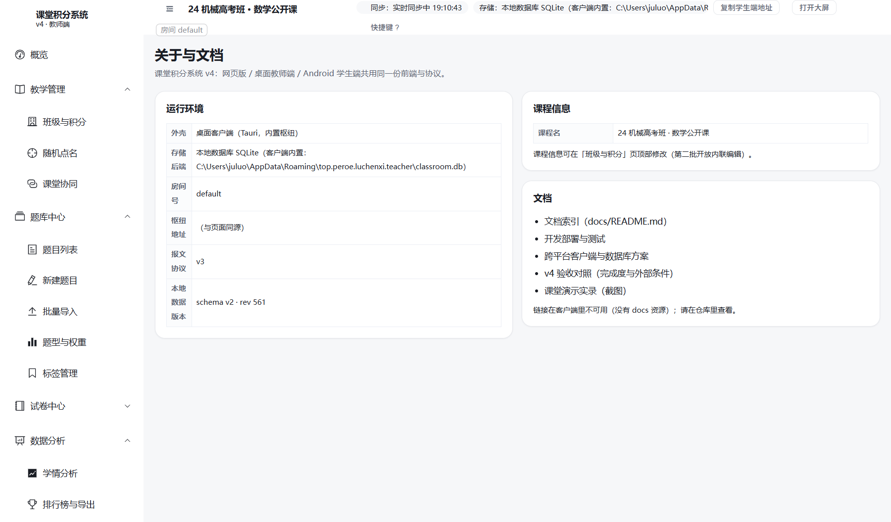

# 教师端桌面客户端（Tauri）· 完整说明文档

> 产物：Windows `.msi` / `.exe`(NSIS)，macOS `.dmg`，Linux `.deb` / `.AppImage`
> 工程：`apps/teacher/`（Tauri v2 薄壳 + Rust 内置枢纽 + EasyTier sidecar）
> 本文截图为**真实运行的应用窗口**（不是浏览器里的同一套页面）：通过 WebView2 的远程调试端口截取，
> 脚本见 [tests/shot-tauri.js](../../tests/shot-tauri.js)。

---

## 0. 它到底是什么

一句话：**把界面装进一个桌面窗口，再补上浏览器做不到的三件事**。

| 能力 | 浏览器版 | 桌面客户端 |
| --- | --- | --- |
| 界面 | ✅ | ✅ **同一份 Vue 构建产物**（v5 起，由 `scripts/sync-ui.mjs` 从 `web/dist` 同步进 `ui/`） |
| 数据落盘 | 浏览器存储 + 本地枢纽 SQLite | ✅ **应用内直接读写本机 SQLite**，不经浏览器 |
| 局域网枢纽 | 需要另跑 `node sync-server.js` | ✅ **Rust 内置枢纽**，开箱即用 |
| 跨网段组网 | 手动装 EasyTier | ✅ 内置 EasyTier sidecar，界面上一键组网 |
| 安装 | 无 | `.msi` / `.exe` / `.dmg` / `.deb` |

```
apps/teacher/
├─ ui/                 ← 由 scripts/sync-ui.mjs 从 web/dist 生成（勿手改）
└─ src-tauri/          Rust：SQLite 命令 + 内置枢纽 + 组网
   ├─ src/lib.rs       业务（Tauri 命令注册）
   ├─ src/db.rs        SQLite 持久层（与 packages/db/schema.sql 同源）
   ├─ src/hub.rs       内置枢纽
   ├─ src/net.rs       EasyTier sidecar 管理
   └─ binaries/        easytier-core / easytier-cli
```

数据落在 `%APPDATA%\top.peroe.luchenxi.teacher\classroom.db`（macOS/Linux 为对应 app_data_dir），
换机器时直接拷这个文件，或用界面上的「导出全部数据 / 导入备份」。

> **v5 的一个大变化**：客户端以前套的是"旧版零构建界面"，与网页版分叉；
> 现在 `sync-ui.mjs` 直接同步 `web/dist`，**客户端与网页版是同一套 Vue 界面**，不会再各长各的。

---

## 1. 实测：应用跑起来是什么样

顶栏一眼可见：课程名、房间号、**同步：实时同步中 hh:mm:ss**，
以及 **存储：本地数据库 SQLite（客户端内置：…\classroom.db）** ——
存储那条写的是"客户端内置"，这条路径由 Rust 侧直接给出，不是浏览器猜的。

### 1.1 概览



### 1.2 班级与积分



### 1.3 课堂协同（客户端最有价值的一页）



这一页能看出客户端相对网页版的核心优势：

- **内置枢纽已在运行**：顶部显示「已连接枢纽」，**不需要另外开终端跑 `node sync-server.js`**；
- **学生端地址直接给出**：`http://10.126.126.66:8080/join?room=default`；
- **二维码直接出图**（v5 修复点之一）：早期客户端因为没打包 Node 的 `qrcode` 模块而显示"未安装 qrcode 依赖"，
  v5 把二维码交给 Rust 枢纽的 `/qr.png` 统一提供，**客户端现在也能扫码入座**；
- 课堂环节切换、计时器、签到、抢答榜、待确认提交、实时流一应俱全。

### 1.4 题库中心



### 1.5 学情分析


注意这一页在客户端里的实际表现：内置枢纽就是 **Rust 核心**，
所以「统计来源」会显示**「Rust 核心」**（而不是回退的"本地参考实现"）—— 客户端是 v5 完整形态。

### 1.6 存储与备份



### 1.7 组网（EasyTier）



客户端独有能力：内置 `easytier-core` sidecar，界面上一键组网；浏览器版只能手动装 EasyTier。

### 1.8 关于



### 1.9 内置枢纽的实测输出

应用启动后，内置枢纽会在 8080 上监听（可用 `CLASSROOM_PORT` 覆盖）。实测：

```jsonc
// GET http://127.0.0.1:8080/health
{
  "ok": true,
  "service": "classroom-hub-rust",     // ← Rust 实现（网页版跑 Node 版时是 classroom-hub）
  "storage": "sqlite",
  "db": "classroom.db",
  "port": 8080,
  "qrcode": false,
  "rooms": ["default"],
  "ips": ["10.126.126.66", "192.168.0.180", "172.25.64.1", "172.19.112.1", "198.18.0.1"],
  "counts": { "questions": 6, "quizzes": 1, "records": 46, "students": 16, "teams": 4 }
}
```

`ips` 里就是"该发给学生哪条地址"的依据 —— 多网卡时按局域网/组网网段优先排序。

---

## 2. 怎么构建

```powershell
# 前置：Node 22+、Rust（rustup + MSVC 生成工具）
npm run web:build                      # 先构建 Vue 界面（产物在 web/dist）
node scripts/sync-ui.mjs teacher       # 再把 web/dist 同步进 apps/teacher/ui
node scripts/fetch-easytier.mjs        # 放好 easytier-core / easytier-cli sidecar（打包必需）

cd apps/teacher
npm install
npm run dev                            # 开发模式
npm run build                          # 出安装包（.msi / .exe / .dmg / .deb / .AppImage）
npm run build -- --no-bundle           # 只编译可执行文件，不出安装包（快速验证用）
```

> **改界面必须重编 Rust**：Vue 产物是被 `generate_context!` **编译进二进制**的，
> 只跑 `npm run web:build` 不重编，应用里还是旧界面。
> **sidecar 必须存在**，否则 `tauri build` 会报找不到 `externalBin`。

---

## 3. 本轮实测发现的问题

### 3.1 已在上一轮修复、本轮复验仍然有效 ✅

| 问题 | 修法 | 本轮复验 |
| --- | --- | --- |
| 应用打开的是**大屏页**而不是教师端 | `tauri.conf.json` 窗口补 `"url": "admin.html"` | ✅ 实测 URL = `http://tauri.localhost/admin.html#/`，标题「课堂积分 · 教师端」 |
| 应用**永远连不上自己的内置枢纽**（一直单机模式） | `assets/js/sync.js` 的 `servedOverHttp()` 排除 Tauri 伪源 `tauri.localhost` | ✅ 零配置下顶栏显示「实时同步中」 |

> 这两条的根因是同一个：**Tauri v2 把前端挂在 `http://tauri.localhost` 下，
> 而代码里把它当成了"真实的 http 源 / 枢纽源"**。详见 [README](README.md) 的"一个值得注意的规律"。

### 3.2 本轮新发现

| 问题 | 现象 | 说明 |
| --- | --- | --- |
| 窗口逻辑尺寸与截图尺寸不一致 | 应用窗口配置 1440×900，但 CDP 截出来是 **1800×1055** | 这是系统 DPI 缩放（150%）所致，不是缺陷；文档里所有应用截图的像素尺寸都是 1800×1055 |

> 本轮**没有**在客户端侧发现新的功能性缺陷：8 个页面全部正常渲染、内置枢纽正常、同步正常、二维码正常。

---

## 4. 排障速查

| 现象 | 处理 |
| --- | --- |
| 应用起来了但"与枢纽断开" | 先确认 8080 没被别的进程占用（比如另开的 Node 枢纽）；Tauri 伪源那条修复已内置 |
| 学生端连不上 | 用「课堂协同」页显示的那条网卡地址（多网卡时别用 `127.0.0.1`）；放行防火墙 |
| 换了电脑没有名单 | 数据在 `%APPDATA%\top.peroe.luchenxi.teacher\classroom.db`；拷这个文件，或用「导出/导入备份」 |
| 改了界面但应用没变 | Vue 产物编译进二进制，必须重跑 `web:build` + `sync-ui` + `tauri build`（§2） |
| 构建报找不到 sidecar | 先跑 `node scripts/fetch-easytier.mjs` |
| 构建报符号链接错误（Windows） | 桌面端不涉及；这是安卓端的问题，见 [05](05-学生端安卓客户端.md) §3 |

---

## 5. 实测环境

| 项 | 值 |
| --- | --- |
| 平台 | Windows（x64，系统 DPI 150%） |
| 应用二进制 | `target/release/luchenxi-teacher.exe`，14.91 MB（release，`--no-bundle`） |
| WebView2 | `Edg/154.0.4258.97` |
| 内置枢纽 | `service=classroom-hub-rust`，`storage=sqlite`，端口 8080 |
| 截图方式 | `WEBVIEW2_ADDITIONAL_BROWSER_ARGUMENTS=--remote-debugging-port=9333` 启动应用 → CDP `Page.captureScreenshot` |
| 截图数量 | 8 张（8 个页面） |

> 为什么不用 `PrintWindow` 截窗口：WebView2 走 GPU 合成，`PrintWindow` 只能拿到**全黑图**
> （实测 1454×882 全黑，6 KB）。走 WebView2 自带的调试端口才是可靠办法，
> 而且拿到的是**应用窗口内真实渲染的界面**。

---

## 6. 顺带验证：桌面端可以当"教师机枢纽"给学生端用

本轮实测还确认了一条实用路径：**只装桌面客户端也能开课**。

把桌面客户端打开（它自带 Rust 枢纽 + 二维码 + 学生端地址），
安卓学生端只要填对地址就能连上来 —— 这正是 [05 学生端安卓客户端](05-学生端安卓客户端.md) §7
里那次端到端验证的做法，两边数据是同一份。
