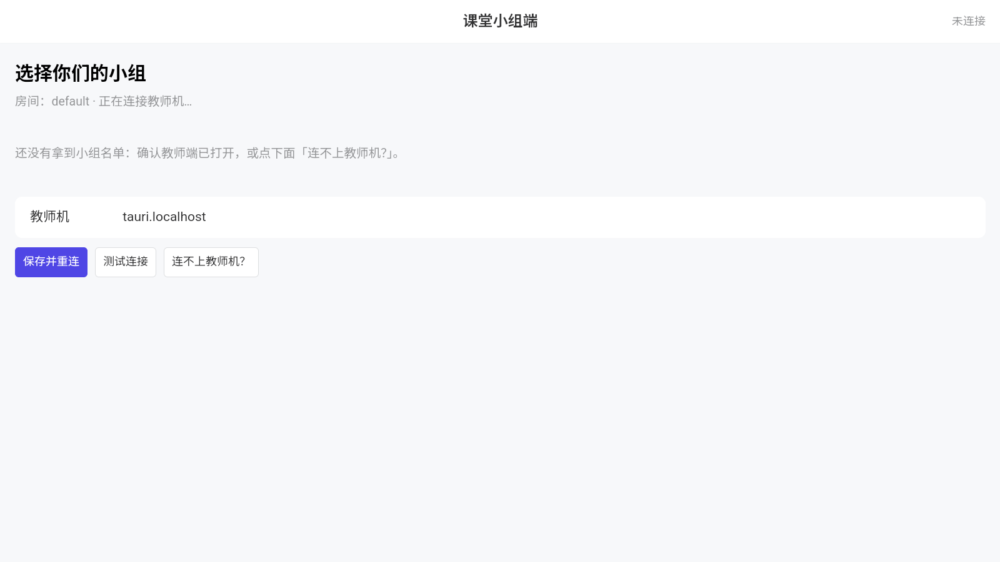
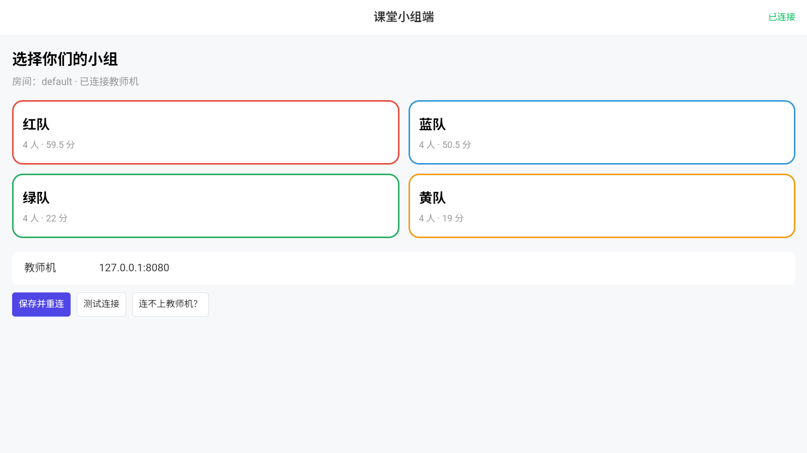
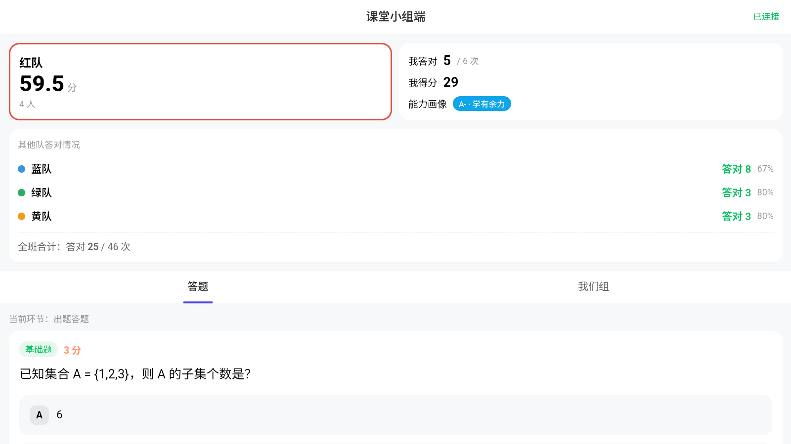
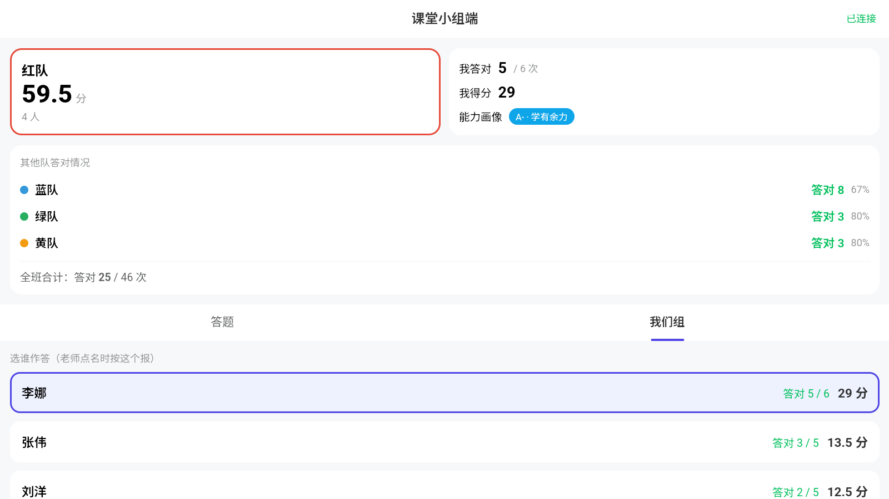
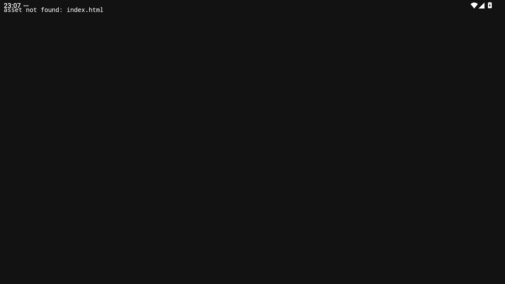

# 学生端安卓客户端（Tauri）· 完整说明文档

> 产物：`.apk`（arm64-v8a / x86_64）
> 工程：`apps/student/`（Tauri v2 薄壳，界面复用学生端 Vue 构建产物）
> 本文记录**本轮在 Android 15 模拟器上的完整端到端实测**：
> 构建 → 签名 → 安装 → 启动 → 界面渲染 → **连上教师机 → 入座 → 看到真实数据**。

---

## 0. 它是什么，和网页版什么关系

学生端安卓应用 = **同一个学生端界面 + 一个安卓壳**。壳只做浏览器做不到的事：

| 能力 | 手机浏览器打开 `/join` | 安卓 App |
| --- | --- | --- |
| 界面 | ✅ | ✅ **同一份 Vue 构建产物**（`sync-ui.mjs` 从 `web/dist` 同步） |
| 进入方式 | 扫码 / 输地址 | 桌面图标点开 |
| 教师机地址自检 | 靠浏览器 | ✅ Rust 侧 `check_hub` + 地址规范化（只写 IP 自动补 `:8080`） |
| 明文 HTTP | 浏览器可能拦 | ✅ 清单里 `usesCleartextTraffic=true` |
| 后台驻留 / 全屏 | 受限 | ✅ 原生窗口 |
| 体积 | 0 | 11.8 MB（已签名，x86_64） |

**依赖刻意做到最薄**（`apps/student/src-tauri/Cargo.toml`）：

```toml
[dependencies]
ci-protocol = { path = "../../../crates/ci-protocol" }
ci-domain   = { path = "../../../crates/ci-domain" }
tauri = { version = "2", features = [] }
tauri-plugin-dialog = "2"
tauri-plugin-shell  = "2"
```

只依赖 **协议** 与 **领域规则** 两个 crate —— **不把枢纽和 SQLite 塞进安卓包**：
手机是纯客户端，课堂数据只存在教师机上。`crate-type` 带 `staticlib`/`cdylib`，
这是 Tauri v2 移动端必须的 lib target（`tests/ci.test.js` 会校验，缺了直接红）。

---

## 1. 实测结果：它真的跑起来了

### 1.1 未入座（入座页）



打开就是 Vue 新版界面：顶部「课堂小组端 / 未连接」，房间号，下面一行提示，
再下面是**教师机地址输入框**与三个按钮（保存并重连 / 测试连接 / 连不上教师机？）。

### 1.2 连上教师机：四支队都拿到了



填入教师机地址并点「保存并重连」后：右上角 **已连接**（绿），
「房间：default · **已连接教师机**」，四支队的卡片带**人数与当前积分**全部出现
（红队 4 人·59.5 分 / 蓝队 4 人·50.5 分 / 绿队 4 人·22 分 / 黄队 4 人·19 分）。

### 1.3 入座后的答题页



点「红队」入座，立刻拿到本组与个人的实时数据：

- 本队积分 59.5 分 / 4 人；
- **我答对 5 / 6 次、我得分 29、能力画像 A+ · 学有余力**；
- 其他队答对情况（蓝队 答对 8 · 67%、绿队 答对 3 · 80%、黄队 答对 3 · 80%）；
- 全班合计 答对 25 / 46 次；
- 当前环节「出题答题」+ 当前题（基础题 3 分 · 选择题）。

> 这些数字**不是模拟的**：它们来自同时运行的桌面教师端内置枢纽，
> 由教师端的真实快照推送过来。这是本轮最有价值的一条证据 —— 整条链路真的通了。

### 1.4 我们组



选谁作答 + 组内每人得分，与网页版完全一致（同一份界面代码）。

### 1.5 实测环境

| 项 | 值 |
| --- | --- |
| 模拟器 | MuMu Player 实例 1（**不是**用户那个"明日方舟"游戏实例） |
| Android | 15（SDK 35） |
| ABI | `x86_64`（`abilist` 还带 `arm64-v8a`，即支持 ARM 转译） |
| 屏幕 | 1600×900（横屏 surface） |
| 教师机 | **桌面客户端的内置 Rust 枢纽**（`localhost:8080`，`service=classroom-hub-rust`） |
| 网络打通方式 | `adb reverse tcp:8080 tcp:8080`（把设备的 8080 转发到宿主的 8080） |
| 安装 | `adb install -r app-x86_64-release-signed.apk` → `Success` |

### 1.6 历史证据：修复前的黑屏



这张图是**上一轮**（旧版界面时期）的真实故障现场：装好、点开，纯黑屏，
只有一行 `asset not found: index.html`；进程活着、没有崩溃日志，但**什么都没有**。
根因见 §2.1 —— 现在这个 bug 已修，这张图留作"不真机上跑就发现不了"的例证。

---

## 2. 实测发现并修复的问题

全部属于"**编译得过、单测也绿，但 App 装上去不好用/不能用**"，只有真的装到设备上跑才会暴露。

### 2.1 安卓 App 打开就是黑屏（上一轮修复，本轮复验有效）✅

| 项 | 内容 |
| --- | --- |
| 现象 | 启动后纯黑屏，只有一行 `asset not found: index.html` |
| 根因 | `tauri.conf.json` 的窗口配置**没有 `url` 字段**：Tauri 默认加载 `index.html`，但学生的 `ui/` 里只有 `student.html` |
| 修法 | 窗口加 `"url": "student.html"` |
| 复验 | 本轮重编重装后界面正常渲染（§1.1），logcat 无 `asset not found` |

> 教师端桌面壳有一模一样的毛病（见 [04](04-教师端桌面客户端.md) §3.1）：
> Tauri 的 `url` 不写就默认 `index.html`。教师端表现为"打开了大屏页"，学生端更惨 —— **直接黑屏**。

### 2.2 学生填不了教师机地址（上一轮修复，本轮复验有效）✅

| 项 | 内容 |
| --- | --- |
| 现象 | 界面停在「等待老师端推送名单…」，而且**页面上根本没有"填教师机地址"输入框** |
| 根因 | `assets/js/student.js` 的 `servedByHub()` 只看"协议是不是 http、host 是否非空"；Tauri 的 `http://tauri.localhost` 被判成"由枢纽托管"→ 入座页据此**隐藏**地址输入框 |
| 修法 | `servedByHub()` 排除客户端伪源 `tauri.localhost` |
| 复验 | 输入框出现且可输入（§1.1） |

### 2.3 「保存并重连」存的是空地址（本轮发现并修复）🔴→✅

| 项 | 内容 |
| --- | --- |
| 现象 | 学生填好教师机 IP、点「保存并重连」，**毫无反应**，永远连不上，界面上也没有任何报错 |
| 根因 | Vue 组件把输入框的值**作为参数**传进去（`CIStudent.saveHost(hostInput.value)`），但领域层的 `saveHost()` **不接参数** ——它去读旧版 DOM 的 `$('hubInput')`。v5 把旧界面删掉后那个元素不存在，`v` 恒为 `''`，于是**把空字符串存成了教师机地址** |
| 修法 | `saveHost(value)` 优先用传入值，旧 `#hubInput` 只作兜底 |
| 验证 | 修复后在同一台模拟器上**实测连上了教师机并看到四支队**（§1.2/§1.3） |

这条特别隐蔽：它不报错、不崩溃、按钮还有正常的按下反馈，
只是"存了个空地址" —— 如果没在真机/模拟器上点一次，光看代码很难发现。

### 2.4 顺手修掉的一类"悬空调用"（本轮发现并修复）🔴→✅

追 2.3 的时候顺带扫了一遍 `student.js`，发现 v5 删掉旧版渲染函数后，**还有 5 处调用没删**，
而且全在热路径上：

| 位置 | 原来 | 触发时机 |
| --- | --- | --- |
| WebSocket `presence` 分支 | `renderHeader()` | **每收到一次 presence 广播**都抛 `ReferenceError`（本轮实测一次运行刷了 52 条） |
| `switchTeam()` | `renderJoin()` | 学生点「重新选小组」 |
| `setAnswerer(id)` | `renderTeam()` | 学生点组员名字 |
| `toggleOption(key)` | `renderQA()` | **学生点选项** |
| `submit(skip)` | `renderQA()` | **学生提交** |

这些函数在 v5 已随旧界面删除，调用即抛 `ReferenceError`。
虽然 Vue 包装层随后会自己 `refresh()` 一次（所以界面看起来还能动），
但异常会**打断 `notify()` 这个"通知出口"**，并且 presence 那条路径没有任何包装层，
会导致在线状态更新不触发重绘。

修法：5 处统一改成 `notify()`（与保留下来的 `render()` 走同一个出口）。
修复后重跑整套截图：**页面错误从 52 条降到 0 条**。

---

## 3. 构建：会遇到一个 Windows 专有的坑

### 3.1 正常构建命令

```powershell
# 前置：Node 22+、Rust（含 Android target）、JDK 17、Android SDK + NDK
npm run web:build                      # 先构建 Vue 界面
node scripts/sync-ui.mjs student       # 再同步进 apps/student/ui
cd apps/student
npm install
npm run android:init                   # 首次生成 gen/android 工程
npm run android:build                  # 内部就是 tauri android build --apk
```

本机工具链（portable 安装，见 `scripts/setup-toolchain.ps1`）：

| 组件 | 本机实际 |
| --- | --- |
| Rust | 1.98.1，targets：`aarch64` / `armv7` / `i686` / `x86_64`-linux-android + `x86_64-pc-windows-msvc` |
| JDK | Temurin 17（`D:\app\jdk17`） |
| Android SDK | `D:\app\android-sdk`（NDK `26.1.10909125`、platform `android-34`） |
| Gradle | wrapper 自动拉取 9.6.1 |

### 3.2 坑：Windows 上没有"开发者模式"就构建不出来 🔴

Rust 侧**编译成功**（产出 `target/<triple>/release/libluchenxi_student_lib.so`，8.4–8.7 MB），
然后倒在最后一步 —— Tauri 要把 `.so` **符号链接**进 `jniLibs/`：

```
failed to build Android app: Failed to create a symbolic link from
  "…\target\x86_64-linux-android\release\libluchenxi_student_lib.so" to file
  "…\jniLibs\x86_64\libluchenxi_student_lib.so" (file clobbering enabled):
Creation symbolic link is not allowed for this system.
For Windows 10 or newer: You should use developer mode.
```

原因：Windows 创建符号链接需要 `SeCreateSymbolicLinkPrivilege`，
普通账户只有在**开启开发者模式**或**以管理员运行**时才具备。

> 试过但**无效**的办法：预先手工把 `.so` 复制到 `jniLibs/`。
> Tauri 走的是"先删后建"（`file clobbering enabled`），照样失败，而且顺手把你的文件删了。

### 3.3 绕过办法（本机实测可行 ✅）

把"编 Rust"和"打 APK"两步拆开，让 Gradle 跳过它自己那个会做符号链接的任务：

```powershell
$env:JAVA_HOME='D:\app\jdk17'
$env:ANDROID_HOME='D:\app\android-sdk'; $env:ANDROID_SDK_ROOT='D:\app\android-sdk'
$env:NDK_HOME='D:\app\android-sdk\ndk\26.1.10909125'
$env:PATH="D:\app\jdk17\bin;$env:ANDROID_HOME\platform-tools;$env:PATH"

# ① 先让 Tauri 把 Rust 编出来（它会倒在符号链接那步，但 .so 已经产出了）
cd apps\student; npm run android:build -- --target x86_64

# ② 手工把 .so 放进 jniLibs
$dst = "src-tauri\gen\android\app\src\main\jniLibs\x86_64"
New-Item -ItemType Directory -Path $dst -Force | Out-Null
Copy-Item "..\..\..\target\x86_64-linux-android\release\libluchenxi_student_lib.so" $dst -Force

# ③ 直接跑 Gradle，排除掉那个会做符号链接的 Rust 任务
cd src-tauri\gen\android
.\gradlew.bat assembleX86_64Release -x rustBuildX86_64Release --no-daemon
```

实测：`BUILD SUCCESSFUL in 12–14s`（首次要下 Gradle 与依赖，约 5 分钟）。

> **为什么不建议当成常规流程**：`-x rustBuildX86_64Release` 意味着 Gradle 不再保证 Rust 产物最新 ——
> 改完界面或 Rust **必须先重跑 ①** 再 `Copy-Item`，否则打出来的是旧包
> （本轮就踩过：改了 `saveHost` 却忘了重编，装上去还是旧行为）。
> 长期方案是在 Windows 上开启开发者模式；CI 跑在 Linux 上，本来就没这个限制。

---

## 4. 产物验证

### 4.1 签名与安装

Gradle 产出的是**未签名**包，安装前必须签名：

```powershell
keytool -genkeypair -keystore ci-debug.keystore -alias androiddebugkey `
  -storepass android -keypass android -dname "CN=Android Debug,O=Android,C=US" `
  -keyalg RSA -keysize 2048 -validity 10000

apksigner sign --ks ci-debug.keystore --ks-pass pass:android --key-pass pass:android `
  --ks-key-alias androiddebugkey `
  --out app-x86_64-release-signed.apk app-x86_64-release-unsigned.apk
```

实测产物与安装：

```
$ adb install -r app-x86_64-release-signed.apk
Performing Streamed Install
Success: streamed 11832491 bytes
Success

$ adb shell pm list packages | grep luchenxi
package:top.peroe.luchenxi.student
```

| 文件 | 说明 |
| --- | --- |
| `app-arm64-release-signed.apk` | 真机用（arm64-v8a） |
| `app-x86_64-release-signed.apk` | 模拟器用，**实测安装并跑通全流程** |

### 4.2 APK 内容核对

```
$ tar -tf app-x86_64-release-signed.apk | grep -E 'lib/|classes.dex|AndroidManifest'
classes.dex
lib/x86_64/libluchenxi_student_lib.so     ← Rust 核心（含界面资源）
AndroidManifest.xml
```

**关键点**：界面资源不在 `assets/` 里，而是被 `generate_context!` **编译进 Rust 二进制**。
所以构建顺序必须是 `web:build` → `sync-ui` → `cargo build`；
**改完界面不重编 Rust 不会生效**（本轮每次改 `student.js` 都重编了 Rust，正是这个原因）。

### 4.3 清单（用 aapt2 查成品包，不是看源码）

```
$ aapt2 dump xmltree --file AndroidManifest.xml app-x86_64-release-signed.apk
A: package="top.peroe.luchenxi.student"
A: android:minSdkVersion=24
A: android:targetSdkVersion=37
E: uses-permission  android:name="android.permission.INTERNET"
A: android:usesCleartextTraffic=true          ← 明文 HTTP 确实放行了
```

| 项 | 值 | 说明 |
| --- | --- | --- |
| `applicationId` | `top.peroe.luchenxi.student` | 与教师端 `…teacher` 区分 |
| `minSdk` / `targetSdk` | 24 / 37 | 覆盖 Android 7.0 以上机型 |
| 权限 | 仅 `INTERNET` | **只申请联网**，不碰通讯录/存储/定位 |
| `usesCleartextTraffic` | `true` | 课堂内网走 `http://`，安卓 9+ 默认禁明文，必须显式打开；否则学生装上必然连不上教师机 |
| `leanback` | `required=false` | 允许装到 Android TV / 大屏盒子 |
| 组件 | `MainActivity` + `FileProvider` | 单 Activity；FileProvider 供导入备份用 |

---

## 5. 组网的现实约束

**学生端安卓 App 不能内置 EasyTier**：官方 Android 只提供 GUI APK，没有 CLI，无法作为 sidecar 打包。
跨网段上课时只有两条路：

1. **同一局域网直连**（最常见）：学生手机与教师机同一个 WiFi，填教师机地址即可；
2. **先装官方 EasyTier App**，加入与教师机相同的虚拟网，再在学生端填教师机的**虚拟网 IP**。

教师端的 EasyTier 是内置的（sidecar + 界面一键组网），学生端只负责"填对地址"。

---

## 6. 排障速查

| 现象 | 处理 |
| --- | --- |
| **打开是黑屏 / 只有一行 asset not found** | 见 §2.1：`tauri.conf.json` 的窗口缺 `url` |
| **看不到"填教师机地址"输入框** | 见 §2.2：`servedByHub()` 把客户端伪源误判成枢纽 |
| **填了地址点保存没反应** | 见 §2.3：`saveHost` 存了空值（已修） |
| 装不上（解析包错误） | 用的是 `-unsigned` 包；先签名（§4.1） |
| 装不上（ABI 不匹配） | 模拟器多为 x86_64，需另编 `--target x86_64`；真机用 arm64 |
| App 里连不上教师机 | 用教师端「课堂协同」页显示的**网卡地址**；确认同一 WiFi / 同一虚拟网；Windows 防火墙放行 8080 |
| 改了界面但 App 没变 | 界面资源编译进 Rust 二进制，必须 `web:build` → `sync-ui` → 重编 Rust（§4.2） |
| 构建报符号链接错误 | 见 §3.2 / §3.3 |

---

## 7. 本轮做到哪一步（完整清单）

| 环节 | 结果 |
| --- | --- |
| Rust 交叉编译（aarch64 / x86_64） | ✅ |
| Gradle 打包（arm64 / x86_64） | ✅ |
| 签名（apksigner，调试证书） | ✅ |
| 成品包内容与清单核对（tar / aapt2） | ✅ |
| 安装到 Android 15 模拟器 | ✅ `Success` |
| 启动、界面渲染（Vue 新版界面） | ✅ |
| 地址输入框可用、能输入文本 | ✅ |
| **连上教师机（真实数据）** | ✅ 四支队 + 人数 + 积分 |
| **入座并看到本组/个人实时数据** | ✅ 我答对 5/6、我得分 29、能力画像 A+ |
| **切到「我们组」** | ✅ |

> 上一轮这份清单的最后三项都是"未验证"，本轮**全部补齐**。
> 关键做法有两个：
> ① 修掉 §2.3 那个"存空地址"的 bug（否则点了保存也没用）；
> ② 用 `adb reverse tcp:8080 tcp:8080` 把模拟器的 8080 转发到宿主的 8080，
> 从而让手机端能连上**桌面客户端的内置 Rust 枢纽** —— 一举同时验证了两个客户端。

---

## 8. 结论

安卓壳的**整条链路已经打通并有真实数据为证**：从 Rust 交叉编译、Gradle 打包、签名，
到装进 Android 15 模拟器、启动、渲染 Vue 界面，再到连上教师机、入座、看到本组与个人的实时成绩。

本轮实跑抓出 **2 个会让 App 不可用/难用的问题**（保存地址失效、5 处悬空调用刷 `ReferenceError`），
都是"静态检查发现不了、必须真跑"的那一类。
