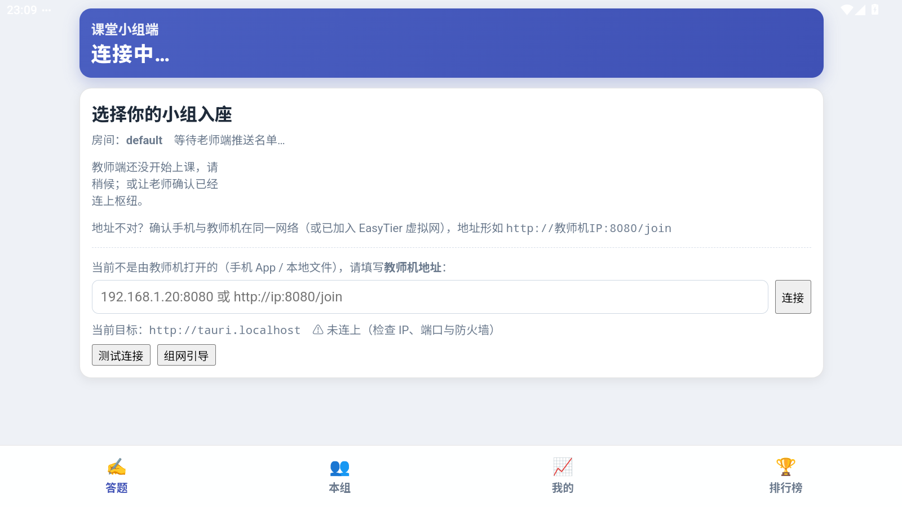

# 学生端安卓客户端（Tauri）· 完整说明文档

> 产物：`.apk`（arm64-v8a / x86_64）
> 工程：`apps/student/`（Tauri v2 薄壳，界面复用学生端网页版）
> 本文记录**本轮在真机模拟器上的完整实测**：构建 → 签名 → 安装 → 启动 → 界面渲染，
> 含 2 个会让 App 完全不可用的严重问题及其修复。

---

## 0. 它是什么，和网页版什么关系

学生端安卓应用 = **同一个学生端网页 + 一个安卓壳**。壳只做浏览器做不到的事：

| 能力 | 手机浏览器打开 `/join` | 安卓 App |
| --- | --- | --- |
| 界面 | ✅ | ✅ **同一份代码**（`scripts/sync-ui.mjs` 同步进 `ui/`） |
| 进入方式 | 扫码 / 输地址 | 桌面图标点开 |
| 教师机地址自检 | 靠浏览器 | ✅ Rust 侧 `check_hub` + 地址规范化（只写 IP 自动补 `:8080`） |
| 明文 HTTP | 浏览器可能拦 | ✅ 清单里 `usesCleartextTraffic=true` |
| 后台驻留 / 全屏 | 受限 | ✅ 原生窗口 |
| 体积 | 0 | 10.38 MB（已签名，x86_64） |

**依赖刻意做到最薄**（`apps/student/src-tauri/Cargo.toml`）：

```toml
[dependencies]
ci-protocol = { path = "../../../crates/ci-protocol" }
ci-domain   = { path = "../../../crates/ci-domain" }
tauri = { version = "2", features = [] }
tauri-plugin-dialog = "2"
tauri-plugin-shell  = "2"
```

只依赖 **协议** 与 **领域规则** 两个 crate —— **不把枢纽和 SQLite 塞进安卓包**：
手机是纯客户端，课堂数据只存在教师机上。`crate-type` 带 `staticlib`/`cdylib`，
这是 Tauri v2 移动端必须的 lib target（`tests/ci.test.js` 会校验，缺了直接红）。

---

## 1. 实测：装到模拟器上跑起来

### 1.1 修复前：黑屏（App 完全不可用）🔴

装好、点开，界面是这样：


一块纯黑，左上角一行字：**`asset not found: index.html`**。
App 没崩（进程活着、Activity 也是前台），但**什么都没有**。

### 1.2 修复后：正常入座页



界面正常渲染，学生可以：选小组入座、看到房间号、填写教师机地址、测试连接、看组网引导。
底部是 4 个标签页：**答题 / 本组 / 我的 / 排行榜**。

> 注意这是**旧版学生端界面**（4 个标签页）。v5 的 Vue 新版学生端（2 个标签页）目前只在网页版 `/next/join` 下提供，
> 尚未同步进 `ui/` —— 与教师端桌面壳的情况一致。

### 1.3 实测环境

| 项 | 值 |
| --- | --- |
| 模拟器 | MuMu Player 实例 1（**不是**用户那个"明日方舟"游戏实例） |
| Android | 15（SDK 35） |
| ABI | `x86_64`（`abilist` 还带 `arm64-v8a`，即支持 ARM 转译） |
| 屏幕 | 1600×900（横屏 surface） |
| 安装方式 | `adb install -r app-x86_64-release-signed.apk` → `Success` |

---

## 2. 实测发现并修复的两个严重问题

这两个都属于"**编译得过、测试也绿，但 App 装上去根本不能用**"，
而且**只有真正装到设备上跑**才会暴露。

### 2.1 安卓 App 打开就是黑屏 🔴→✅

| 项 | 内容 |
| --- | --- |
| 现象 | 启动后纯黑屏，只有一行 `asset not found: index.html`；进程正常、无崩溃日志 |
| 根因 | `apps/student/src-tauri/tauri.conf.json` 的窗口配置**没有 `url` 字段**。Tauri 此时默认加载 `index.html`，但学生的 `ui/` 目录里**只有 `student.html`**（由 `sync-ui.mjs` 决定：`student: { html: ['student.html'] }`）→ 找不到就白/黑屏 |
| 修法 | 给窗口加 `"url": "student.html"` |
| 验证 | 重装后同一台设备：截图从 15 KB 纯黑变成 184 KB 正常界面，logcat 里 `asset not found` 消失 |

```diff
   "windows": [
     {
       "title": "课堂小组端",
+      "url": "student.html",
       "width": 420,
```

> 教师端桌面壳有一模一样的毛病（见 [04](04-教师端桌面客户端.md) §3.1）：Tauri 的 `url` 不写就默认 `index.html`。
> 教师端是"打开了大屏页"，学生端更惨 —— **直接什么都没有**。

### 2.2 学生填不了教师机地址，永远连不上 🔴→✅

| 项 | 内容 |
| --- | --- |
| 现象 | 界面停在「等待老师端推送名单…」，而且**页面上根本没有"填教师机地址"的输入框**，学生无路可走 |
| 根因 | `assets/js/student.js` 的 `servedByHub()` 只看"协议是不是 http、host 是否非空"。Tauri 把前端挂在 `http://tauri.localhost` 下，于是被判成"页面由教师机枢纽托管"→ 入座页据此**隐藏**了地址输入框（`(servedByHub() ? '' : '<输入框…>')`） |
| 修法 | `servedByHub()` 排除客户端伪源：`if (/^tauri\.localhost$/i.test(loc.host)) return false;` |
| 验证 | 重装后地址输入框出现，且能正常输入（实测输入 `127.0.0.1:8080`）；「当前目标」显示 `http://tauri.localhost ⚠️ 未连上`，明确告诉学生还没连上 |

这是 **同一个根因的第三处**（前两处见 [04](04-教师端桌面客户端.md) §3.2）：
**Tauri v2 的 `http://tauri.localhost` 被当成了真实可回连的源**。
三处分别打在三套不同的代码上（教师端同步、学生端同步、学生端入座页）——
这也说明"客户端 asset 协议"这个假设值得在项目里统一收口，而不是每处各判一次。

---

## 3. 构建：会遇到一个 Windows 专有的坑

### 3.1 正常构建命令

```powershell
# 前置：Node 22+、Rust（含 Android target）、JDK 17、Android SDK + NDK
cd apps/student
npm install
npm run android:init     # 首次生成 gen/android 工程
npm run android:build    # 内部就是 tauri android build --apk
```

本机工具链（portable 安装，见 `scripts/setup-toolchain.ps1`）：

| 组件 | 本机实际 |
| --- | --- |
| Rust | 1.98.1，targets：`aarch64` / `armv7` / `i686` / `x86_64`-linux-android + `x86_64-pc-windows-msvc` |
| JDK | Temurin 17（`D:\app\jdk17`） |
| Android SDK | `D:\app\android-sdk`（NDK `26.1.10909125`、platform `android-34`） |
| Gradle | wrapper 自动拉取 9.6.1 |

### 3.2 坑：Windows 上没有"开发者模式"就构建不出来 🔴

Rust 侧**编译成功**（`Finished release profile [optimized] target(s)`，
产出 `target/<triple>/release/libluchenxi_student_lib.so`，8.4–8.7 MB），
然后倒在最后一步 —— Tauri 要把 `.so` **符号链接**进 `jniLibs/`：

```
failed to build Android app: Failed to create a symbolic link from
  "…\target\x86_64-linux-android\release\libluchenxi_student_lib.so" to file
  "…\jniLibs\x86_64\libluchenxi_student_lib.so" (file clobbering enabled):
Creation symbolic link is not allowed for this system.
For Windows 10 or newer: You should use developer mode.
```

原因：Windows 创建符号链接需要 `SeCreateSymbolicLinkPrivilege`，
普通账户只有在**开启开发者模式**或**以管理员运行**时才具备。

> 试过但**无效**的办法：预先手工把 `.so` 复制到 `jniLibs/`。
> Tauri 走的是"先删后建"（`file clobbering enabled`），照样失败，而且顺手把你的文件删了。

### 3.3 绕过办法（本机实测可行 ✅）

把"编 Rust"和"打 APK"两步拆开，让 Gradle 跳过它自己那个会做符号链接的任务：

```powershell
$env:JAVA_HOME='D:\app\jdk17'
$env:ANDROID_HOME='D:\app\android-sdk'; $env:ANDROID_SDK_ROOT='D:\app\android-sdk'
$env:NDK_HOME='D:\app\android-sdk\ndk\26.1.10909125'
$env:PATH="D:\app\jdk17\bin;$env:ANDROID_HOME\platform-tools;$env:PATH"

# ① 先让 Tauri 把 Rust 编出来（它会倒在符号链接那步，但 .so 已经产出了）
cd apps\student; npm run android:build -- --target x86_64

# ② 手工把 .so 放进 jniLibs
$dst = "src-tauri\gen\android\app\src\main\jniLibs\x86_64"
New-Item -ItemType Directory -Path $dst -Force | Out-Null
Copy-Item "..\..\..\target\x86_64-linux-android\release\libluchenxi_student_lib.so" $dst -Force

# ③ 直接跑 Gradle，排除掉那个会做符号链接的 Rust 任务
cd src-tauri\gen\android
.\gradlew.bat assembleX86_64Release -x rustBuildX86_64Release --no-daemon
```

实测：`BUILD SUCCESSFUL in 11s`（`--target aarch64` 时是 4m57s，首次要下 Gradle 与依赖）。

> **为什么不建议当成常规流程**：`-x rustBuildX86_64Release` 意味着 Gradle 不再保证 Rust 产物最新 ——
> 改完 Rust **必须先重跑 ①** 再 `Copy-Item`，否则打出来的是旧库。
> 长期方案是在 Windows 上开启开发者模式；CI 跑在 Linux 上，本来就没这个限制。

---

## 4. 产物验证

### 4.1 签名与安装

Gradle 产出的是**未签名**包，安装前必须签名：

```powershell
keytool -genkeypair -keystore ci-debug.keystore -alias androiddebugkey `
  -storepass android -keypass android -dname "CN=Android Debug,O=Android,C=US" `
  -keyalg RSA -keysize 2048 -validity 10000

apksigner sign --ks ci-debug.keystore --ks-pass pass:android --key-pass pass:android `
  --ks-key-alias androiddebugkey `
  --out app-x86_64-release-signed.apk app-x86_64-release-unsigned.apk
```

实测产物：

| 文件 | 大小 | 说明 |
| --- | --- | --- |
| `app-arm64-release-signed.apk` | **9.65 MB** | 真机用（arm64-v8a） |
| `app-x86_64-release-unsigned.apk` | 10.32 MB | 模拟器用，Gradle 原始产物 |
| `app-x86_64-release-signed.apk` | **10.38 MB** | 模拟器用，已签名，**实测安装成功** |

```
$ adb install -r app-x86_64-release-signed.apk
Performing Streamed Install
Success: streamed 10882219 bytes
Success

$ adb shell pm list packages | grep luchenxi
package:top.peroe.luchenxi.student
```

### 4.2 APK 内容核对

```
$ tar -tf app-x86_64-release-signed.apk | grep -E 'lib/|classes.dex|AndroidManifest'
classes.dex
lib/x86_64/libluchenxi_student_lib.so     ← Rust 核心（含界面资源）
AndroidManifest.xml
```

**关键点**：界面资源不在 `assets/` 里，而是被 `generate_context!` **编译进 Rust 二进制**。
所以构建顺序必须是 `sync-ui.mjs` → `cargo build`；**改完界面不重编 Rust 不会生效**
（本轮每次改配置都重编了 Rust，正是这个原因）。

### 4.3 清单（用 aapt2 查成品包，不是看源码）

```
$ aapt2 dump xmltree --file AndroidManifest.xml app-x86_64-release-signed.apk
A: package="top.peroe.luchenxi.student"
A: android:minSdkVersion=24
A: android:targetSdkVersion=37
E: uses-permission  android:name="android.permission.INTERNET"
A: android:usesCleartextTraffic=true          ← 明文 HTTP 确实放行了
```

| 项 | 值 | 说明 |
| --- | --- | --- |
| `applicationId` | `top.peroe.luchenxi.student` | 与教师端 `…teacher` 区分 |
| `minSdk` / `targetSdk` | 24 / 37 | 覆盖 Android 7.0 以上机型 |
| 权限 | 仅 `INTERNET` | **只申请联网**，不碰通讯录/存储/定位 |
| `usesCleartextTraffic` | `true` | 课堂内网走 `http://`，安卓 9+ 默认禁明文，必须显式打开；否则学生装上必然连不上教师机 |
| `leanback` | `required=false` | 允许装到 Android TV / 大屏盒子 |
| 组件 | `MainActivity` + `FileProvider` | 单 Activity；FileProvider 供导入备份用 |

（`npm test` 里 `android-manifest.test.js` 会打印两条 `[fail] 未找到 Android 工程 / release 包未放行明文流量`，
那是它在**临时目录的夹具工程**上做反向校验的分支，与真实工程无关；真实产物以 `aapt2` 输出为准。）

---

## 5. 组网的现实约束

**学生端安卓 App 不能内置 EasyTier**：官方 Android 只提供 GUI APK，没有 CLI，无法作为 sidecar 打包。
跨网段上课时只有两条路：

1. **同一局域网直连**（最常见）：学生手机与教师机同一个 WiFi，填教师机地址即可；
2. **先装官方 EasyTier App**，加入与教师机相同的虚拟网，再在学生端填教师机的**虚拟网 IP**。

教师端的 EasyTier 是内置的（sidecar + 界面一键组网），学生端只负责"填对地址"。

---

## 6. 排障速查

| 现象 | 处理 |
| --- | --- |
| **打开是黑屏 / 只有一行 asset not found** | 见 §2.1：`tauri.conf.json` 的窗口缺 `url` |
| **看不到"填教师机地址"输入框** | 见 §2.2：`servedByHub()` 把客户端伪源误判成枢纽 |
| 装不上（解析包错误） | 用的是 `-unsigned` 包；先签名（§4.1） |
| 装不上（ABI 不匹配） | 模拟器多为 x86_64，需另编 `--target x86_64`；真机用 arm64 |
| App 里连不上教师机 | 用教师端「课堂协同」页显示的**网卡地址**；确认同一 WiFi / 同一虚拟网；Windows 防火墙放行 8080 |
| 改了界面但 App 没变 | 界面资源编译进 Rust 二进制，必须 `sync-ui.mjs` → 重编 Rust（§4.2） |
| 构建报符号链接错误 | 见 §3.2 / §3.3 |

---

## 7. 本轮做到哪一步（诚实清单）

| 环节 | 结果 |
| --- | --- |
| Rust 交叉编译（aarch64 / x86_64） | ✅ |
| Gradle 打包（arm64 / x86_64） | ✅ |
| 签名（apksigner，调试证书） | ✅ |
| 成品包内容与清单核对（tar / aapt2） | ✅ |
| 安装到 Android 15 模拟器 | ✅ `Success` |
| 启动、界面渲染 | ✅（修复 §2.1/§2.2 之后） |
| 地址输入框可用、能输入文本 | ✅ 实测输入 `127.0.0.1:8080` |
| **点「连接」真正连上教师机** | ❌ **未验证** |

最后一项没做成的**原因不在 App**：MuMu 模拟器上 `adb shell input tap` 能让按钮获得焦点，
但**不触发 WebView 的 click 事件**（`swipe` 模拟长按、`keyevent 61+66` 键盘激活都试过，均无效），
而 release 包默认关闭 WebView 调试（`/proc/net/unix` 里没有 `webview_devtools_remote`），
所以既点不动也接管不了。**界面本身是活的**（能渲染、能接收键盘输入），
差的是一次真实触摸 —— 建议在真机上用一次点击确认。

---

## 8. 结论

安卓壳的**整条链路已经打通并跑起来了**：从 Rust 交叉编译、Gradle 打包、签名，
到安装进 Android 15 模拟器、启动、界面正常渲染。这轮实跑抓出了 **2 个会让 App 完全不可用的问题**
（黑屏、填不了地址），都是"静态检查发现不了、必须真跑"的那一类。

仍建议补上的一步：**在真机上点一次「连接」**，把
「App → 教师机枢纽 → 学生入座 → 答题 → 抢答」这条链路走完。
