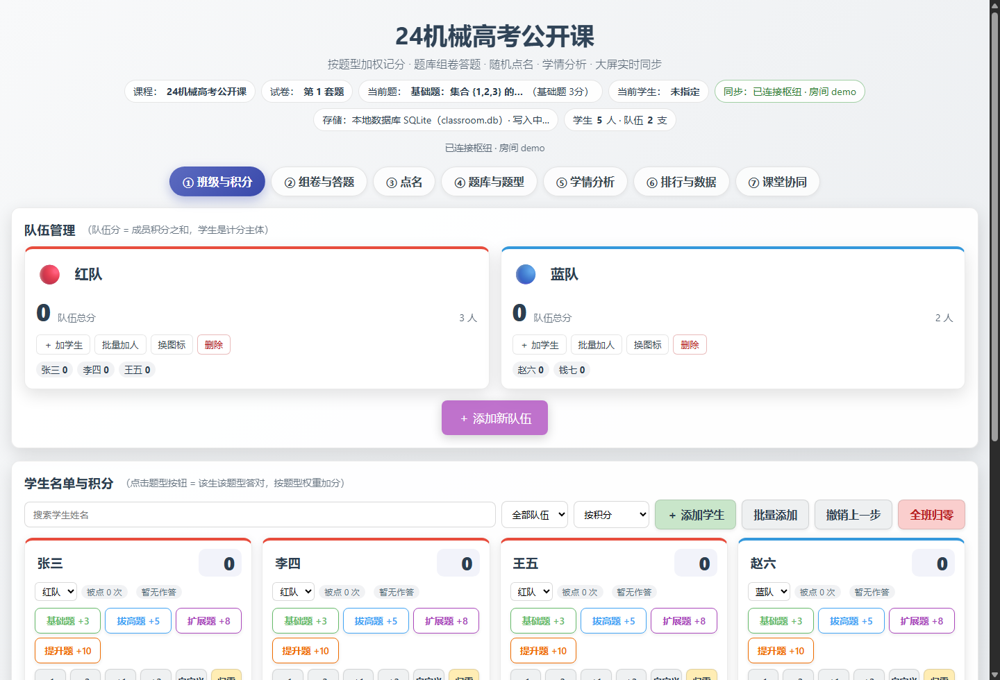
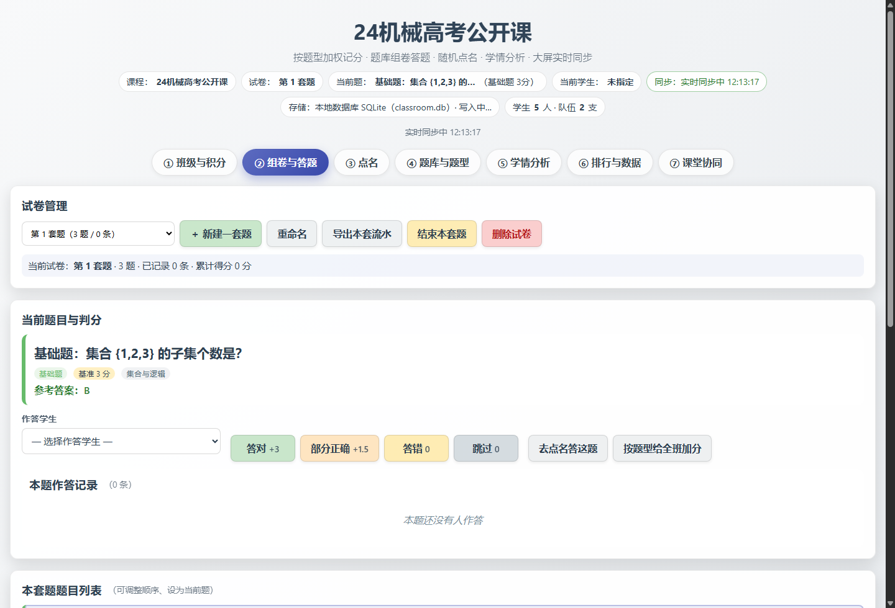
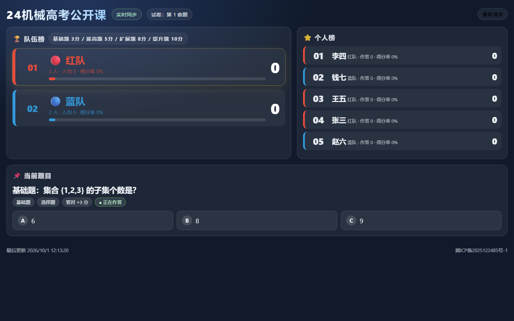
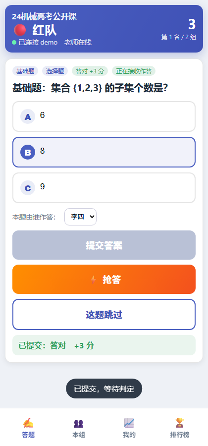
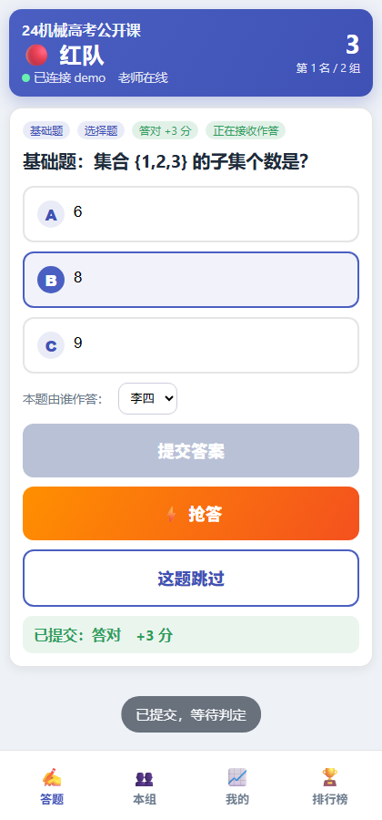
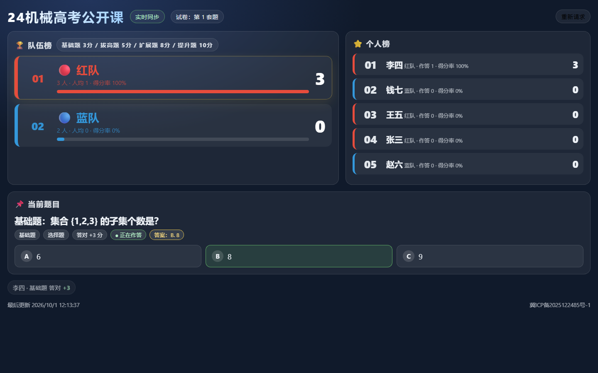

# 课堂演示实录（自动生成）

> 由 `node tests/demo.js` 生成：自动起一个隔离枢纽，用**真实页面**（教师端 / 学生端 / 大屏）走完整堂课流程，并逐步截图。
> 房间号 `demo`，浏览器 Chrome/154.0.8037.59。

| 步骤 | 说明 | 截图 |
| --- | --- | --- |
| 教师端建班 | 班级与积分（5 名学生、2 支队） |  |
| 打开组卷页 | 题库 3 题已加入「第 1 次随堂测」 |  |
| 学生端入座 | 手机端打开 /join：选小组入座 |  |
| 教室大屏 | 大屏只读：队伍榜 + 个人榜 + 当前题 |  |
| 学生答题 | 提交后看到判定 |  |
| 自动判分 | 教师端实时流出现「答对（+3）」 |  |
| 公布答案 | 学生端显示正确答案 |  |
| 公布答案 | 大屏显示正确答案 |  |
| 抢答 | 教师端抢答榜出现该队 |  |

## 关键结果

- 学生提交后分数变化：`[0,0,0,0,0]` → `[0,3,0,0,0]`
- 教师端实时流：`["李四 B. 8 → 答对（+3）","红队 已入座"]`
- 页面错误：无

> 这份实录覆盖了「建班 → 组卷 → 推题 → 入座 → 答题 → 自动判分 → 公布答案 → 抢答」整条链路；
> 客户端（Tauri）出包后应能在同一房间复现同样结果（协议未变）。